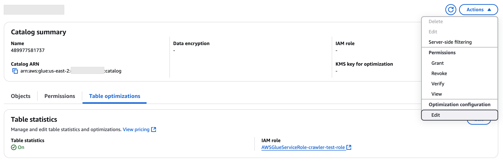
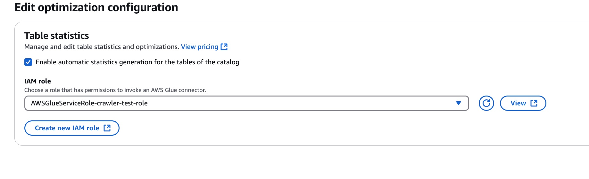

# Enabling catalog-level automatic statistics generation

You can enable the automatic column statistics generation for all new
Apache Iceberg tables and tables in non-OTF table (Parquet, JSON, CSV, XML, ORC,
ION) formats in the Data Catalog. After creating the table, you can also explicitly update the column
statistics settings manually.

To update the Data Catalog settings to enable catalog-level, the IAM role used must have the `glue:UpdateCatalog`
permission or AWS Lake Formation `ALTER CATALOG` permission on the root catalog. You can use `GetCatalog` API to verify the
catalog properties.

AWS Management Console

###### To enable the automatic column statistics generation at the account-level

1. Open the Lake Formation console at [https://console.aws.amazon.com/lakeformation/](https://console.aws.amazon.com/lakeformation/ "https://console.aws.amazon.com/lakeformation/").
2. On the left navigation bar, choose **Catalogs**.
3. On the **Catalog summary** page, choose **Edit** under **Optimization configuration**.

 4. On the **Table optimization configuration** page, choose
the **Enable automatic statistics generation for the tables of the catalog** option.

 5. Choose an existing IAM role or create a new one that has the necessary
permissions to run the column statistics task. 6. Choose **Submit**.

AWS CLI
You can also enable catalog-level statistics collection through the
AWS CLI. To configure table-level statistics collection using AWS CLI, run
the following command:

```
aws glue update-catalog --cli-input-json '{
    "name": "123456789012",
    "catalogInput": {
        "description": "Updating root catalog with role arn",
        "catalogProperties": {
            "customProperties": {
                "ColumnStatistics.RoleArn": "arn:aws:iam::"123456789012":role/service-role/AWSGlueServiceRole",
                "ColumnStatistics.Enabled": "true"
            }
        }
    }
}'

```

The above command calls AWS Glue's `UpdateCatalog` operation, which takes in a `CatalogProperties` structure
with the following key-value pairs for catalog-level statistics generation:

- ColumnStatistics.RoleArn – IAM role ARN to be used for all tasks triggered for Catalog-level statistics generation
- ColumnStatistics.Enabled – Boolean indicating whether the catalog-level settings is enabled or disabled
