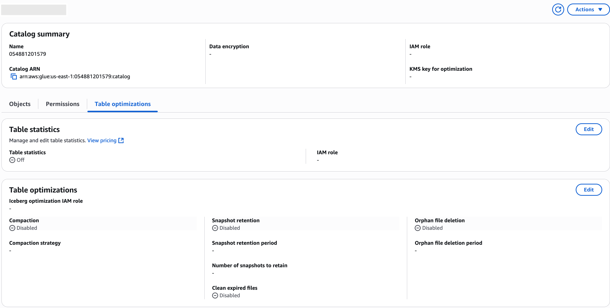
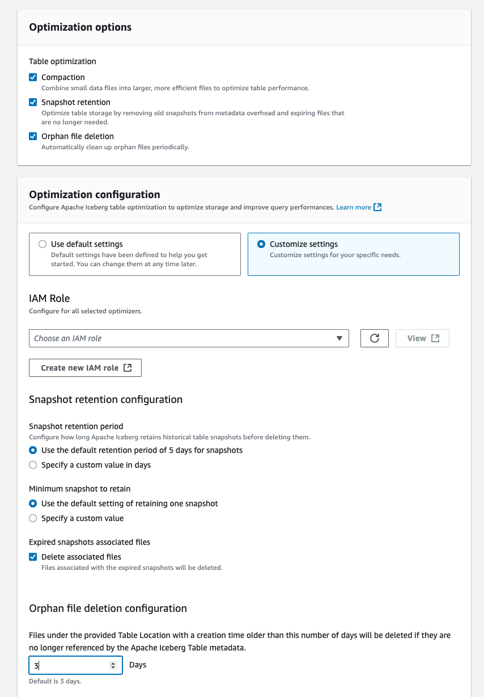

# Enabling catalog-level automatic table optimization

You can enable the automatic table optimization for all new
Apache Iceberg tables in the Data Catalog. After creating the table, you can also explicitly update the table optimization settings manually.

To update the Data Catalog settings to enable catalog-level table optimizations, the IAM role used must have the `glue:UpdateCatalog`
permission on the root catalog. You can use `GetCatalog` API to verify the catalog properties.

For the Lake Formation managed tables, the IAM role selected during the catalog optimization configuration requires Lake Formation `ALTER`, `DESCRIBE`, `INSERT`, and `DELETE` permissions for any new tables or updated tables.

1. Open the Lake Formation console at [https://console.aws.amazon.com/lakeformation/](https://console.aws.amazon.com/lakeformation/ "https://console.aws.amazon.com/lakeformation/").
2. In the navigation pane, choose **Data Catalog**.
3. Select the **Catalogs** tab.
4. Choose the account-level catalog.
5. Choose **Table optimizations**, **Edit** under **Table optimizations** tab. You can also choose **Edit optimizations** from **Actions**.

 6. On the **Table optimization** page, configure the following options:



    1. Configure **Compaction** settings:


    	* Enable/disable compaction.
    	* Choose the IAM role that has the necessary permissions to run the optimizers.


    	For more information on the permission requirements for the IAM role, see [Table optimization prerequisites](optimization-prerequisites.md "optimization-prerequisites.md") .
    2. Configure **Snapshot retention** settings:


    	* Enable/disable retention.
    	* Set snapshot retention period in days - default is 5 days.
    	* Set number of snapshots to retain - default is 1 snapshot.
    	* Enable/disable cleaning of expired files.
    3. Configure **Orphan file deletion** settings:


    	* Enable/disable orphan file deletion.
    	* Set orphan file retention period in days - default is 3 days.

7. Choose **Save**.
   Use the following CLI command to update an existing catalog with optimizer settings:

###### Example Update catalog with optimizer settings

```
aws glue update-catalog \
   --name `catalog-id` \
  --catalog-input \
  '{
    "CatalogId": "`111122223333`",
    "CatalogInput": {
        "CatalogProperties": {
            "CustomProperties": {
                "ColumnStatistics.Enabled": "false",
                "ColumnStatistics.RoleArn": "arn:aws:iam::`111122223333`:role/service-role/`stats-role-name`"
            },
            "IcebergOptimizationProperties": {
                "RoleArn": "arn:aws:iam::`111122223333`:role/`optimizer-role-name`",
                "Compaction": {
                    "enabled": "`true`"
                },
                "Retention": {
                    "enabled": "`true`",
                    "snapshotRetentionPeriodInDays": "`10`",
                    "numberOfSnapshotsToRetain": "`5`",
                    "cleanExpiredFiles": "`true`"
                },
                "OrphanFileDeletion": {
                    "enabled": "`true`",
                    "orphanFileRetentionPeriodInDays": "`3`"
                }
            }
        }
    }
}'
```

If you encounter issues with catalog-level optimizers, check the following:

- Ensure the IAM role has the correct permissions as outlined in the Prerequisites
  section.
- Check CloudWatch logs for any error messages related to optimizer operations.

For more information, see [View available metrics](../../../AmazonCloudWatch/latest/monitoring/viewing_metrics_with_cloudwatch.md "../../../AmazonCloudWatch/latest/monitoring/viewing_metrics_with_cloudwatch.md") in the _Amazon CloudWatch User Guide_.

- Verify that the catalog settings were successfully applied by checking the catalog configuration.
- For table access failures, check the CloudWatch logs and EventBridge notifications for detailed error information.
