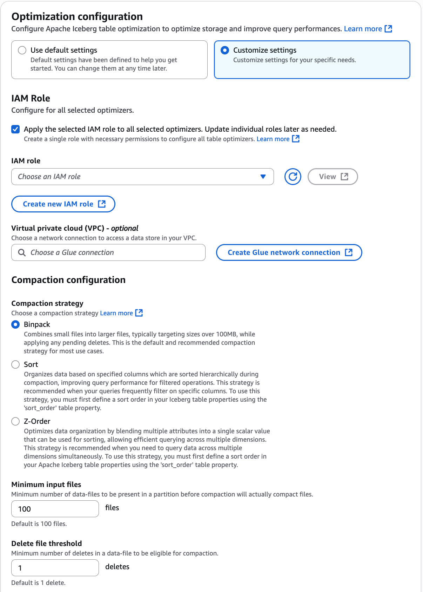

# Enabling compaction optimizer

You can use AWS Glue console, AWS CLI, or AWS API to enable compaction for your Apache Iceberg tables in the AWS Glue Data Catalog.
For new tables, you can choose Apache Iceberg as table format and enable compaction when you create the table.
Compaction is disabled by default for new tables.

Console

######

To enable compaction

1. Open the AWS Glue console at [https://console.aws.amazon.com/glue/](https://console.aws.amazon.com/glue/ "https://console.aws.amazon.com/glue/") and sign in as a data lake administrator, the table creator, or a user who has been granted
   the `glue:UpdateTable` and `lakeformation:GetDataAccess` permissions on the table.
2. In the navigation pane, under **Data Catalog**, choose **Tables**.
3. On the **Tables** page, choose a table in open table format that you want to
   enable compaction for, then under **Actions** menu, choose
   **Optimization**, and then choose
   **Enable**.

You can also enable compaction by selecting the **Table
optimization** tab on the **Table details** page.
Choose the **Table optimization** tab on the lower section of the
page, and choose **Enable compaction**.

The **Enable optimization** option is also available when
you create a new Iceberg table in the Data Catalog. 4. On the **Enable optimization** page, choose
**Compaction** under **Optimization
options**.

 5. Next, select an IAM role from the drop down with the permissions shown in
the [Table optimization prerequisites](optimization-prerequisites.md "optimization-prerequisites.md") section.

You can also choose **Create a new IAM role** option to
create a custom role with the required permissions to run compaction.

Follow the steps below to update an existing IAM role:

    1. To update the permissions policy for the IAM role, in the IAM console, go to the IAM role that is being used for running compaction.
    2. In the **Add permissions** section, choose Create policy. In the newly opened browser window, create a new policy to use with your role.
    3. On the Create policy page, choose the `JSON` tab. Copy the JSON
     code shown in the Prerequisites into the policy editor field.

6. If you have security policy configurations where the Iceberg table
   optimizer needs to access Amazon S3 buckets from a specific Virtual Private
   Cloud (VPC), create an AWS Glue network connection or use an existing
   one.

If you don't have an AWS Glue VPC connection set up already,
create a new one by following the steps in the [Creating connections for connectors](creating-connections.md "creating-connections.md") section using the AWS Glue console or the AWS CLI/SDK. 7. Choose a compaction strategy. The available options are:

    * **Binpack** – Binpack is the default compaction strategy in
     Apache Iceberg. It combines smaller data files into larger ones for optimal
     performance.
    * **Sort** – Sorting in Apache Iceberg is
     a data organization technique that clusters information within files based on
     specified columns, significantly improving query performance by reducing the
     number of files that need to be processed. You define the sort order in
     Iceberg's metadata using the sort-order field, and when multiple columns are
     specified, data is sorted in the sequence the columns appear in the sort
     order, ensuring records with similar values are stored together within files.
     The sorting compaction strategy takes the optimization further by sorting data
     across all files within a partition.
    * **Z-order** – Z-ordering is a way to organize data when you
     need to sort by multiple columns with equal importance. Unlike traditional
     sorting that prioritizes one column over others, Z-ordering gives balanced
     weight to each column, helping your query engine read fewer files when
     searching for data.


    The technique works by weaving together the binary digits of values from
     different columns. For example, if you have the numbers 3 and 4 from two
     columns, Z-ordering first converts them to binary (3 becomes 011 and 4 becomes
     100), then interleaves these digits to create a new value: 011010. This
     interleaving creates a pattern that keeps related data physically close
     together.


    Z-ordering is particularly effective for multi-dimensional queries. For
     example, a customer table Z-ordered by income, state, and zip code can deliver
     superior performance compared to hierarchical sorting when querying across
     multiple dimensions. This organization allows queries targeting specific
     combinations of income and geographic location to quickly locate relevant data
     while minimizing unnecessary file scans.

8. **Minimum input files** – The number of
   data files required in a partition before compaction is triggered.
9. **Delete files threshold** – Minimum
   delete operations required in a data file before it becomes eligible for
   compaction.
10. Choose **Enable optimization**.

AWS CLI
The following example shows how to enable compaction. Replace the account ID
with a valid AWS account ID. Replace the database name and table name with actual
Iceberg table name and the database name. Replace the `roleArn` with the
AWS Resource Name (ARN) of the IAM role and name of the IAM role that has the
required permissions to run compaction. You can replace compaction strategy
`sort` with other supported strategies like `z-order` or
`binpack`.

order" depending on your requirements.

```
aws glue create-table-optimizer \
  --catalog-id `123456789012` \
  --database-name `iceberg_db` \
  --table-name `iceberg_table` \
  --table-optimizer-configuration '{
    "roleArn": "`arn:aws:iam::123456789012:role/optimizer_role`",
    "enabled": true,
    "vpcConfiguration": {"glueConnectionName": "glue_connection_name"},
    "compactionConfiguration": {
      "icebergConfiguration": {"strategy": "`sort`"}
    }
  }'\
--type `compaction`
```

AWS API
Call [CreateTableOptimizer](aws-glue-api-table-optimizers.md#aws-glue-api-table-optimizers-CreateTableOptimizer "aws-glue-api-table-optimizers.md#aws-glue-api-table-optimizers-CreateTableOptimizer") operation to enable compaction for a table.

After you enable compaction, **Table optimization** tab shows the
following compaction details once the compaction run is complete:

Start time

The time at which the compaction process started within Data Catalog. The value is a timestamp in UTC time.

End time

The time at which the compaction process ended in Data Catalog. The value is a timestamp in UTC time.

Status

The status of the compaction run. Values are success or fail.

Files compacted
Total number of files compacted.

Bytes compacted

Total number of bytes compacted.
