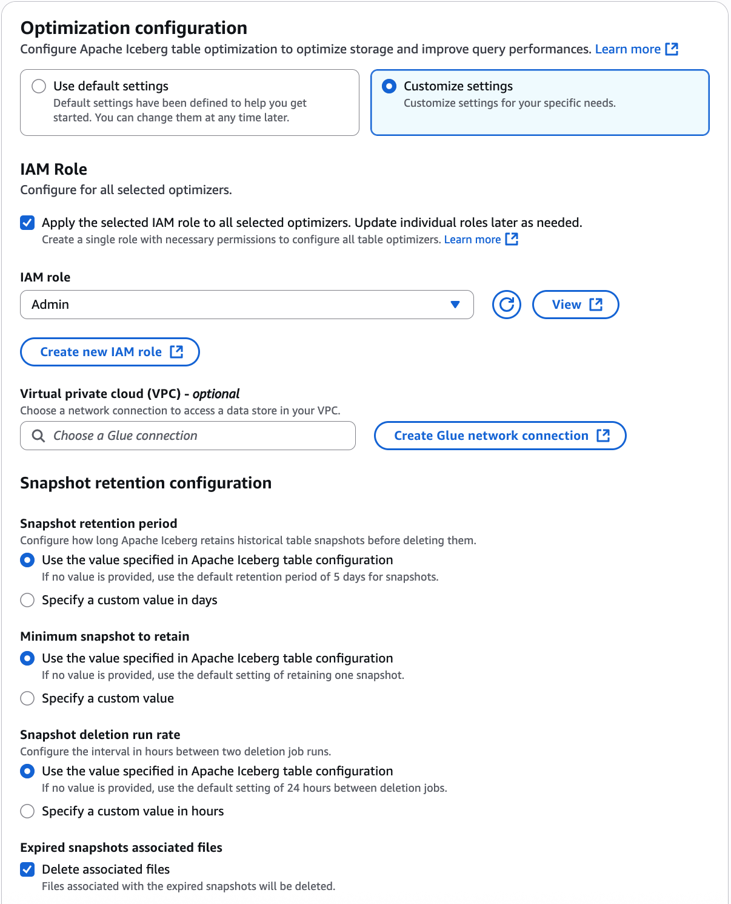

# Enabling snapshot retention optimizer

You can use AWS Glue console, AWS CLI, or AWS API to enable snapshot retention optimizers for your Apache Iceberg tables in the Data Catalog.
For new tables, you can choose Apache Iceberg as table format and enable snapshot retention optimizer when you create the table.
Snapshot retention is disabled by default for new tables.

Console

###### To enable snapshot retention optimizer

1. Open the AWS Glue console at [https://console.aws.amazon.com/glue/](https://console.aws.amazon.com/glue/ "https://console.aws.amazon.com/glue/") and sign in as a data lake administrator, the table creator, or a user who has been granted
   the `glue:UpdateTable` and `lakeformation:GetDataAccess` permissions on the table.
2. In the navigation pane, under **Data Catalog**, choose **Tables**.
3. On the **Tables** page, choose an Iceberg table that you want to enable
   snapshot retention optimizer for, then under **Actions** menu,
   choose **Enable** under **Optimization**.

You can also enable optimization by selecting the table and opening the
**Table details** page. Choose the **Table
optimization** tab on the lower section of the page, and choose
**Enable snapshot retention**. 4. On the **Enable optimization** page, under
**Optimization configuration**, you have two options:
**Use default setting** or **Customize
settings**. If you choose to use the default settings, AWS Glue utilizes
the properties defined in the Iceberg table configuration to determine the
snapshot retention period and the number of snapshots to be retained. In the
absence of this configuration, AWS Glue retains one snapshot for five days, and
deletes files associated with the expired snapshots. 5. Next, choose an IAM role that AWS Glue can assume on your behalf to run the optimizer. For details about the permissions required for the IAM role,
see the [Table optimization prerequisites](optimization-prerequisites.md "optimization-prerequisites.md") section.

Follow the steps below to update an existing IAM role:

    1. To update the permissions policy for the IAM role, in the IAM console, go to the IAM role that is being used for running compaction.
    2. In the Add permissions section, choose Create policy. In the newly opened browser window, create a new policy to use with your role.
    3. On the Create policy page, choose the JSON tab. Copy the JSON code shown in the Prerequisites into the policy editor field.

6. If you prefer to set the values for the **Snapshot retention configuration** manually, choose **Customize settings**.

 7. Choose the box **Apply the selected IAM role to the selected
optimizers** option to use a single IAM role for all enabling all
optimizers. 8. If you have security policy configurations where the Iceberg table
optimizer needs to access Amazon S3 buckets from a specific Virtual Private
Cloud (VPC), create an AWS Glue network connection or use an existing
one.

If you don't have an AWS Glue VPC Connection set up already,
create a new one by following the steps in the [Creating connections for connectors](creating-connections.md "creating-connections.md") section using the AWS Glue console or the AWS CLI/SDK. 9. Next, under **Snapshot retention configuration**, either choose to use the
values specified in the [Iceberg table configuration](https://iceberg.apache.org/docs/1.5.2/configuration/#table-behavior-properties "https://iceberg.apache.org/docs/1.5.2/configuration/#table-behavior-properties"), or specify custom values for snapshot
retention period (history.expire.max-snapshot-age-ms), minimum number of snapshots
(history.expire.min-snapshots-to-keep) to retain, and the time in hours between
consecutive snapshot deletion job runs. 10. Choose **Delete associated files** to delete underlying files when the table optimizer deletes old snapshots from the table metadata.

If you don't choose this option, when older snapshots are removed from the table metadata, their associated files will remain in the storage as orphaned files. 11. Next, read the caution statement, and choose **I acknowledge**
to proceed.

###### Note

In the Data Catalog, the snapshot retention optimizer honors the lifecycle that
is controlled by branch and tag level retention policies. For more information,
see [Branching and tagging](https://iceberg.apache.org/docs/latest/branching/#overview "https://iceberg.apache.org/docs/latest/branching/#overview") section in the Iceberg documentation. 12. Review the configuration and choose **Enable
optimization**.

Wait a few minutes for the retention optimizer to run and expire old snapshots
based on the configuration.

AWS CLI

To enable snapshot retention for new Iceberg tables in AWS Glue,
you need to create a table optimizer of type `retention` and set the `enabled` field to `true` in the `table-optimizer-configuration`.
You can do this using the AWS CLI command `create-table-optimizer` or `update-table-optimizer`.
Additionally, you need to specify the retention configuration fields like `snapshotRetentionPeriodInDays` and `numberOfSnapshotsToRetain`
based on your requirements.

The following example shows how to enable the snapshot retention optimizer.
Replace the account ID with a valid AWS account ID. Replace the database name and
table name with actual Iceberg table name and the database name. Replace the
`roleArn` with the AWS Resource Name (ARN) of the IAM role and name
of the IAM role that has the required permissions to run the snapshot retention
optimizer.

```
aws glue create-table-optimizer \
  --catalog-id `123456789012` \
  --database-name `iceberg_db` \
  --table-name `iceberg_table` \
  --table-optimizer-configuration '{"roleArn":"arn:aws:iam::`123456789012`:role/`optimizer_role`","enabled":'true', "vpcConfiguration":{
"glueConnectionName":`"glue_connection_name"`}, "retentionConfiguration":{"icebergConfiguration":{"snapshotRetentionPeriodInDays":`7`,"numberOfSnapshotsToRetain":`3`,"cleanExpiredFiles":`'true'`}}}'\
  --type retention
```

This command creates a retention optimizer for the specified Iceberg table in the given catalog, database, and Region.
The table-optimizer-configuration specifies the IAM role ARN to use, enables the optimizer, and sets the retention configuration.
In this example, it retains snapshots for 7 days, keeps a minimum of 3 snapshots, and cleans expired files.

- snapshotRetentionPeriodInDays –The number of days to retain snapshots
  before expiring them. The default value is `5`.
- numberOfSnapshotsToRetain – The minimum number of snapshots to keep, even
  if they are older than the retention period. The default value is `1`.
- cleanExpiredFiles – A boolean indicating whether to delete expired data
  files after expiring snapshots. The default value is `true`.

When set to true, older snapshots are removed from table metadata, and their
underlying files are deleted. If this parameter is set to false, older snapshots
are removed from table metadata but their underlying files remain in the storage
as orphan files.

AWS API
Call [CreateTableOptimizer](aws-glue-api-table-optimizers.md#aws-glue-api-table-optimizers-CreateTableOptimizer "aws-glue-api-table-optimizers.md#aws-glue-api-table-optimizers-CreateTableOptimizer") operation to enable snapshot retention optimizer for a table.

After you enable compaction, **Table optimization** tab shows the
following compaction details (after approximately 15-20 minutes):

Start time

The time at which the snapshot retention optimizer started. The value is a timestamp in UTC time.

Run time

The time shows how long the optimizer takes to complete the task. The value is a
timestamp in UTC time.

Status

The status of the optimizer run. Values are success or fail.

Data files deleted
Total number of files deleted.

Manifest files deleted

Total number of manifest files deleted.

Manifest lists deleted

Total number of manifest lists deleted.
