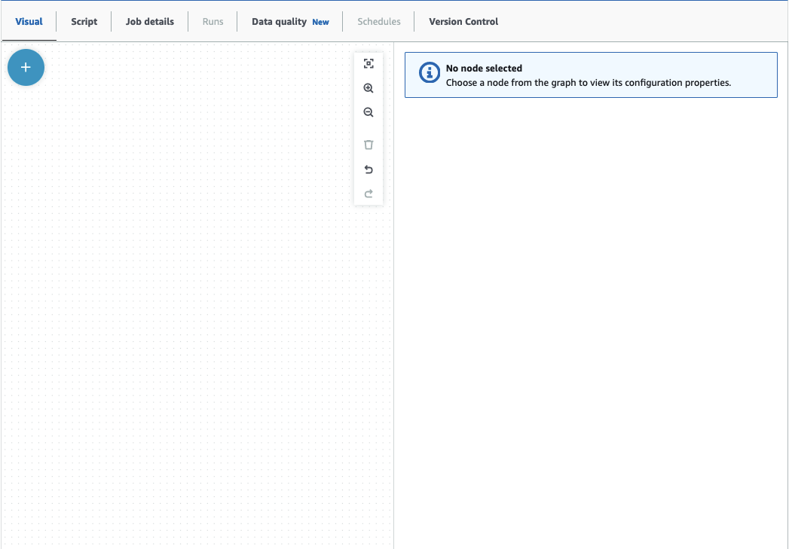
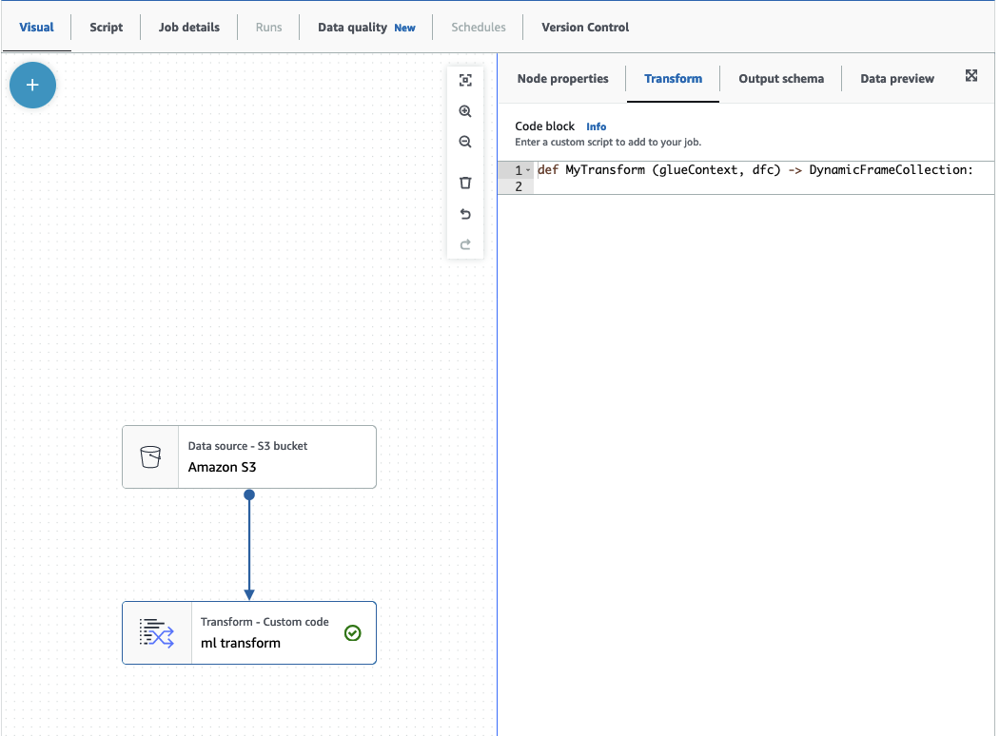

# Using FindMatches in a visual job

To use the **FindMatches** transform in AWS Glue Studio, you can use the **Custom Transform**
node that invokes the FindMatches API. For more information on how to use a custom transform, see
[Creating a custom transformation](../ug/transforms-custom.md "../ug/transforms-custom.md")

###### Note

Currently, the FindMatches API only works with `Glue 2.0`. In order to run a job with the Custom transform that invokes the FindMatches API,
ensure the AWS Glue version is `Glue 2.0` in the **Job details** tab. If the version of AWS Glue
is not `Glue 2.0`, the job will fail at runtime with the following error message:
“cannot import name 'FindMatches' from 'awsglueml.transforms'”.

## Prerequisites

- In order to use the **Find Matches** transform, open the AWS Glue Studio console at
  [https://console.aws.amazon.com/gluestudio/](https://console.aws.amazon.com/gluestudio/ "https://console.aws.amazon.com/gluestudio/").
- Create a machine learning transform. When created, a transformId is generated. You will need this ID for the steps below. For more information
  on how to create a machine learning transform, see
  [Adding and editing machine learning transforms](console-machine-learning-transforms.md#console-machine-learning-transforms-actions "console-machine-learning-transforms.md#console-machine-learning-transforms-actions").

## Adding a FindMatches transform

###### To add a FindMatches transform:

1. In the AWS Glue Studio job editor, open the Resource panel by clicking on the cross symbol in the upper left-hand corner of the visual job
   graph and choose a Data source by choosing the **Data tab**. This is the data source you want to check for matches.

 2. Choose the data source node, then open the Resource panel by clicking on the cross symbol in the upper left-hand corner of the visual job
graph and search for 'custom transform'. Choose the **Custom Transform** node to add it to the graph.
The **Custom Transform** is linked to the data source node. If it is not, you can click on the **Custom Transform** node and choose the **Node properties** tab, then under **Node parents**, choose the data source. 3. Click the **Custom Transform** node in the visual graph, then choose the **Node properties** tab and
name the custom transform. It is recommended that you rename the transform so that the transform name is easily identifiable in the visual graph. 4. Choose the **Transform** tab, where you can edit the code block. This is where the code to invoke the FindMatches API
can be added.



The code block contains pre-populated code to get you started. Overwrite the pre-populated code with the template below. The template
has a placeholder for the **transformId**, which you can provide.

```
def MyTransform (glueContext, dfc) -> DynamicFrameCollection:
    dynf = dfc.select(list(dfc.keys())[0])
    from awsglueml.transforms import FindMatches
    findmatches = FindMatches.apply(frame = dynf, transformId = "<your id>")
    return(DynamicFrameCollection({"FindMatches": findmatches}, glueContext))

```

5. Click the **Custom Transform** node in the visual graph, then open the Resource panel by clicking on the cross symbol
   in the upper left-hand corner of the visual job graph and search for 'Select From Collection'. There is no need to change the default selection
   since there is only one DynamicFrame in the collection.
6. You can continue adding transformations or store the result, which is now enriched with the find matches additional columns.
   If you want to reference those new columns in downstream transforms, you need to add them to the transform output schema. the easiest way to
   do that is to choose the **Data preview** tab and then in the schema tab choose “Use datapreview schema”.
7. To customize FindMatches, you can add additional parameters to pass to the 'apply' method. See
   [FindMatches class](aws-glue-api-crawler-pyspark-transforms-findmatches.md "aws-glue-api-crawler-pyspark-transforms-findmatches.md").

## Adding a FindMatches incrementally transformation

In the case of incremental matches, the process is the same as **Adding a FindMatches transformation** with the following
differences:

- Instead of a parent node for the custom transform, you need two parent nodes.
- The first parent node should be the dataset.
- The second parent node should be the incremental dataset.

Replace the `transformId` with your `transformId` in the template code block:

```
def MyTransform (glueContext, dfc) -> DynamicFrameCollection:
    dfs = list(dfc.values())
    dynf = dfs[0]
    inc_dynf = dfs[1]
    from awsglueml.transforms import FindIncrementalMatches
    findmatches = FindIncrementalMatches.apply(existingFrame = dynf, incrementalFrame = inc_dynf,
                                    transformId = "<your id>")
    return(DynamicFrameCollection({"FindMatches": findmatches}, glueContext))

```

- For optional parameters, see
  [FindIncrementalMatches class](aws-glue-api-crawler-pyspark-transforms-findincrementalmatches.md "aws-glue-api-crawler-pyspark-transforms-findincrementalmatches.md").
