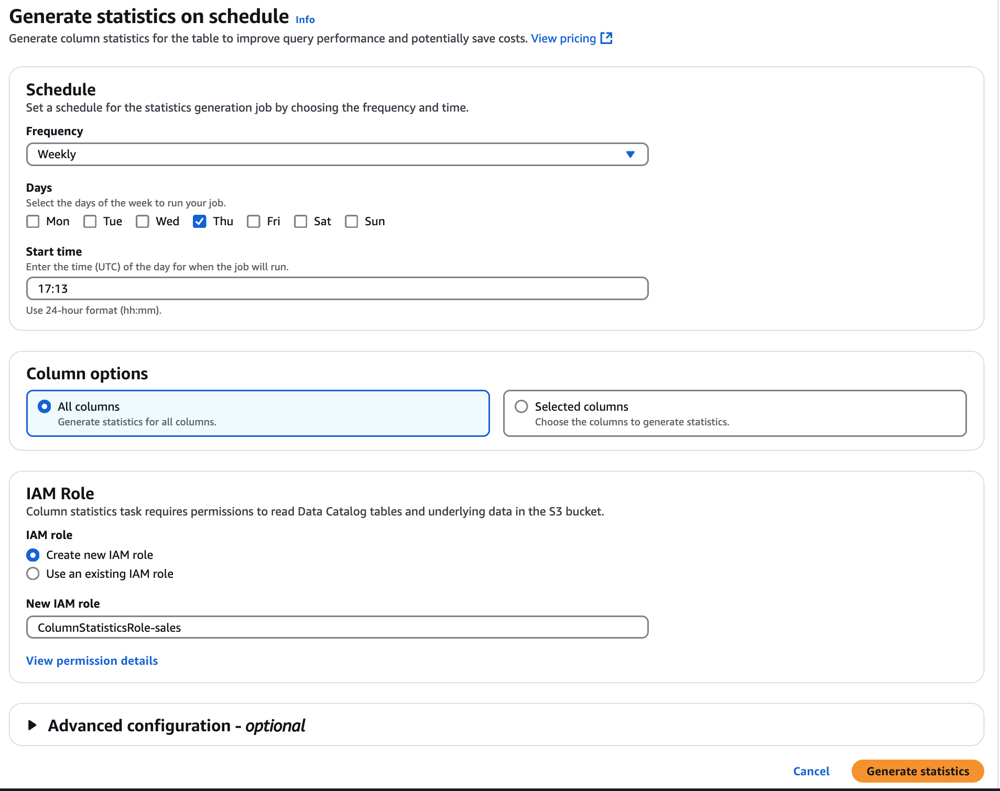

# Generating column statistics on a

schedule

Follow these steps to configure a schedule for generating column statistics in the AWS Glue Data Catalog
using the AWS Glue console, the AWS CLI, or the
[CreateColumnStatisticsTaskSettings](aws-glue-api-crawler-column-statistics.md#aws-glue-api-crawler-column-statistics-CreateColumnStatisticsTaskSettings "aws-glue-api-crawler-column-statistics.md#aws-glue-api-crawler-column-statistics-CreateColumnStatisticsTaskSettings") operation.

Console

###### To generate column statistics using the console

1. Sign in to the AWS Glue console at [https://console.aws.amazon.com/glue/](https://console.aws.amazon.com/glue/ "https://console.aws.amazon.com/glue/").
2. Choose Data Catalog tables.
3. Choose a table from the list.
4. Choose **Column statistics** tab in the lower
   section of the **Tables** page.
5. You can also choose **Generate on schedule** under **Column statistics** from **Actions**.
6. On the **Generate statistics on schedule** page,
   configure a recurring schedule for running the column statistics
   task by choosing the frequency and start time. You can choose the
   frequency to be hourly, daily, weekly, or define a cron expression
   to specify the schedule.

A cron expression is a string representing a schedule pattern,
consisting of 6 fields separated by spaces: \* \* \* \* \* <minute>
<hour> <day of month> <month> <day of week> <year>
For example, to run a task every day at midnight, the cron
expression would be: 0 0 \* \* ? \*

For more information, see [Cron expressions](monitor-data-warehouse-schedule.md#CronExpressions "monitor-data-warehouse-schedule.md#CronExpressions").

 7. Next, choose the column option to generate statistics.

    * All columns –
     Choose this option to generate statistics for all columns in the
     table.
    * Selected columns –
     Choose this option to generate statistics for specific columns.
     You can select the columns from the drop-down list.

8. Choose an IAM role or create an existing role that has permissions to generate statistics. AWS Glue assumes this role to generate column statistics.

A quicker approach is to let the AWS Glue console to create a
role for you. The role that it creates is specifically for
generating column statistics, and includes the
`AWSGlueServiceRole` AWS managed policy plus the
required inline policy for the specified data source.

If you specify an existing role for generating column
statistics, ensure that it includes the
`AWSGlueServiceRole` policy or equivalent (or
a scoped down version of this policy), plus the required
inline policies. 9. (Optional) Next, choose a security configuration to enable at-rest
encryption for logs. 10. (Optional) You can choose a sample size by indicating only
a specific percent of rows from the table to generate statistics. The default is all rows.
Use the up and down arrows to increase or decrease the percent
value.

We recommend to include all rows in the table to
compute accurate statistics. Use sample rows to generate
column statistics only when approximate values are
acceptable. 11. Choose **Generate statistics** to run the column
statistics generation task.

AWS CLI
You can use the following AWS CLI example to create a column statistics
generation schedule. The database-name, table-name, and role are required
parameters, and optional parameters are schedule, column-name-list,
catalog-id, sample-size, and security-configuration.

```
aws glue create-column-statistics-task-settings \
 --database-name '`database_name`' \
 --table-name `table_name` \
 --role 'arn:aws:iam::`123456789012`:role/`stats-role`' \
 --schedule '`cron(0 0-5 14 * * ?)`' \
 --column-name-list '`col-1`' \
 --catalog-id '`123456789012`' \
 --sample-size '`10.0` ' \
 --security-configuration '`test-security`'

```

You can generate column statistics also by calling the [StartColumnStatisticsTaskRun](aws-glue-api-crawler-column-statistics.md#aws-glue-api-crawler-column-statistics-StartColumnStatisticsTaskRun "aws-glue-api-crawler-column-statistics.md#aws-glue-api-crawler-column-statistics-StartColumnStatisticsTaskRun") operation.
