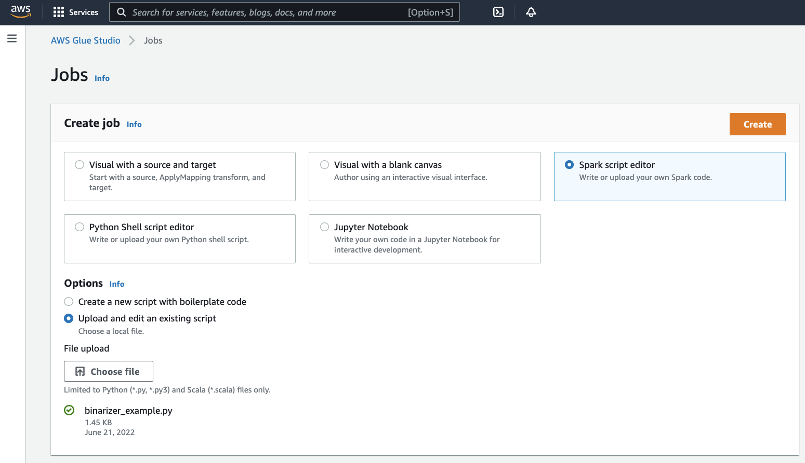
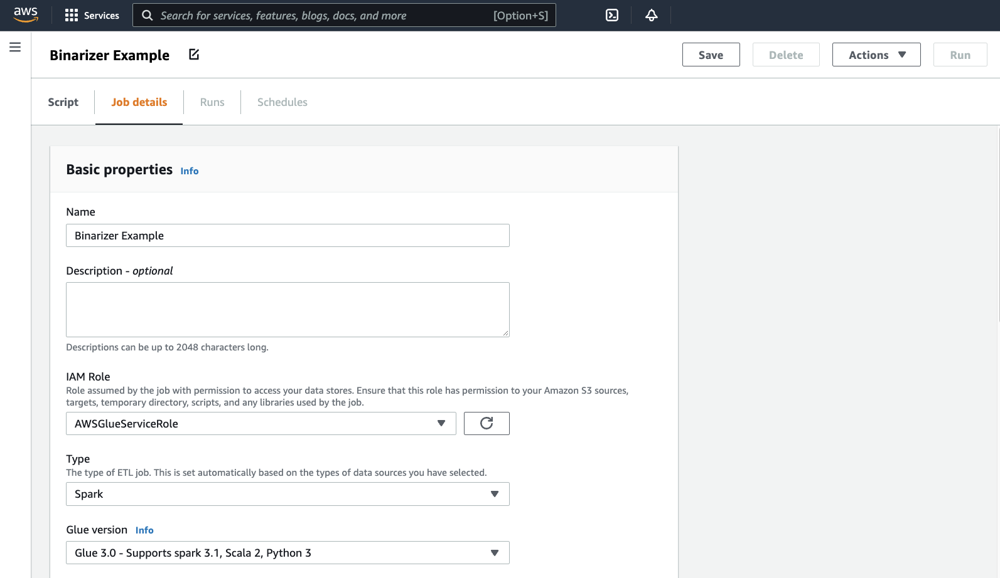
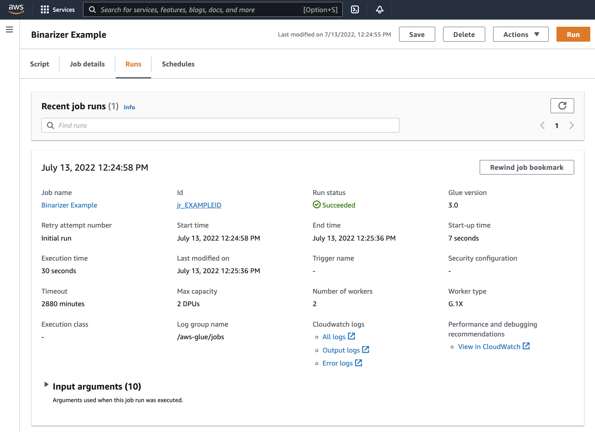
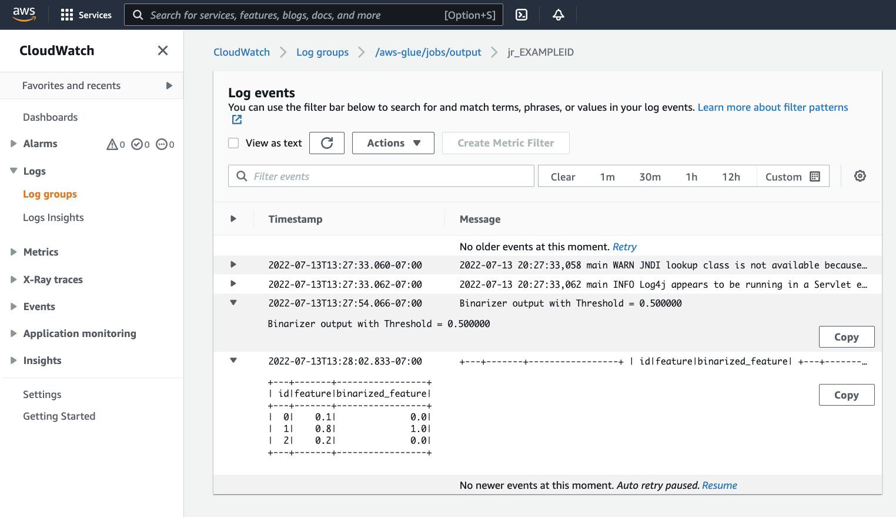

# Migrate Apache Spark programs to AWS Glue

Apache Spark is an open-source platform for distributed computing workloads performed on large datasets. AWS Glue
leverages Spark's capabilities to provide an optimized experience for ETL. You can migrate Spark programs to
AWS Glue to take advantage of our features. AWS Glue provides the same performance enhancements you would expect from
Apache Spark on Amazon EMR.

## Run Spark code

Native Spark code can be run in a AWS Glue environment out of the box. Scripts are often developed by
iteratively changing a piece of code, a workflow suited for an Interactive Session. However, existing code
is more suited to run in a AWS Glue job, which allows you to schedule and consistently get logs and metrics for
each script run. You can upload and edit an existing script through the console.

1. Acquire the source to your script. For this example, you will use an example script from the Apache Spark repository.
   [Binarizer Example](https://github.com/apache/spark/blob/master/examples/src/main/python/ml/binarizer_example.py "https://github.com/apache/spark/blob/master/examples/src/main/python/ml/binarizer_example.py")
2. In the AWS Glue Console, expand the left-side navigation pane and select **ETL** > **Jobs**

In the **Create job** panel, select **Spark script editor**. An
**Options** section will appear. Under **Options**, select
**Upload and edit an existing script**.

A **File upload** section will appear. Under **File upload**,
click **Choose file**. Your system file chooser will appear. Navigate to the location where you saved
`binarizer_example.py`, select it and confirm your selection.

A **Create** button will appear on the header for the **Create job** panel. Click it.

 3. Your browser will navigate to the script editor. On the header, click the **Job
details** tab. Set the **Name** and **IAM Role**. For
guidance around AWS Glue IAM roles, consult [Setting up IAM permissions for AWS Glue](set-up-iam.md "set-up-iam.md").

Optionally - set **Requested number of workers** to `2` and
**Number of retries** to `1`. These options are valuable when running
production jobs, but turning them down will streamline your experience while testing out a
feature.

In the title bar, click **Save**, then **Run**

 4. Navigate to the **Runs** tab. You will see a panel corresponding to your job run.
Wait a few minutes and the page should automatically refresh to show **Succeeded**
under **Run status**.

 5. You will want to examine your output to confirm that the Spark script ran as intended. This Apache
Spark sample script should write a string to the output stream. You can find that by navigating to
**Output logs** under **Cloudwatch logs** in the panel for the
successful job run. Note the job run id, a generated id under the **Id** label beginning with `jr_`.

This will open the CloudWatch console, set to visualize the contents of the default AWS Glue log
group `/aws-glue/jobs/output`, filtered to the contents of the log streams for the job
run id. Each worker will have generated a log stream, shown as rows under the **Log
streams** . One worker should have run the requested code. You will need to open all the
log streams to identify the correct worker. Once you find the right worker, you should see the output
of the script, as seen in the following image:



## Common procedures needed for migrating Spark programs

### Assess Spark version support

AWS Glue release versions define the version of Apache Spark and Python available to the AWS Glue job. You can
find our AWS Glue versions and what they support at [AWS Glue versions](release-notes.md#release-notes-versions "release-notes.md#release-notes-versions"). You may need
to update your Spark program to be compatible with a newer version of Spark in order to access certain
AWS Glue features.

### Include third-party libraries

Many existing Spark programs will have dependencies, both on private and public artifacts. AWS Glue
supports JAR style dependencies for Scala Jobs as well as Wheel and source pure-Python dependencies for Python jobs.

**Python** - For information about Python dependencies, see [Using Python libraries with AWS Glue](aws-glue-programming-python-libraries.md "aws-glue-programming-python-libraries.md")

Common Python dependencies are provided in the AWS Glue environment, including the commonly requested
[Pandas](https://pandas.pydata.org/ "https://pandas.pydata.org/") library. Dependencies are included in AWS Glue
Version 2.0+. For more information about provided modules, see [Python modules already provided in AWS Glue](aws-glue-programming-python-libraries.md#glue-modules-provided "aws-glue-programming-python-libraries.md#glue-modules-provided"). If you need to supply a Job with a different version of a
dependency included by default, you can use `--additional-python-modules`. For information about job arguments, see
[Using job parameters in AWS Glue jobs](aws-glue-programming-etl-glue-arguments.md "aws-glue-programming-etl-glue-arguments.md").

You can supply additional Python dependencies with the `--extra-py-files` job argument.
If you are migrating a job from a Spark program, this parameter is a good option because it is functionally equivalent to the `--py-files` flag in PySpark, and is subject to the
same limitations. For more information about the `--extra-py-files` parameter, see [Including Python files with PySpark native features](aws-glue-programming-python-libraries.md#extra-py-files-support "aws-glue-programming-python-libraries.md#extra-py-files-support")

For new jobs, you can manage Python dependencies with the `--additional-python-modules` job
argument. Using this argument allows for a more
thorough dependency management experience. This parameter supports Wheel style dependencies, including those with native code bindings compatible with Amazon Linux 2.

**Scala**

You can supply additional Scala dependencies with the `--extra-jars` Job Argument.
Dependencies must be hosted in Amazon S3 and the argument value should be a comma delimited list of Amazon S3
paths with no spaces. You may find it easier to manage your configuration by rebundling your
dependencies before hosting and configuring them. AWS Glue JAR dependencies contain Java bytecode, which
can be generated from any JVM language. You can use other JVM languages, such as Java, to write custom
dependencies.

### Manage data source credentials

Existing Spark programs may come with complex or custom configuration to pull data from their
datasources. Common datasource auth flows are supported by AWS Glue connections. For more information about
AWS Glue connections, see [Connecting to data](glue-connections.md "glue-connections.md").

AWS Glue connections facilitate connecting your Job
to a variety of types of data stores in two primary ways: through
method calls to our libraries and setting the **Additional
network connection** in the AWS console. You may also call the AWS SDK from within your job to retrieve information from
a connection.

**Method calls** – AWS Glue Connections are tightly integrated with the AWS Glue
Data Catalog, a service that allows you to curate information about your datasets, and the methods
available to interact with AWS Glue connections reflect that. If you have an existing auth configuration
you would like to reuse, for JDBC connections, you can access your AWS Glue connection configuration
through the `extract_jdbc_conf` method on the `GlueContext`. For more information, see [extract_jdbc_conf](aws-glue-api-crawler-pyspark-extensions-glue-context.md#aws-glue-api-crawler-pyspark-extensions-glue-context-extract_jdbc_conf "aws-glue-api-crawler-pyspark-extensions-glue-context.md#aws-glue-api-crawler-pyspark-extensions-glue-context-extract_jdbc_conf")

**Console configuration** – AWS Glue Jobs use associated AWS Glue connections to configure connections to Amazon VPC subnets. If you directly
manage your security materials, you may need to provide a `NETWORK` type **Additional
network connection** in the AWS console to configure routing. For more information about the AWS Glue
connection API, see [Connections API](aws-glue-api-catalog-connections.md "aws-glue-api-catalog-connections.md")

If your Spark programs has a custom or uncommon auth flow, you may need to manage your security
materials in a hands-on fashion. If AWS Glue connections do not seem like a good fit, you can securely host security materials in
Secrets Manager and access them through the boto3 or AWS SDK, which are provided in the job.

### Configure Apache Spark

Complex migrations often alter Spark configuration to acommodate their workloads. Modern versions of
Apache Spark allow runtime configuration to be set with the `SparkSession`. AWS Glue 3.0+ Jobs
are provided a `SparkSession`, which can be modified to set runtime configuration. [Apache Spark Configuration](https://spark.apache.org/docs/latest/configuration.html "https://spark.apache.org/docs/latest/configuration.html"). Tuning
Spark is complex, and AWS Glue does not guarantee support for setting all Spark configuration. if your migration
requires substantial Spark-level configuration, contact support.

### Set custom configuration

Migrated Spark programs may be designed to take custom configuration. AWS Glue allows configuration to be
set on the job and job run level, through the job arguments. For information about job arguments, see
[Using job parameters in AWS Glue jobs](aws-glue-programming-etl-glue-arguments.md "aws-glue-programming-etl-glue-arguments.md"). You can access job arguments within the
context of a job through our libraries. AWS Glue provides a utility function to provide a consistent view between arguments
set on the job and arguments set on the job run. See [Accessing
parameters using getResolvedOptions](aws-glue-api-crawler-pyspark-extensions-get-resolved-options.md "aws-glue-api-crawler-pyspark-extensions-get-resolved-options.md") in Python and [AWS Glue Scala GlueArgParser
APIs](glue-etl-scala-apis-glue-util-glueargparser.md "glue-etl-scala-apis-glue-util-glueargparser.md") in Scala.

### Migrate Java code

As explained in [Include third-party libraries](#glue-author-migrate-apache-spark-third-party-libraries "#glue-author-migrate-apache-spark-third-party-libraries"), your
dependencies can contain classes generated by JVM languages, such as Java or Scala. Your dependencies
can include a `main` method. You can use a `main` method in a dependency as
the entrypoint for a AWS Glue Scala job. This allows you to write your `main` method in Java,
or reuse a `main` method packaged to your own library standards.

To use a `main` method from a dependency, perform the following: Clear the contents of the
editing pane providing the default `GlueApp` object. Provide the fully qualified name of a
class in a dependency as a job argument with the key `--class`. You should then be able to
trigger a Job run.

You cannot configure the order or structure of the arguments AWS Glue passes to the `main`
method. If your existing code needs to read configuration set in AWS Glue, this will likely cause
incompatibility with prior code. If you use `getResolvedOptions`, you will also not have a
good place to call this method. Consider invoking your dependency directly from a main method generated
by AWS Glue. The following AWS Glue ETL script shows an example of this.

```
import com.amazonaws.services.glue.util.GlueArgParser

object GlueApp {
  def main(sysArgs: Array[String]) {
    val args = GlueArgParser.getResolvedOptions(sysArgs, Seq("JOB_NAME").toArray)

    // Invoke static method from JAR. Pass some sample arguments as a String[], one defined inline and one taken from the job arguments, using getResolvedOptions
    com.mycompany.myproject.MyClass.myStaticPublicMethod(Array("string parameter1", args("JOB_NAME")))

    // Alternatively, invoke a non-static public method.
    (new com.mycompany.myproject.MyClass).someMethod()
  }
}
```
