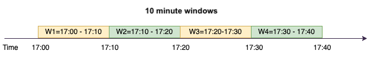
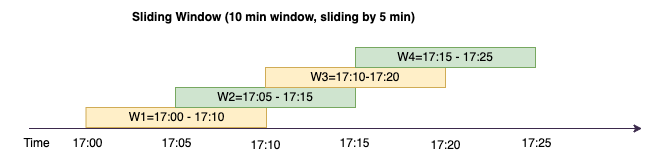
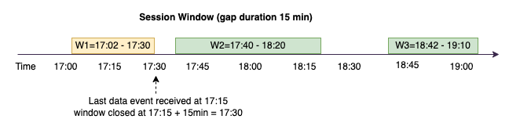
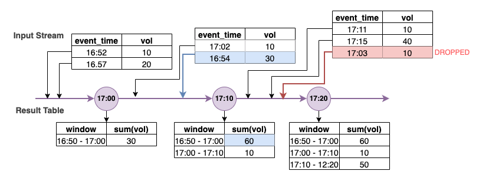

#

Advanced AWS Glue streaming concepts

In contemporary data-driven applications, the significance of data diminishes over time and its value
transitions from being predictive to reactive. As a result, customers want to process data in real-time for
making faster decisions. When dealing with real-time data feeds, such as from IoT sensors, the data may arrive
unordered or experience delays in processing due to network latency and other source-related failures during
ingestion. As part of the AWS Glue platform, AWS Glue Streaming builds on these
capabilities to provide scalable, serverless streaming ETL, powered by Apache Spark structured streaming,
empowering users with real-time data processing.

In this topic, we will explore advanced streaming concepts and capabilities of AWS Glue Streaming.

## Time considerations when processing streams

There are four notions of time when processing streams:



- **Event-time** – The time at which the event occurred. In most cases, this field is embedded into the event-data itself, at the source.
- **Event-time-window** – The time frame between two event-times.
  As shown in the above diagram, **W1** is an event-time-window from 17:00 to 17:10.
  Each event-time-window is a grouping of multiple events.
- **Trigger-time** – The trigger time controls how often the processing of data and updating of results occurs. This is the time when the micro-batch processing started.
- **Ingestion-time** – The time when the stream-data was ingested into
  the streaming service. If event-time is not embedded into the event itself, this time can be
  used for windowing in some cases.

## Windowing

Windowing is a technique where you group and aggregate multiple events by event-time-window.
We will explore the benefits of windowing and when you would use it in the
following examples.

Depending on the business use case, there are three types of time windows supported by spark.

- Tumbling window – a series of non-overlapping fixed size event-time-windows over which
  you aggregate.
- Sliding window – similar to the tumbling windows from the point of being “fixed-sized”,
  but windows can overlap or slide as long as the duration of slide is smaller than the duration of
  window itself.
- Session window – starts with an input data event and continues to expands itself as
  long as it receives input within a gap or duration of inactivity. A session window can have a
  static or dynamic size of the window length, depending on the inputs.

### Tumbling window

Tumbling window is a series of non-overlapping fixed size event-time-windows over which you aggregate.
Lets understand this with a real world example.


Company ABC Auto wants to do a marketing campaign for a new brand of sports car. They want to pick
a city where they have biggest sports car fans. To achieve this goal, they showcase a short 15
second advertisement introducing the car on their website. All the “clicks“ and the corresponding
”city“ are recorded and streamed to Amazon Kinesis Data Streams. We want to count the number of clicks in
a 10 minute window and group it by city to see which city has the highest demand. The following is the
output of the aggregation.

| window_start_time   | window_end_time     | city    | total_clicks |
| ------------------- | ------------------- | ------- | ------------ |
| 2023-07-10 17:00:00 | 2023-07-10 17:10:00 | Dallas  | 75           |
| 2023-07-10 17:00:00 | 2023-07-10 17:10:00 | Chicago | 10           |
| 2023-07-10 17:20:00 | 2023-07-10 17:30:00 | Dallas  | 20           |
| 2023-07-10 17:20:00 | 2023-07-10 17:30:00 | Chicago | 50           |

As explained above, these event-time-windows are different from trigger-time intervals.
For example, even if your trigger time is every minute, the output results will only show 10 minute
non-overlapping aggregation windows. For optimization, its better to have the trigger interval
aligned with the event-time-window.

In the table above, Dallas saw 75 clicks in the 17:00-17:10 window, while Chicago had 10 clicks.
Also, there is no data for the 17:10 - 17:20 window for any city, so this window is omitted.

Now you can run further analysis on this data in the downstream analytics
application to determine the most exclusive city to run the marketing campaign.

###### Using tumbling windows in AWS Glue

1. Create a Amazon Kinesis Data Streams DataFrame and read from it. Example:

```
parsed_df = kinesis_raw_df \
                .selectExpr('CAST(data AS STRING)') \
                .select(from_json("data", ticker_schema).alias("data")) \
                .select('data.event_time','data.ticker','data.trade','data.volume', 'data.price')

```

2. Process data in a tumbling window. In the example below, data is grouped based on the
   input field “event_time” in 10 minute tumbling windows and writing the output to an
   Amazon S3 data lake.

```
grouped_df = parsed_df \
                .groupBy(window("event_time", "10 minutes"), "city") \
                .agg(sum("clicks").alias("total_clicks"))

summary_df = grouped_df \
                .withColumn("window_start_time", col("window.start")) \
                .withColumn("window_end_time", col("window.end")) \
                .withColumn("year", year("window_start_time")) \
                .withColumn("month", month("window_start_time")) \
                .withColumn("day", dayofmonth("window_start_time")) \
                .withColumn("hour", hour("window_start_time")) \
                .withColumn("minute", minute("window_start_time")) \
                .drop("window")

write_result = summary_df \
                .writeStream \
                .format("parquet") \
                .trigger(processingTime="10 seconds") \
                .option("checkpointLocation", "s3a://bucket-stock-stream/stock-stream-catalog-job/checkpoint/") \
                .option("path", "s3a://bucket-stock-stream/stock-stream-catalog-job/summary_output/") \
                .partitionBy("year", "month", "day") \
                .start()

```

### Sliding window

Sliding windows are similar to the tumbling windows from the point of being “fixed-sized”, but
windows can overlap or slide as long as the duration of slide is smaller than the duration of
window itself. Due to the nature of sliding, an input can be bound to the multiple windows.



To better understand, lets consider the example of a bank that want to detect potential credit
card fraud. A streaming application could monitor a continuous stream of credit card transactions.
These transactions could be aggregated into windows of 10 minutes duration and every 5 minutes,
the window would slide forward, eliminating the oldest 5 minutes of data and adding the latest
5 minutes of new data. Within each window, the transactions could be grouped by country checking
for suspicious patterns, such as a transaction in the US immediately followed by another in Australia.
For simplicity, lets us categorize such transactions as fraud when the total transactions amount is
greater than $100. If such a pattern is detected, it signals potential fraud and the card could be
frozen.

The credit card processing system is sending a steam of transaction events to kinesis for each
card-id along with the country. An AWS Glue job runs the analysis and produces the
following aggregated output.

| window_start_time   | window_end_time     | card_last_four | country   | total_amount |
| ------------------- | ------------------- | -------------- | --------- | ------------ |
| 2023-07-10 17:00:00 | 2023-07-10 17:10:00 | 6544           | US        | 85           |
| 2023-07-10 17:00:00 | 2023-07-10 17:10:00 | 6544           | Australia | 10           |
| 2023-07-10 17:05:45 | 2023-07-10 17:15:45 | 6544           | US        | 50           |
| 2023-07-10 17:10:45 | 2023-07-10 17:20:45 | 6544           | US        | 50           |
| 2023-07-10 17:10:45 | 2023-07-10 17:20:45 | 6544           | Australia | 150          |

Based on the above aggregation, you can see the 10 minute window sliding every 5 minutes,summed by
transaction amount. The anomaly is detected in the 17:10 - 17:20 window where there is an outlier,
which is a transaction for $150 in Australia. AWS Glue can detect this anomaly and push
an alarm-event with the offending key to an SNS topic using boto3. Further a Lambda function can subscribe to this topic and take action.

#### Process data in a sliding window

The `group-by` clause and the window function is used to implement the sliding
window as shown below.

```
grouped_df = parsed_df \
            .groupBy(window(col("event_time"), "10 minute", "5 min"), "country", "card_last_four") \
            .agg(sum("tx_amount").alias("total_amount"))

```

### Session window

Unlike the above two windows that have a fixed-size, session window can have a static or
dynamic size of the window length, depending on the inputs. A session window starts with an
input data event and continues to expands itself as long as it receives input within a gap or
duration of inactivity.



Lets take an example. Company ABC hotel wants to find out when is the busiest time in a week
and provide better deals for their guests. As soon as a guest checks-in, a session window is
started and spark maintains a state with aggregation for that event-time-window. Every time a
guests checks in, an event is generated and sent to Amazon Kinesis Data Streams. The hotel makes a
decision that if there is no check-ins for a period of 15 minutes, the event-time-window can be
closed. The next event-time-window will start again when there is a new check-in. The output looks
as follows.

| window_start_time   | window_end_time     | city    | total_checkins |
| ------------------- | ------------------- | ------- | -------------- |
| 2023-07-10 17:02:00 | 2023-07-10 17:30:00 | Dallas  | 50             |
| 2023-07-10 17:02:00 | 2023-07-10 17:30:00 | Chicago | 25             |
| 2023-07-10 17:40:00 | 2023-07-10 18:20:00 | Dallas  | 75             |
| 2023-07-10 18:50:45 | 2023-07-10 19:15:45 | Dallas  | 20             |

The first check-in occurred at event_time=17:02. The aggregation event-time-window will
start at 17:02. This aggregation will continue as long as we receive events within 15 minute duration.
In the above example, the last event we received was at 17:15 and then for the next 15 minutes there
were no events. As a result, Spark closed that event-time-window at 17:15+15min = 17:30 and set it
as 17:02 - 17:30. It started a new event-time-window at 17:47 when it received a new check-in data
event.

#### Process data in a session window

The `group-by` clause and the window function is used to implement the sliding window.

```
grouped_df = parsed_df \
            .groupBy(session_window(col("event_time"), "10 minute"), "city") \
            .agg(count("check_in").alias("total_checkins"))

```

### Output modes

Output mode is the mode in which the results from the unbounded table are written to the external sink.
There are three modes available. In the following example you are counting occurrences of a word as
lines of data are being streamed and processed in each micro batch.

- **Complete mode** – The whole result table will be written to the
  sink after every micro batch processing even though the word count was not updated in the
  current event-time-window.
- **Append mode** – This is the default mode, where only the new words
  and or rows added to the result table since the last trigger will be written to the sink.
  This mode is good for stateless streaming for queries like map, flatMap, filter, etc.
- **Update mode** – Only the words and or rows in the Result Table that
  were updated or added since the last trigger will be written to the sink.

###### Note

Output mode = "update" is not supported for session windows.

## Handling late data and watermarks

When working with real-time data there could be delays in the arrival of data due to network latency
and upstream failures and we need a mechanism to perform the aggregation again on the missed
event-time-window. However, to do this, state needs to be maintained. At the same time,
the older data needs to be cleaned up to limit the size of the state. Spark version 2.1 added
support for a feature called watermarking which maintains state and allows the user to specify
the threshold for late data.

With reference to our stock ticker example above, lets consider the allowed threshold for the late data as
no more than 10 minutes. To keep it simple we will assume tumbling window, ticker as AMZ, trade as BUY.



In the above diagram, we are calculating the total volume over a tumbling 10 minute window.
We have the trigger at 17:00, 17:10 and 17:20. Above the timeline arrow, we have the input data
stream and below is the unbounded results table.

In the first 10 minute tumbling window we aggregated based on event_time and the total_volume was
calculated as 30. In the second event-time-window, spark got the first data event with event_time=17:02.
Since this is the max event_time seen thus far by spark, the watermark threshold is set 10 minutes back
(that is, watermark_event_time=16:52). Any data event with an event_time after 16:52 will be considered
for time bound aggregation and any data event before that will be dropped. This allows spark to maintain
an intermediate state for additional 10 minutes to accommodate late data. Around wall clock time 17:08
Spark received an event with an event_time=16:54 which was within threshold. Hence spark recalculated the
“16:50 - 17:00“ event-time-window and the total volume was updated from 30 to 60.

However, at the trigger time 17:20, when spark received event with event_time=17:15 it set the
watermark_event_time=17:05. Hence the late data event with event_time=17:03 was considered “too late”
and ignored.

```
Watermark Boundary = Max(Event Time) - Watermark Threshold
```

### Using watermarks in AWS Glue

Spark will not emit or write the data to the external sink until the watermark boundary is passed.
To implement a watermark in AWS Glue, see the example below.

```
grouped_df = parsed_df \
                .withWatermark("event_time", "10 minutes") \
                .groupBy(window("event_time", "5 minutes"), "ticker") \
                .agg(sum("volume").alias("total_volume"))

```
