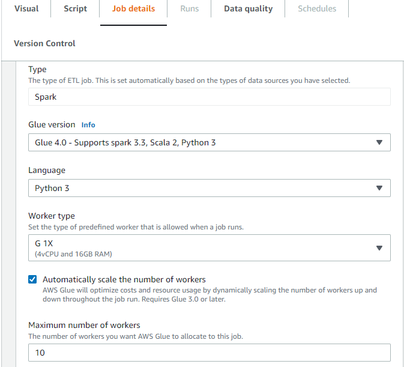
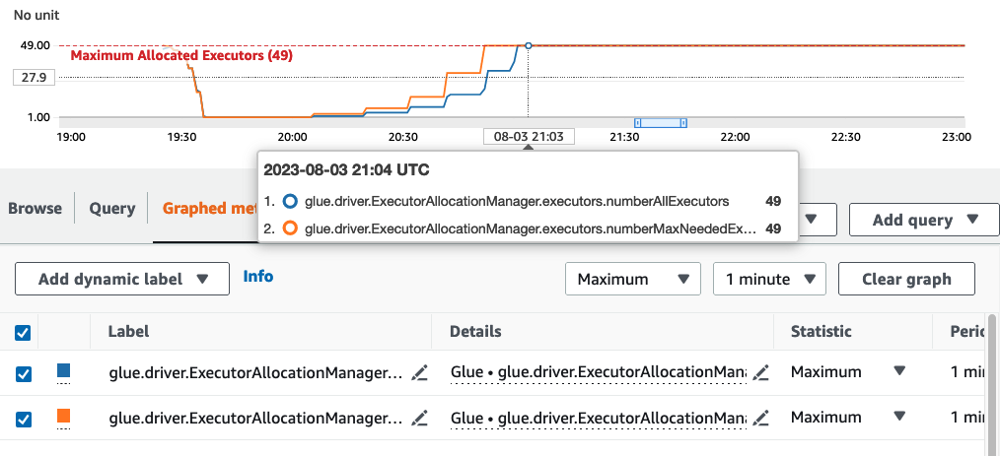
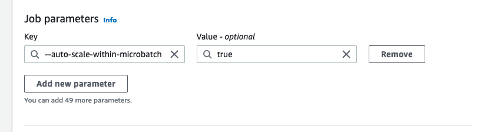

# AWS Glue streaming autoscaling

AWS Glue streaming ETL jobs continuously consume data from streaming sources, clean and transform the data in-flight, and make it available for analysis. By monitoring each stage of the job run, AWS Glue autoscaling can turn off workers when they are idle or add workers if additional parallel processing is possible.

The following sections provide information on AWS Glue streaming autoscaling

## Enabling Auto Scaling in

AWS Glue Studio

On the **Job details** tab in AWS Glue Studio, choose the
type as **Spark** or **Spark Streaming**, and
**Glue version** as `Glue 3.0` or
`Glue 4.0`. Then a check box will show up below
**Worker type**.

- Select the **Automatically scale the number of workers**
  option.
- Set the **Maximum number of workers** to define the maximum
  number of workers that can be vended to the job run.



## Enabling Auto Scaling with the AWS CLI

or SDK

To enable Auto Scaling From the AWS CLI for your job run, run
`start-job-run` with the following configuration:

```
{
    "JobName": "<your job name>",
    "Arguments": {
        "--enable-auto-scaling": "true"
    },
    "WorkerType": "G.2X", // G.1X, G.2X, G.4X, G.8X, G.12X, G.16X, R.1X, R.2X, R.4X, and R.8X are supported for Auto Scaling Jobs
    "NumberOfWorkers": 20, // represents Maximum number of workers
    ...other job run configurations...
}
```

Once at ETL job run is finished, you can also call `get-job-run` to check
the actual resource usage of the job run in DPU-seconds. Note: the new field
**DPUSeconds** will only show up for your batch jobs on AWS Glue 3.0
or later enabled with Auto Scaling. This field is not supported for streaming
jobs.

```
$ aws glue get-job-run --job-name your-job-name --run-id jr_xx --endpoint https://glue.us-east-1.amazonaws.com --region us-east-1
{
    "JobRun": {
        ...
        "GlueVersion": "3.0",
        "DPUSeconds": 386.0
    }
}
```

You can also configure job runs with Auto Scaling using the [AWS Glue
SDK](../webapi/API_StartJobRun.md "../webapi/API_StartJobRun.md") with the same configuration.

## How it works

**Scaling across microbatch**

The following example is used to describe how autoscaling works.

- You have a AWS Glue job that starts with 50 DPUs.
- Autoscaling is enabled.

In this example, AWS Glue looks at the “batchProcessingTimeInMs“ metric for a few micro
batches and determines if your jobs are completing within the window size that you have established.
If your jobs are completing sooner and depending on how soon they complete, AWS Glue
may scale down. This metric, plotted with ”numberAllExecutors“ can be monitored in Amazon CloudWatch
to see how autoscaling works.

The number of executors exponentially scales up or down only after each micro batch completes.
As you can see from the Amazon CloudWatch Monitoring log, AWS Glue looks at the
number of needed executors (Orange Line) and scales the executors (blue line) to match that
automatically.



Once AWS Glue scales down the number of executors and observes that data volumes increase,
consequently increasing the micro batch processing time, AWS Glue will scale up to 50 DPUs,
which is the specified upper limit.

**Scaling within microbatch**

In the above example, the system monitors a few completed micro-batches to make a decision on
whether to scale up or down. Longer windows require autoscaling to respond more quickly within the
microbatch, rather than waiting for a few micro batches. For these cases, you can use an additional
configuration `--auto-scaIe-within-microbatch` to `true`. You can add this to
the AWS Glue job properties in AWS Glue Studio as shown below.


