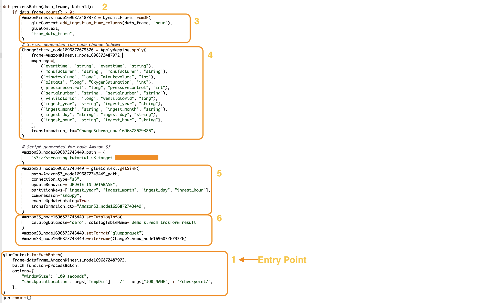

# AWS Glue Streaming concepts

The following sections provide information on concepts of AWS Glue Streaming.

###### Topics

- [Anatomy of a AWS Glue streaming job](#glue-streaming-anatomy "#glue-streaming-anatomy")

##

Anatomy of a AWS Glue streaming job

AWS Glue streaming jobs operate on the Spark streaming paradigm and leverage structured
streaming from the Spark framework. Streaming jobs constantly poll on the streaming data source,
at a specific interval of time, to fetch records as micro batches. The following sections examine the
different parts of a AWS Glue streaming job.



### forEachBatch

The `forEachBatch` method is the entry point of a AWS Glue streaming job run.
AWS Glue streaming jobs uses the `forEachBatch` method to poll data functioning
like an iterator that remains active during the lifecycle of the streaming job
and regularly polls the streaming source for new data and processes the latest data in micro batches.

```
glueContext.forEachBatch(
    frame=dataFrame_AmazonKinesis_node1696872487972,
    batch_function=processBatch,
    options={
        "windowSize": "100 seconds",
        "checkpointLocation": args["TempDir"] + "/" + args["JOB_NAME"] + "/checkpoint/",
    },
)

```

Configure the `frame` property of `forEachBatch` to specify a streaming source.
In this example, the source node that you created in the blank canvas during job creation is populated
with the default DataFrame of the job. Set the `batch_function` property as the
`function` that you decide to invoke for each micro batch operation. You must define a
function to handle the batch transformation on the incoming data.

### Source

In the first step of the `processBatch` function, the program verifies the record count of
the DataFrame that you defined as frame property of `forEachBatch`. The program
appends an ingestion time stamp to a non-empty DataFrame. The `data_frame.count()>0` clause
determines whether the latest micro batch is not empty and is ready for further processing.

```
def processBatch(data_frame, batchId):
    if data_frame.count() >0:
        AmazonKinesis_node1696872487972 = DynamicFrame.fromDF(
            glueContext.add_ingestion_time_columns(data_frame, "hour"),
            glueContext,
            "from_data_frame",
        )

```

### Mapping

The next section of the program is to apply mapping. The `Mapping.apply` method on a
spark DataFrame allows you to define transformation rule around data elements. Typically you can rename,
change the data type, or apply a custom function on the source data column and map those to the
target columns.

```

    #Script generated for node ChangeSchema
    ChangeSchema_node16986872679326 = ApplyMapping.apply(
        frame =  AmazonKinesis_node1696872487972,
        mappings = [
            ("eventtime", "string", "eventtime", "string"),
            ("manufacturer", "string", "manufacturer", "string"),
            ("minutevolume", "long", "minutevolume", "int"),
            ("o2stats", "long", "OxygenSaturation", "int"),
            ("pressurecontrol", "long", "pressurecontrol", "int"),
            ("serialnumber", "string", "serialnumber", "string"),
            ("ventilatorid", "long", "ventilatorid", "long"),
            ("ingest_year", "string", "ingest_year", "string"),
            ("ingest_month", "string", "ingest_month", "string"),
            ("ingest_day", "string", "ingest_day", "string"),
            ("ingest_hour", "string", "ingest_hour", "string"),
        ],
        transformation_ctx="ChangeSchema_node16986872679326",
    )
        )

```

### Sink

In this section, the incoming data set from the streaming source are stored at a target location.
In this example we will write the data to an Amazon S3 location. The `AmazonS3_node_path` property
details is pre-populated as determined by the settings you used during job creation from the canvas.
You can set the `updateBehavior` based on your use case and decide to either Not update
the data catalog table, or Create data catalog and update data catalog schema on subsequent runs, or
create a catalog table and not update the schema definition on subsequent runs.

The `partitionKeys` property defines the storage partition option. The default behavior
is to partition the data per the `ingestion_time_columns` that was made available in the
source section. The `compression` property allows you to set the compression algorithm
to be applied during target write. You have options to set Snappy, LZO, or GZIP as the compression
technique. The `enableUpdateCatalog` property controls whether the AWS Glue
catalog table needs to be updated. Available options for this property are `True` or
`False`.

```

    #Script generated for node Amazon S3
    AmazonS3_node1696872743449 = glueContext.getSink(
        path =  AmazonS3_node1696872743449_path,
        connection_type = "s3",
        updateBehavior = "UPDATE_IN_DATABASE",
        partitionKeys = ["ingest_year", "ingest_month", "ingest_day", "ingest_hour"],
        compression = "snappy",
        enableUpdateCatalog = True,
        transformation_ctx = "AmazonS3_node1696872743449",
    )


```

### AWS Glue Catalog sink

This section of the job controls the AWS Glue catalog table update behavior.
Set `catalogDatabase` and `catalogTableName` property per your AWS Glue
Catalog database name and the table name associated with the AWS Glue job that you are
designing. You can define the file format of the target data via the `setFormat` property.
For this example we will store the data in parquet format.

Once you set up and run the AWS Glue streaming job referring this tutorial, the streaming
data produced at Amazon Kinesis Data Streams will be stored at the Amazon S3 location in a parquet format with
snappy compression. On successful runs of the streaming job you will able to query the data through
Amazon Athena.

```

    AmazonS3_node1696872743449 = setCatalogInfo(
        catalogDatabase =  "demo", catalogTableName = "demo_stream_transform_result"
    )
    AmazonS3_node1696872743449.setFormat("glueparquet")
    AmazonS3_node1696872743449.writeFormat("ChangeSchema_node16986872679326")
    )


```
