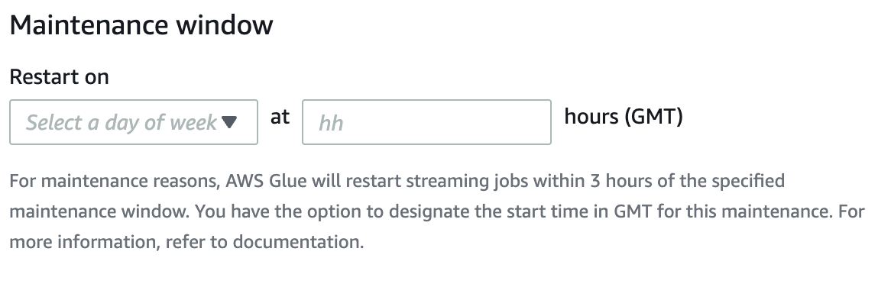
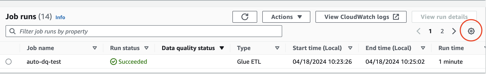
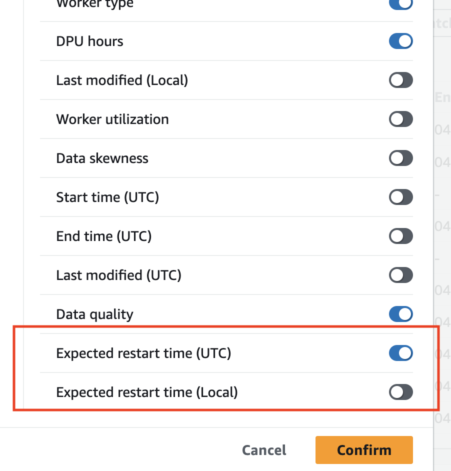
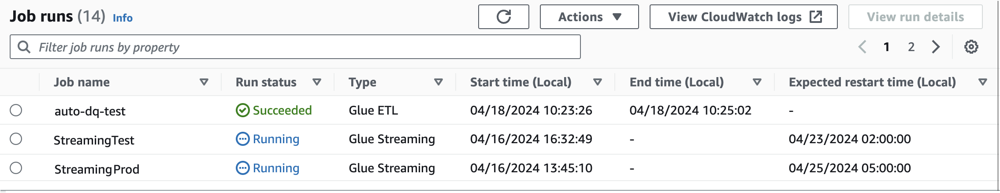

# Maintenance windows for AWS Glue Streaming

AWS Glue periodically performs maintenance activities. During these maintenance windows, AWS Glue will need to restart your streaming jobs. You can control when the jobs are restarted by specifying maintenance windows. In this section, we outline where you can setup the maintenance window and specific behaviors you should consider.

###### Topics

- [Setting up a maintenance window](#glue-streaming-maintenance-setup "#glue-streaming-maintenance-setup")
- [Maintenance window behavior](#glue-streaming-maintenance-behavior "#glue-streaming-maintenance-behavior")
- [Job monitoring](#glue-streaming-maintenance-job-monitoring "#glue-streaming-maintenance-job-monitoring")
- [Data loss handling](#glue-streaming-maintenance-data-loss-handling "#glue-streaming-maintenance-data-loss-handling")

## Setting up a maintenance window

You can set up a maintenance window using AWS Glue Studio or APIs.

### Setting up a maintenance windows in AWS Glue Studio

You can specify a maintenance window in the **Job Details** page of your AWS Glue Streaming job. You can specify the day and time in GMT. AWS Glue will restart your job within the specified time window.



### Setting up a maintenance windows in the API

You can alternatively set up the maintenance window in the Create Job API. Here is an example of configuring a maintenance windows via the API.

```
aws glue create-job —name jobName —role roleArnForTheJob —command Name=gluestreaming,ScriptLocation=s3-path-to-the-script --maintenance-window="Sun:10"
```

An example command is as follows:

```
aws glue create-job —name testMaintenance —role arn:aws:iam::012345678901:role/Glue_DefaultRole —command Name=gluestreaming,ScriptLocation=s3://glue-example-test/example.py **—maintenance-window="Sun:10**
```

## Maintenance window behavior

AWS Glue goes through a series of steps to decide when to restart a job:

1. When a new streaming job is initiated, AWS Glue first checks if there is a timeout associated with the job run. A timeout allows you to configure the end time of the job. If the timeout is less than 7 days, then the job will not be restarted.
2. If the timeout is greater than 7 days, then AWS Glue checks if the maintenance window is configured for the job. If it is then that window is picked up and the window gets assigned to the job run. AWS Glue will restart the job within 3 hours of the specified maintenance window. For instance, if you set up the maintenance window for Monday at 10:00AM GMT, your jobs will be restarted between 10:00AM GMT to 1:00PM GMT.
3. If the maintenance window is not configured, AWS Glue automatically sets the restart time to 7 days past job run initiation time. For instance, if you initiated your job on 7/1/2024 12:00AM GMT and you did not specify maintenance windows, your job will be set to restart on 7/8/2024 at 12:00 AM GMT.

###### Note

If you are already running streaming jobs, this change will impact you starting July 1, 2024. You will have time until June 30th to configure your maintenance windows. After July 1st, any streaming jobs that you start will be restarted per this documentation. If you require any additional support, you can reach out to AWS Support. 4. Sometimes, AWS Glue may not be able to restart the job, especially when the ongoing micro-batch is not processed. In these instances, the job will not be interrupted. In these instances, AWS Glue will restart the job after 14 days, and in this case, the maintenance window is not honored.

## Job monitoring

You can monitor the jobs in the AWS Glue Studio **Monitoring** page.

To see the expected next restart time of streaming jobs, show the column on the Job runs table on the **Monitoring** page.

1. Click the Gear icon in the top right of the table.

 2. Scroll down, and turn on the **Expected restart time** column. Both UTC and Local time options are available.

 3. You can then view the columns in the table.



The original job will have an "EXPIRED" status and the new job instance will have a "RUNNING" status. The new job run that was restarted will have a job run ID as a concatenation of initial job run ID plus the prefix "restart\_" representing the restart count. For example, if the initial job run ID is `jr_1234`, then the restarted job run will have the ID `jr1234_restart_1` for the first restart. The second restart will be `jr1234_restart_2` for the second restart and so on.

Your retry attempt will not be impacted because of the restarts. If a run fails and a new run is started due to an automatic retry, the counter of restart will start from 1 again . For example, if a run fails at `jr_1234_attempt_3_restart_5`, then an automatic retry will start new run with ID: `jr_id1_attempt_4` and when this attempt is restarted after 7 days, the new run ID will be `jr_id1_attempt_4_restart_1`.

## Data loss handling

During maintenance restarts, AWS Glue Streaming follows a process that ensures data integrity and consistency between the previous job run and the restarted job run. Note that AWS Glue does not guarantee data integrity and consistency between job restarts and we recommend architecture considerations to handle duplicated data within streaming jobs.

1. Detecting maintenance restart conditions: AWS Glue Streaming monitors conditions that indicate when a maintenance restart should be triggered, such as when a maintenance window is reached after 7 days or a hard restart is necessary after 14 days.
2. Invoking a graceful termination: When the maintenance restart conditions are met, AWS Glue Streaming initiates a graceful termination process for the currently running job. This process involves the following steps:
   1. Stopping the ingestion of new data: The streaming job stops consuming new data from the input sources (for example, Kafka topics, Kinesis streams, or files).
   2. Processing pending data: The job continues to process any data that is already present in its internal buffers or queues.
   3. Committing offsets and checkpoints: The job commits the latest offsets or checkpoints to external systems (for example, Kafka, Kinesis, or Amazon S3) to ensure that the restarted job can pick up from where the previous job left off.

3. Restarting the job: After the graceful termination process is complete, AWS Glue Streaming restarts the job using the preserved state and checkpoints. The restarted job picks up processing from the last committed offset or checkpoint, ensuring that no data is lost or duplicated.
4. Resuming data processing: The restarted job resumes data processing from the point where the previous job left off. It continues ingesting new data from the input sources, starting from the last committed offset or checkpoint, and processes the data according to the defined ETL logic.
