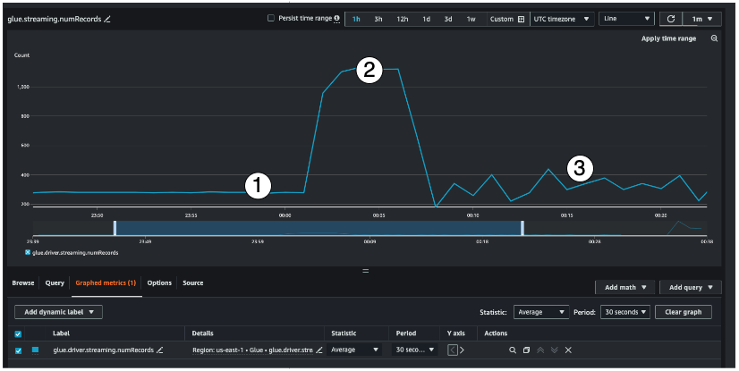
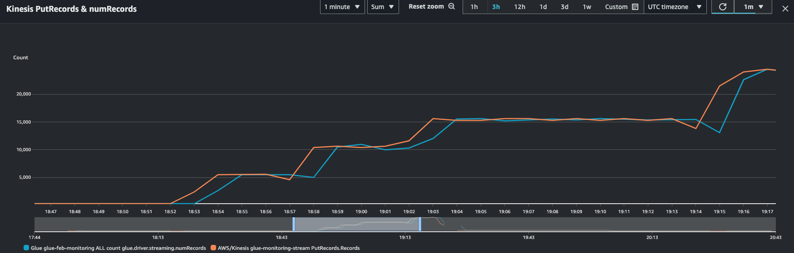
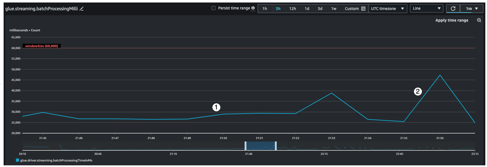
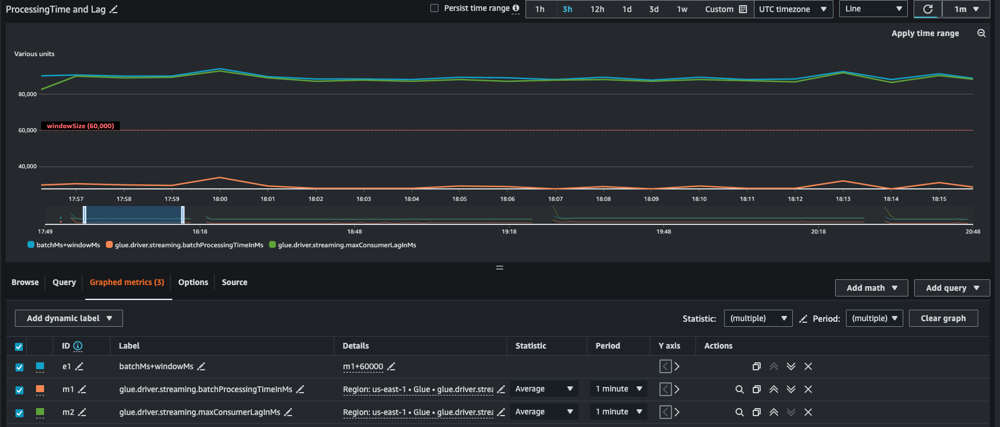
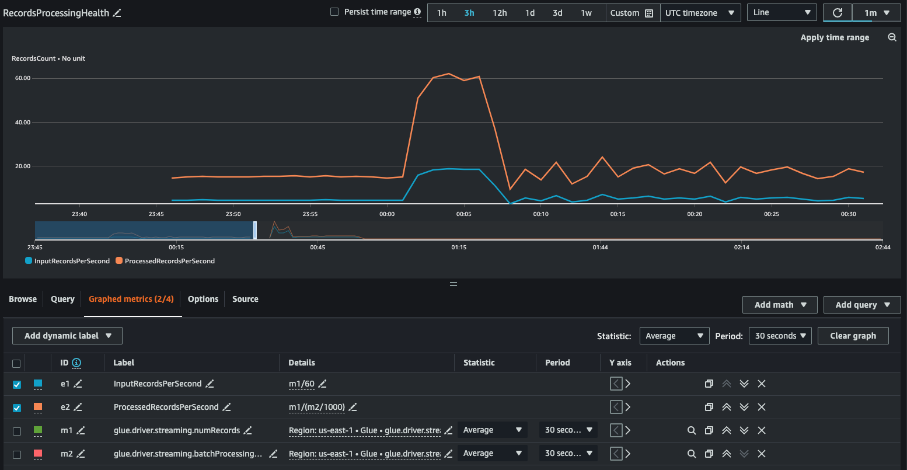
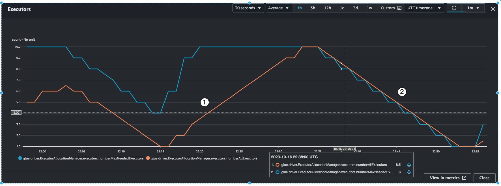

# Using AWS Glue streaming metrics

This section describes each of the metrics and how they co-relate with each other.

## Number of records (metric: streaming.numRecords)

This metric indicates how many records are being processed.

This streaming metric provides visibility into the number of records you are processing in a window. Along with the number of records being processed, it will also help you understand the behavior of the input traffic.

- Indicator #1 shows an example of stable traffic without any bursts. Typically this will be applications like IoT sensors that are collecting data at regular intervals and sending it to the streaming source.
- Indicator #2 shows an example of a sudden burst in traffic on an otherwise stable load. This could happen in a clickstream application when there is a marketing event like Black Friday and there is a burst in the number of clicks
- Indicator #3 shows an example of unpredictable traffic. Unpredictable traffic doesn't mean there is a problem. It is just the nature of the input data. Going back to the IoT sensor example, you can think of hundreds of sensors that are sending weather change events to the streaming source. As the weather change is not predictable, neither is the data. Understanding the traffic pattern is key to sizing your executors. If the input is very spiky, you may consider using autoscaling (more on that later).

You can combine this metric with the Kinesis PutRecords metric to make sure the number of events being ingested and the number of records being read are nearly the same. This is especially useful when you are trying to understand lag. As the ingestion rate increases, so do the `numRecords` read by AWS Glue.

## Batch processing time (metric: streaming.batchProcessingTimeInMs)

The batch processing time metric helps you determine if the cluster is underprovisioned or overprovisioned.

This metric indicates the number of milliseconds that it took to process each micro-batch of records. The main goal here is to monitor this time to make sure it less than the `windowSize` interval. It is okay if the `batchProcessingTimeInMs` goes over temporarily as long as it recovers in the following window interval. Indicator #1 shows a more or less stable time taken to process the job. However if the number of input records are increasing, the time it takes to process the job will increase as well as shown by indicator #2. If the `numRecords` is not going up, but the processing time is going up, then you would need to take a deeper look into the job processing on the executors. It is a good practice to set a threshold and alarm to make sure the `batchProcessingTimeInMs` doesn't stay over 120% for more than 10 minutes. For more information on setting alarms, see [Using Amazon CloudWatch alarms](../../../AmazonCloudWatch/latest/monitoring/AlarmThatSendsEmail.md "../../../AmazonCloudWatch/latest/monitoring/AlarmThatSendsEmail.md").

## Consumer lag (metric: streaming.maxConsumerLagInMs)

The consumer lag metric helps you understand if there is a lag in processing events. If your lag is too high, then you could miss the processing SLA that your business depends on, even though you have a correct windowSize. You have to explicitly enable this metrics using the `emitConsumerLagMetrics` connection option. For more information, see [KinesisStreamingSourceOptions](../webapi/API_KinesisStreamingSourceOptions.md "../webapi/API_KinesisStreamingSourceOptions.md").

## Derived metrics

To gain deeper insights, you can create derived metrics to understand more about your streaming jobs in Amazon CloudWatch.

You can build a graph with derived metrics to decide if you need to use more DPUs. While autoscaling helps you do this automatically, you can use derived metrics to determine if autoscaling is working effectively.

- **InputRecordsPerSecond** indicates the rate at which you are getting input records. It is derived as follows: number of input records (glue.driver.streaming.numRecords)/ WindowSize.
- **ProcessingRecordsPerSecond** indicates the rate at which your records are being processed. It is derived as follows: number of input records (glue.driver.streaming.numRecords)/ batchProcessingTimeInMs.

If the input rate is higher than the processing rate, then you may need to add more capacity to process your job or increase the parallelism.

## Autoscaling metrics

When your input traffic is spiky, then you should consider enabling autoscaling and specify the max workers. With that you get two additional metrics, `numberAllExecutors` and `numberMaxNeededExecutors`.

- **numberAllExecutors** is the number of actively running job executors
- **numberMaxNeededExecutors** is the number of maximum (actively running and pending) job executors needed to satisfy the current load.

These two metrics will help you understand if your autoscaling is working correctly.

AWS Glue will monitor the `batchProcessingTimeInMs` metric over a few micro-batches and do one of two things. It will scale-out the executors, if `batchProcessingTimeInMs` is closer to the `windowSize`, or scale-in the executors, if `batchProcessingTimeInMs` is comparatively lower than `windowSize`. Also, it will use an algorithm for step-scaling the executors.

- indicator #1 shows you how the active executors scaled up to catch up with the max needed executors so as to process the load.
- indicator #2 shows you how the active executers scaled in since the `batchProcessingTimeInMs` was low.

You can use these metrics to monitor current executor-level parallelism and adjust the number of max workers in your auto-scaling configuration accordingly.
