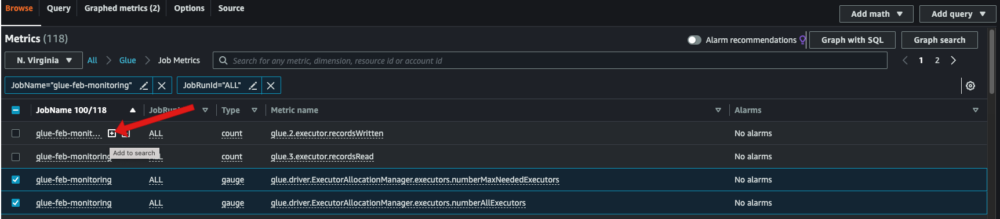
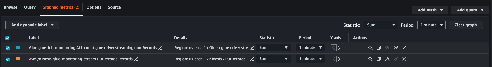
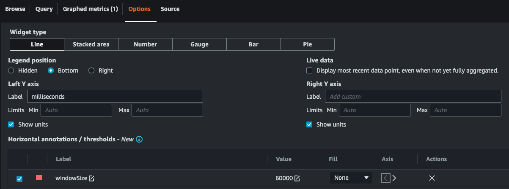
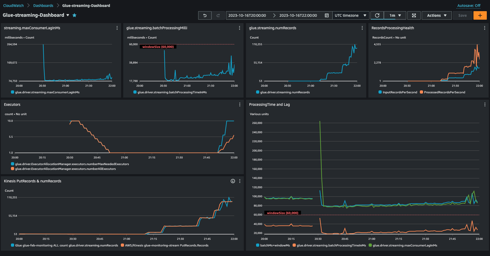

# Visualizing AWS Glue streaming metrics

To plot visual metrics:

1. Go to **Metrics** in the Amazon CloudWatch console and then choose the **Browse** tab. Then choose **Glue** under "Custom namespaces".

 2. Choose **Job Metrics** to show you the metrics for all your jobs. 3. Filter the metrics based on your JobName=glue-feb-monitoring and then JobRunId=ALL. You can click on the "+" sign as shown in the figure below to add it to the search filter. 4. Select the checkbox for the metrics that you are interested in. In the below figure we have selected `numberAllExecutors` and `numberMaxNeededExecutors`.

 5. Once you have selected these metrics, you can go to the **Graphed metrics** tab and apply your statistics. 6. Since the metrics are emitted every min, you can apply the "average" over a minute for `batchProcessingTimeInMs` and `maxConsumerLagInMs`. For the `numRecords` you can apply the "sum" over every minute. 7. You can add a horizontal `windowSize` annotation to your graph using the **Options** tab.

 8. Once you have your metrics selected, create a dashboard and add it. Here is a sample dashboard.

