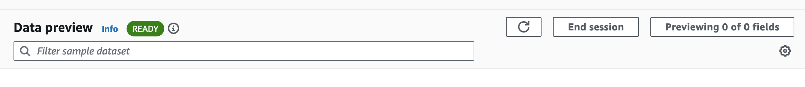
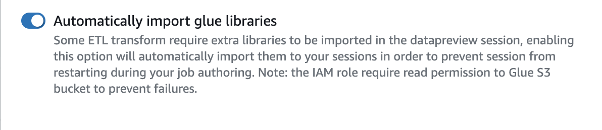
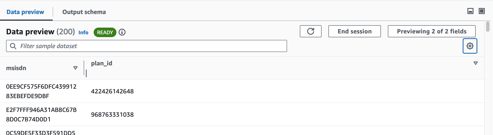
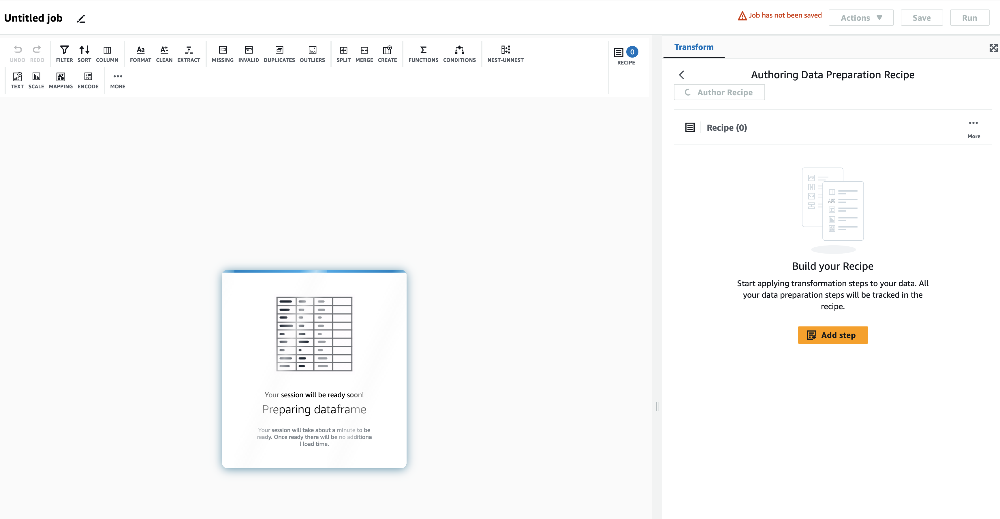
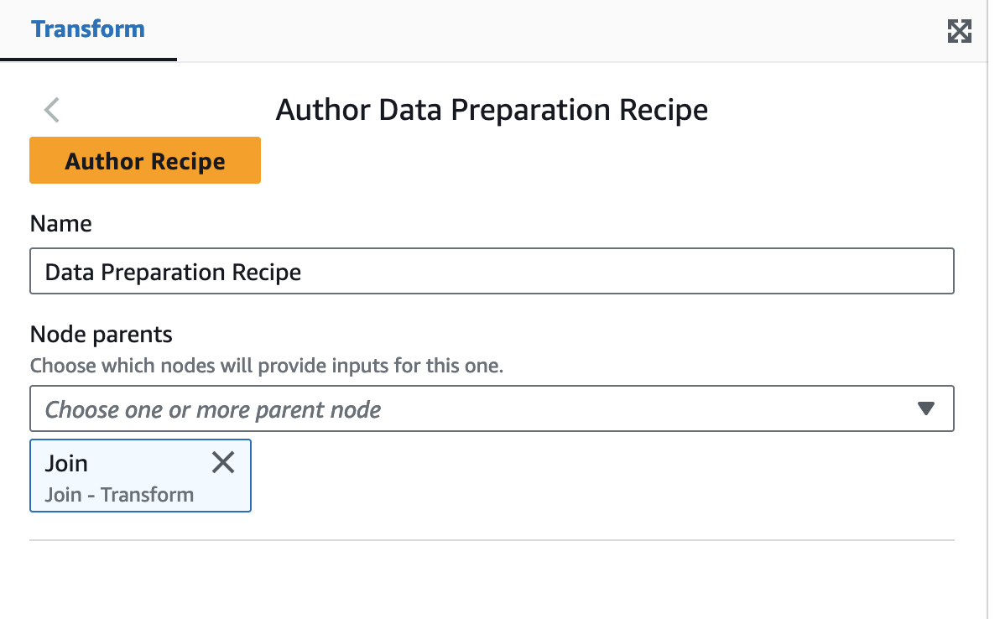
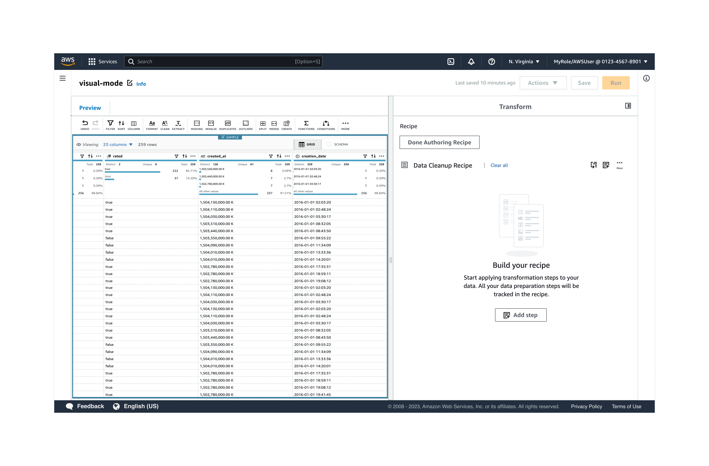
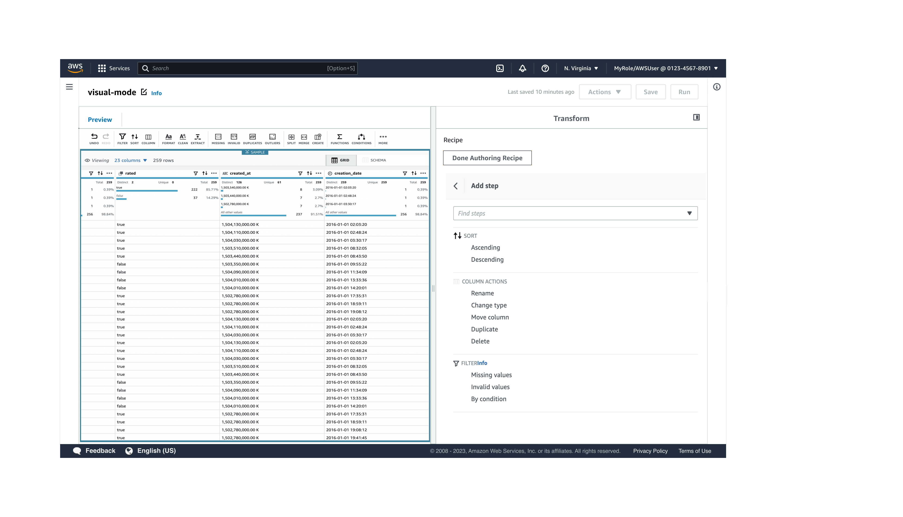
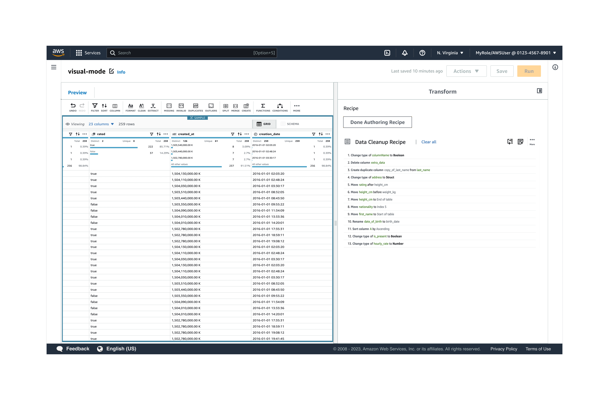
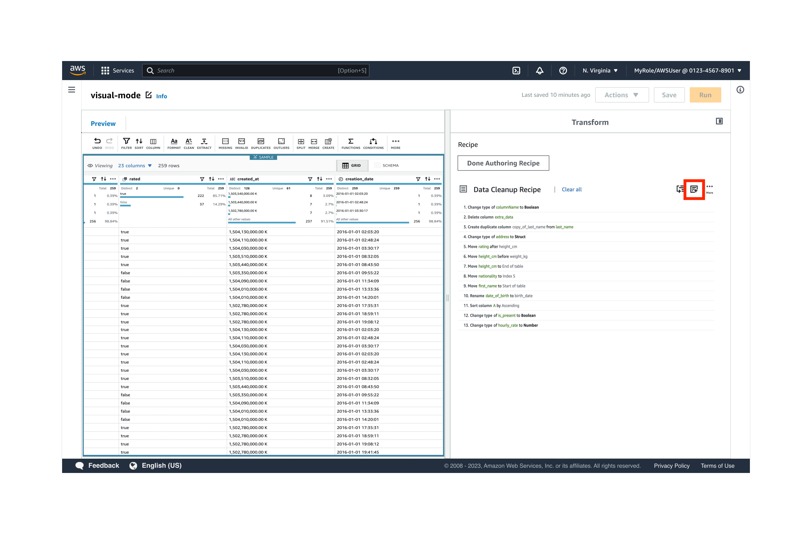

# Author and run data preparation recipes in a visual ETL AWS Glue job

In this scenario, you can author data preparation recipes without having to first create them in DataBrew. Before you can start
authoring recipes, you must:

- Have an active Data Preview session running. When the data preview session is READY, then
  **Author Recipe** will become active and you can begin authoring or editing your recipe.

- Ensure that the toggle for **Automatically import glue libraries** is enabled.

You can do this by choosing the gear icon in the Data Preview pane.

###### To author a data preparation recipe in AWS Glue Studio:

1. Add the **Data Preparation Recipe** transform to your job canvas. Your transform should be connected to
   a data source node parent. When adding the **Data Preparation Recipe** node, the node will restart
   with the proper libraries and you will see the Data Frame being prepared.

 2. Once the Data Preview session is ready, the data with any previously applied steps will appear on the bottom of the
screen. 3. Choose **Author Recipe**. This will allow you to start a new recipe in AWS Glue Studio.

 4. In the **Transform** panel to the right of the job canvas, enter a name for your
data preparation recipe. 5. On the left-side, the canvas will be replaced with a grid view of your data.
To the right, the **Transform** panel will change to show you your recipe steps. Choose
**Add step** to add the first step in your recipe.

 6. In the **Transform** panel,
choose to sort, take an action on the column, and filter values. For example, choose **Rename
column**.

 7. In the Transform panel on the right-side, options for renaming a column allow you to choose the source column to
rename, and to enter the new column name. Once you have done so, choose **Apply**.

You can preview each step, undo a step, and re-order steps and use any of the action icons,
such as Filter, Sort, Split, Merge, etc. When you perform actions in the data grid, the steps are added to
the recipe in the Transform panel.

If you need to make a change, you can do this in the Preview pane by previewing the result of each step,
undoing a step, and re-ordering steps. For example:

    * Undo/redo step – undo a step by choosing the **undo** icon. You can repeat a step
     by choosing the **redo** icon.

    
    * Reorder step – when you reorder a step, AWS Glue Studio will validate each step and let you know if the step
     is invalid.

8. Once you've applied a step, the Transform panel will show you all the steps in your recipe. You can
   clear all the steps to start over, add more steps by choosing the add icon, or choose
   **Done Authoring Recipe**.

 9. Choose **Save** at the top right side of your screen. Your recipe steps will not be saved until you
save your job.
