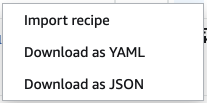

#

Using a data preparation recipe in AWS Glue Studio

The **Data preparation recipe** transform allows you to author a data preparation recipe from
scratch using an interactive grid style authoring interface. It also allows you to import an existing AWS Glue DataBrew
recipe and then edit it in AWS Glue Studio.

The **Data Preparation Recipe** node is available from the Resource panel.
You can connect the **Data Preparation Recipe** node to another node in the visual workflow, whether it
is a Data source node or another transformation node. After choosing a AWS Glue DataBrew recipe and version,
the applied steps in the recipe are visible in the node properties tab.

##

Prerequisites

- If importing an AWS Glue DataBrew recipe, you have the required IAM permissions as described in
  [Import a AWS Glue DataBrew recipe in AWS Glue Studio](glue-studio-data-preparation-import-recipe.md "glue-studio-data-preparation-import-recipe.md")
  .
- A data preview session must be created.

## Limitations

- AWS Glue DataBrew recipes are only supported in
  [commercial DataBrew regions](../../../general/latest/gr/databrew.md "../../../general/latest/gr/databrew.md").
- Not all AWS Glue DataBrew recipes are supported by AWS Glue. Some recipes will not be
  able to be run in AWS Glue Studio.
  - Recipes with `UNION` and `JOIN` transforms are not supported, however,
    AWS Glue Studio already has "Join" and "Union" transform nodes which can be used before or after a
    **Data Preparation Recipe** node.

- **Data Preparation Recipe** nodes are supported for jobs starting with AWS Glue version 4.0.
  This version will be auto-selected after a **Data Preparation Recipe** node is added to the job.
- **Data Preparation Recipe** nodes require Python. This is automatically set when the **Data Preparation Recipe**
  node is added to the job.
- Adding a new **Data Preparation Recipe** node to the visual graph will automatically
  restart your Data Preview session with the correct libraries to use the **Data Preparation Recipe**
  node.
- The following transforms are not supported for import or editing in a **Data Preparation Recipe** node:
  `GROUP_BY`, `PIVOT`, `UNPIVOT`, and `TRANSPOSE`.

## Additional features

When you've selected the **Data Preparation Recipe** transform, you have the ability to take additional
actions after choosing **Author recipe**.

- Add step – you can add additional steps to a recipe as needed by choosing the add step icon, or use the
  toolbar in the Preview pane by choosing an action.

- Import recipe – choose **More** then **Import recipe** to use in your
  AWS Glue Studio job.

- Download as YAML – choose **More** then **Download as YAML** to download
  your recipe to save outside of AWS Glue Studio.
- Download as JSON – choose **More** then **Download as JSON** to download
  your recipe to save outside of AWS Glue Studio.
- Undo and redo recipe steps – You can undo and redo recipe steps in the Preview pane when working with data
  in the grid.

