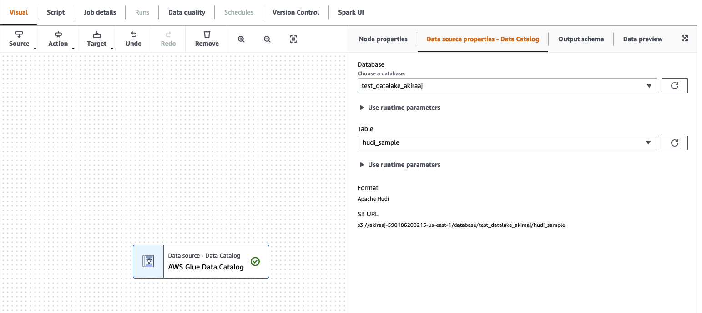
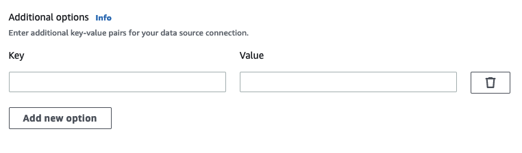
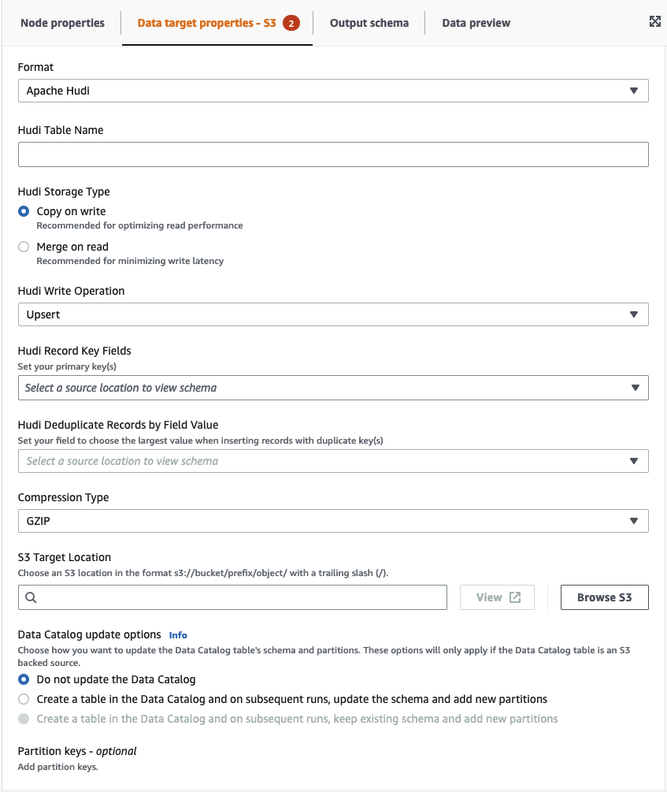

#

Using Hudi framework in AWS Glue Studio

When creating or editing a job, AWS Glue Studio automatically adds the corresponding Hudi
libraries for you depending on the version of AWS Glue you are using. For more information, see
[Using the Hudi framework in AWS Glue](aws-glue-programming-etl-format-hudi.md "aws-glue-programming-etl-format-hudi.md").

###

Using Apache Hudi framework in Data Catalog data sources

######

To add a Hudi data source format to a job:

1. From the Source menu, choose AWS Glue Studio Data Catalog.
2. In the **Data source properties** tab, choose a database and table.
3. AWS Glue Studio displays the format type as Apache Hudi and the Amazon S3 URL.

###

Using Hudi framework in Amazon S3 data sources

1. From the Source menu, choose Amazon S3.
2. If you choose Data Catalog table as the Amazon S3 source type, choose a database and table.
3. AWS Glue Studio displays the format as Apache Hudi and the Amazon S3 URL.
4. If you choose Amazon S3 location as the **Amazon S3 source type**, choose the Amazon S3 URL
   by clicking **Browse Amazon S3**.
5. In **Data format**, select Apache Hudi.

###### Note

If AWS Glue Studio is unable to infer the schema from the Amazon S3 folder or file you selected,
choose **Additional options** to select a new folder or file.

In **Additional options** choose from the following options under **Schema inference**:

    * Let AWS Glue Studio automatically choose a sample file — AWS Glue Studio will choose a sample file in the
     Amazon S3 location so that the schema can be inferred. In the **Auto-sampled file** field, you can
     view the file that was automatically selected.
    * Choose a sample file from Amazon S3 — choose the Amazon S3 file to use by clicking **Browse Amazon S3**.

6. Click **Infer schema**. You can then view the output schema by clicking on the **Output schema** tab.
7. Choose **Additional options** to enter a key-value pair.

##

Using Apache Hudi framework in data targets

###

Using Apache Hudi framework in Data Catalog data targets

1. From the **Target** menu, choose AWS Glue Studio Data Catalog.
2. In the **Data source properties** tab, choose a database and table.
3. AWS Glue Studio displays the format type as Apache Hudi and the Amazon S3 URL.

####

Using Apache Hudi framework in Amazon S3 data targets

Enter values or select from the available options to configure Apache Hudi format. For more information on Apache Hudi, see
[Apache Hudi documentation](https://hudi.apache.org/docs/overview "https://hudi.apache.org/docs/overview").

- **Hudi Table Name** — this is the name of your hudi table.
- **Hudi Storage Type** — choose from two options:
  - **Copy on write** — recommended for optimizing read performance. This is the default
    Hudi storage type. Each update creates a new version of files during a write.
  - **Merge on read** — recommended for minimizing write latency.
    Updates are logged to row-based delta files and are compacted as needed to create new versions of the columnar files.

- **Hudi Write Operation** - choose from the following options:
  - **Upsert** — this is the default operation where the input records are
    first tagged as inserts or updates by looking up the index. Recommended where you are updating existing data.
  - **Insert** — this inserts records but doesn't check for existing records and may
    result in duplicates.
  - **Bulk Insert** — this inserts records and is recommended for large amounts of data.

- **Hudi Record Key Fields** — use the search bar to search for and choose primary record keys.
  Records in Hudi are identified by a primary key which is a pair of record key and partition path where the record
  belongs to.
- **Hudi Precombine Field** — this is the field used in preCombining before actual write.
  When two records have the same key value, AWS Glue Studio will pick the one with the largest value for the
  precombine field.
  Set a field with incremental value (e.g. updated_at) belongs to.
- **Compression Type** — choose from one of the compression type options: Uncompressed, GZIP, LZO, or
  Snappy.
- **Amazon S3 Target Location** — choose the Amazon S3 target location by clicking **Browse S3**.
- **Data Catalog update options** — choose from the following options:
  - Do not update the Data Catalog: (Default) Choose this option if you don't want the job to update the
    Data Catalog, even if the schema changes or new partitions are added.
  - Create a table in the Data Catalog and on subsequent runs, update the schema and add new partitions: I
    f you choose this option, the job creates the table in the Data Catalog on the first run of the job.
    On subsequent job runs, the job updates the Data Catalog table if the schema changes or new partitions are added.

  You must also select a database from the Data Catalog and enter a table name.
  - Create a table in the Data Catalog and on subsequent runs, keep existing schema and add new partitions:
    If you choose this option, the job creates the table in the Data Catalog on the first run of the job.
    On subsequent job runs, the job updates the Data Catalog table only to add new partitions.

  You must also select a database from the Data Catalog and enter a table name.

- Partition keys: Choose which columns to use as partitioning keys in the output.
  To add more partition keys, choose Add a partition key.
- **Addtional options** — enter a key-value pair as needed.

##

Generating code through AWS Glue Studio

When the job is saved, the following job parameters are added to the job if a Hudi source or target are detected:

- `--datalake-formats` – a distinct list of data lake formats detected in the visual job
  (either directly by choosing a “Format” or indirectly by selecting a catalog table that is backed by a data lake).
- `--conf` – generated based on the value of `--datalake-formats`. For example, if
  the value for `--datalake-formats` is 'hudi', AWS Glue generates a value of
  `spark.serializer=org.apache.spark.serializer.KryoSerializer —conf spark.sql.hive.convertMetastoreParquet=false`
  for this parameter.

##

Overriding AWS Glue-provided libraries

To use a version of Hudi that AWS Glue doesn't support, you can specify your own Hudi library JAR files.
To use your own JAR file:

- use the `--extra-jars` job parameter. For example, `'--extra-jars': 's3pathtojarfile.jar'`.
  For more information, see
  [AWS Glue job parameters](aws-glue-programming-etl-glue-arguments.md "aws-glue-programming-etl-glue-arguments.md").
- do not include `hudi` as a value for the `--datalake-formats` job parameter. Entering a blank string
  as a value ensures that no data lake libraries are provided for you by AWS Glue automatically. For more information,
  see
  [Using the Hudi framework in AWS Glue](aws-glue-programming-etl-format-hudi.md "aws-glue-programming-etl-format-hudi.md").
