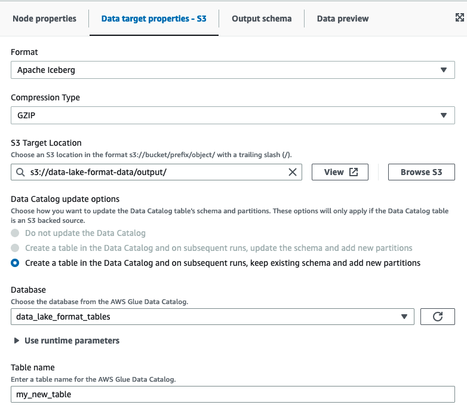
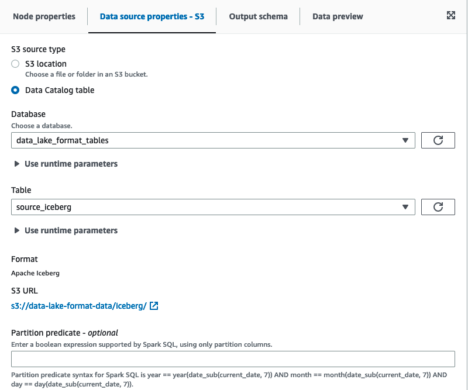

#

Using Apache Iceberg framework in AWS Glue Studio

##

Using Apache Iceberg framework in data targets

###

Using Apache Iceberg framework in Data Catalog data targets

1. From the **Target** menu, choose AWS Glue Studio Data Catalog.
2. In the **Data source properties** tab, choose a database and table.
3. AWS Glue Studio displays the format type as Apache Iceberg and the Amazon S3 URL.

### Using Apache Iceberg framework in Amazon S3 data targets

Enter values or select from the available options to configure Apache Iceberg format.

- **Format** – choose **Apache Iceberg** from the drop-down menu.
- **Amazon S3 Target Location** – choose the Amazon S3 target location by clicking **Browse S3**.
- **Data Catalog update options** – **Create a table in the Data Catalog and on subsequent runs,
  keep existing schema and add new partitions** must be selected to proceed. Writing a new Iceberg table using
  AWS Glue requires the Data Catalog to be configured as the catalog for the Iceberg table. To update
  an existing Iceberg table that has been registered in the Data Catalog, choose Data Catalog as the
  target.
  - **Database** – Choose the database from the Data Catalog.
  - **Table Name** – Enter the value for your table name. Apache Iceberg table names must be
    in all lower case. Use underscores if needed since spaces are not allowed. For example "data_lake_format_tables".

##

Using Apache Iceberg framework in Amazon S3 data sources

###

Using Apache Iceberg framework in Data Catalog data sources

1. From the **Source** menu, choose AWS Glue Studio Data Catalog.
2. In the **Data source properties** tab, choose a database and table.
3. AWS Glue Studio displays the format type as Apache Iceberg and the Amazon S3 URL.

### Using Apache Iceberg framework in Amazon S3 data sources

Apache Iceberg is not available as a data option for Amazon S3 source nodes in AWS Glue Studio.
