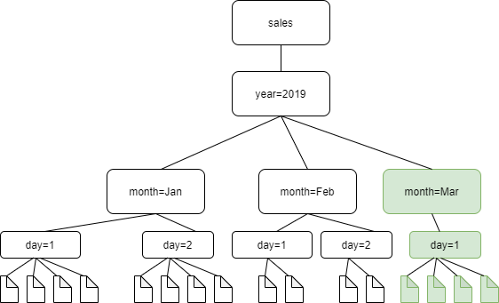

# Scheduling incremental crawls for adding new partitions

You can configure an AWS Glue crawler run incremental crawls to add only new partitions to the
table schema. When the crawler runs for the first time, it performs a full crawl to processes the entire data
source to record the complete schema and all existing partitions in the AWS Glue Data Catalog.

Subsequent crawls after the initial full crawl will be incremental, where the crawler
identifies and adds only the new partitions that have been introduced since the previous
crawl. This approach results in faster crawl times, as the crawler no longer needs to process
the entire data source for each run, but instead focuses only on the new partitions.

###### Note

Incremental crawls don't detect modifications or deletions of
existing partitions. This configuration is best suited for data sources with a stable schema.
If a one-time major schema change occurs, it is advisable to temporarily set the crawler to
perform a full crawl to capture the new schema accurately, and then switch back to incremental
crawling mode.

The following diagram shows that with the incremental crawl setting enabled, the crawler will only detect and add the newly added folder, month=March, to the catalog.


Follow these steps to update your crawler to perform incremental crawls:

AWS Management Console

1. Sign in to the AWS Management Console and open the AWS Glue console at
   [https://console.aws.amazon.com/glue/](https://console.aws.amazon.com/glue/ "https://console.aws.amazon.com/glue/").
2. Choose **Crawlers** under the **Data Catalog**.
3. Choose a crawler that you want to set up to crawl incrementally.
4. Choose **Edit**.
5. Choose **Step 2. Choose data sources and classifiers**.
6. Choose the data source that you want to incrementally crawl.
7. Choose **Edit**.
8. Choose **Crawl new sub-folders only** under **Subsequent crawler runs**.
9. Choose **Update**.

To create a schedule for a crawler, see [Scheduling a crawler](schedule-crawler.md "schedule-crawler.md").

AWS CLI

```
aws glue update-crawler \
 --name myCrawler \
 --recrawl-policy RecrawlBehavior=CRAWL_NEW_FOLDERS_ONLY \
 --schema-change-policy UpdateBehavior=LOG,DeleteBehavior=LOG
```

###### Notes and restrictions

When this option is turned on, you can't change the Amazon S3 target data stores when editing the crawler. This option affects certain crawler configuration settings. When turned on, it forces the update behavior and delete behavior of the crawler to `LOG`. This means that:

- If it discovers objects where schemas are not compatible, the crawler will not add the objects in the Data Catalog, and adds this detail as a log in CloudWatch Logs.
- It will not update deleted objects in the Data Catalog.
