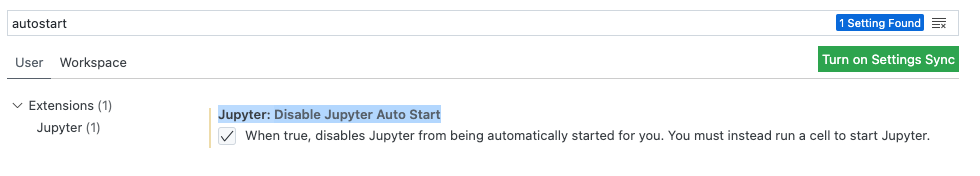
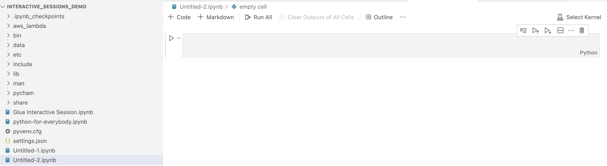
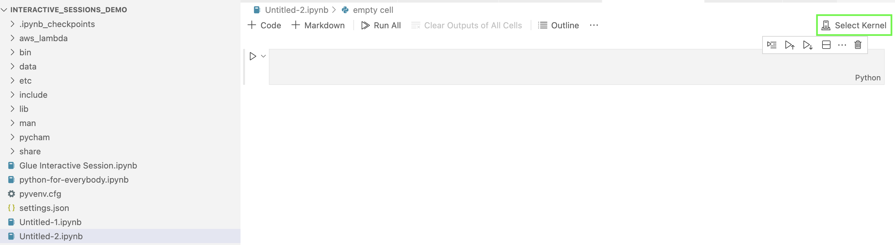
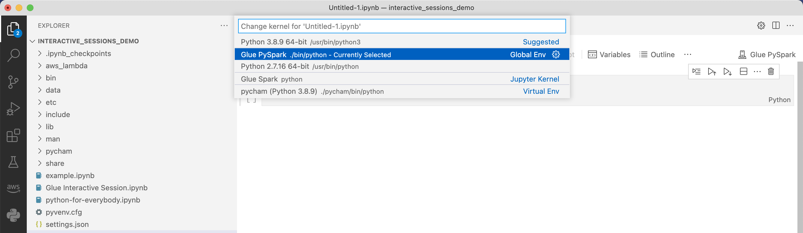

#

Using interactive sessions with Microsoft Visual Studio Code

**Prerequisites**

- Install AWS Glue interactive sessions and verify it works with Jupyter Notebook.
- Download and install Visual Studio Code with Jupyter. For details, see
  [Jupyter
  Notebook in VS Code](https://code.visualstudio.com/docs/datascience/jupyter-notebooks "https://code.visualstudio.com/docs/datascience/jupyter-notebooks").

######

To get started with interactive sessions with VSCode

1. Disable Jupyter AutoStart in VS Code.

In Visual Studio Code, Jupyter kernels will auto-start which will prevent your magics from taking effect as the session will
already be started. To disable **Auto Start** on Windows, go to **File** > **Preferences**

> **Extensions** > **Jupyter** > right-click on Jupyter then choose
> **Extension Settings**.

On MacOS, go to **Code** > **Settings** > **Extensions** > **Jupyter**

> right-click on Jupyter then choose **Extension Settings**.

Scroll down until you see **Jupyter: Disable Jupyter Auto Start**. Check the box "When true, disables Jupyter from
being automatically started for you. You must instead run a cell to start Jupyter."

 2. Go to File > New File > Save to save this file with name of your choice as an `.ipynb` extension or
select **jupyter** under **select a language** and save the file.

 3. Double-click on the file. The Jupyter shell will display and a notebook will be opened.

 4. On Windows, when you first create a file, by default no kernel is selected.
Click on **Select Kernel** and a list of available kernels is displayed. Choose
**Glue PySpark**.

On MacOS, If you do not see the **Glue PySpark** kernel, try the following steps:

    1. Run a local Jupyter session to obtain the URL.


    For example, run the following command to launch Jupyter Notebook.


    ```
    jupyter notebook
    ```

    When the notebook first runs, you will see a URL that looks like
     `http://localhost:8888/?token=3398XXXXXXXXXXXXXXXX`.


    Copy the URL.
    2. In VS Code, click the current kernel, then **Select Another Kernel...**, then select
     **Existing Jupyter Server...**. Paste the URL you copied from the step above.


    If you receive an error message, see the
     [VS Code Jupyter wiki](https://github.com/microsoft/vscode-jupyter/wiki/Connecting-to-a-remote-Jupyter-server-from-vscode.dev "https://github.com/microsoft/vscode-jupyter/wiki/Connecting-to-a-remote-Jupyter-server-from-vscode.dev") .
    3. If successful, this will set the kernel to **Glue PySpark**.



Choose the **Glue PySpark** or **Glue Spark** kernel (for Python and Scala respectively).



If you don't see **AWS Glue PySpark** and **AWS Glue Spark** kernels
in the drop-down list,
please ensure you have installed the AWS Glue kernel in the step above,
or that your `python.defaultInterpreterPath` setting in Visual Studio Code is correct. For more
information, see
[python.defaultInterpreterPath setting description](https://github.com/microsoft/vscode-python/wiki/Setting-descriptions#pythondefaultinterpreterpath "https://github.com/microsoft/vscode-python/wiki/Setting-descriptions#pythondefaultinterpreterpath") . 5. Create an AWS Glue Interactive Session. Proceed to create a session in
the same manner as you did in Jupyter Notebook. Specify any magics at the top of your
first cell and run a statement of code.
