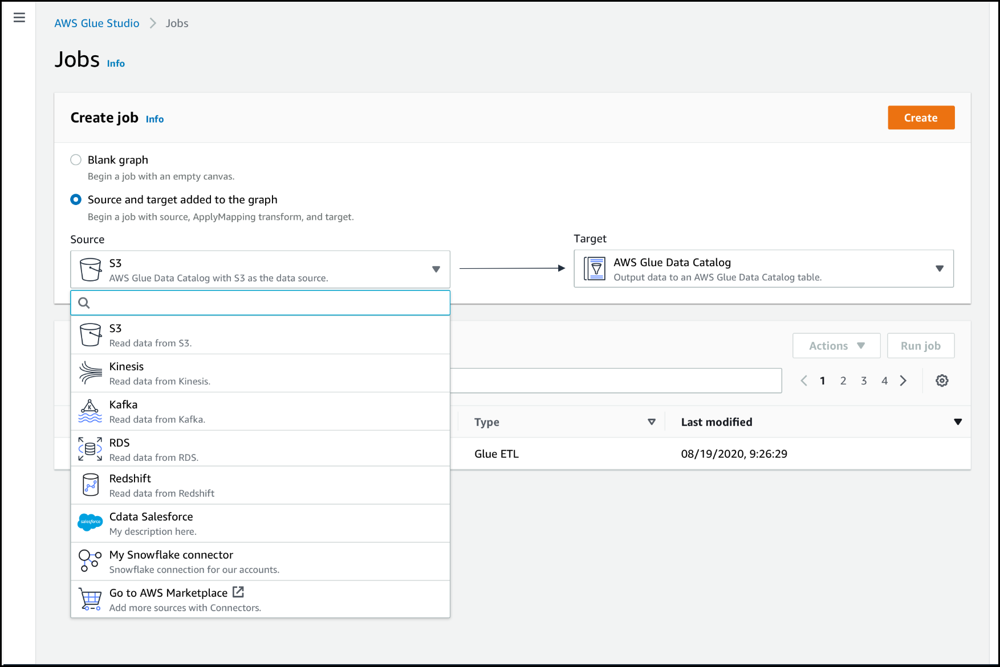

# Authoring jobs with custom

connectors

You can use connectors and connections for both data source nodes and data target nodes in
AWS Glue Studio.

###### Topics

- [Create jobs that use a connector for the data
  source](#create-job-connectors "#create-job-connectors")
- [Configure source properties for nodes that use
  connectors](#edit-connector-source "#edit-connector-source")
- [Configure target properties for nodes that use
  connectors](#edit-connector-target "#edit-connector-target")

## Create jobs that use a connector for the data

source

When you create a new job, you can choose a connector for the data source and data
targets.

###### To create a job that uses connectors for the data source or data target

1. Sign in to the AWS Management Console and open the AWS Glue Studio console at
   [https://console.aws.amazon.com/gluestudio/](https://console.aws.amazon.com/gluestudio/ "https://console.aws.amazon.com/gluestudio/").
2. On the **Connectors** page, in the
   **Your connections** resource list, choose the connection you want
   to use in your job, and then choose **Create job**.

Alternatively, on the AWS Glue Studio **Jobs** page, under
**Create job**, choose **Source and target added to the
graph**. In the **Source** drop-down list, choose the custom
connector that you want to use in your job.
You can also choose a connector for **Target**.

 3. Choose **Create** to open the visual job editor. 4. Configure the data source node, as described in [Configure source properties for nodes that use
connectors](#edit-connector-source "#edit-connector-source"). 5. Continue creating your ETL job by adding transforms, additional data stores, and
data targets, as described in [Starting visual ETL jobs in AWS Glue Studio](edit-nodes-chapter.md "edit-nodes-chapter.md"). 6. Customize the job run environment by configuring job properties as described in
[Modify the job properties](managing-jobs-chapter.md#edit-jobs-properties "managing-jobs-chapter.md#edit-jobs-properties"). 7. Save and run the job.

## Configure source properties for nodes that use

connectors

After you create a job that uses a connector for the data source, the visual job editor
displays a job graph with a data source node configured for the connector. You must
configure the data source properties for that node.

###### To configure the properties for a data source node that uses a connector

1. Choose the connector data source node in the job graph or add a new node and
   choose the connector for the **Node type**. Then, on the right-side, in
   the node details panel, choose the **Data source properties** tab, if it's
   not already selected.

 2. In the **Data source properties** tab, choose the connection that you
want to use for this job.

Enter the additional information required for each connection type:

JDBC

    * **Data source input type**: Choose to provide either a
     table name or a SQL query as the data source. Depending on your choice, you
     then need to provide the following additional information:


    	+ **Table name**: The name of the table in the data
    	 source. If the data source does not use the term
    	 *table*, then supply the name of an appropriate data
    	 structure, as indicated by the custom connector usage information (which
    	 is available in AWS Marketplace).
    	+ **Filter predicate**: A condition clause to use when
    	 reading the data source, similar to a `WHERE` clause, which is
    	 used to retrieve a subset of the data.
    	+ **Query code**: Enter a SQL query to use to retrieve
    	 a specific dataset from the data source. An example of a basic SQL query
    	 is:


    	```
    	SELECT `column_list` FROM
    	                          `table_name` WHERE `where_clause`

    	```
    * **Schema**: Because AWS Glue Studio is using information stored in
     the connection to access the data source instead of retrieving metadata
     information from a Data Catalog table, you must provide the schema metadata for the
     data source. Choose **Add schema** to open the schema editor.


    For instructions on how to use the schema editor, see [Editing the schema in a custom transform
     node](transforms-custom.md#transforms-custom-editschema "transforms-custom.md#transforms-custom-editschema").
    * **Partition column**: (Optional) You can choose to
     partition the data reads by providing values for **Partition
     column**, **Lower bound**, **Upper
     bound**, and **Number of partitions**.


    The `lowerBound` and `upperBound` values are used to
     decide the partition stride, not for filtering the rows in table. All rows in
     the table are partitioned and returned.


    ###### Note

    Column partitioning adds an extra partitioning condition to the query
     used to read the data. When using a query instead of a table name, you
     should validate that the query works with the specified partitioning
     condition. For example:


    	+ If your query format is `"SELECT col1 FROM table1"`, then
    	 test the query by appending a `WHERE` clause at the end of
    	 the query that uses the partition column.
    	+ If your query format is `"SELECT col1 FROM table1 WHERE
    	 col2=val"`, then test the query by extending the
    	 `WHERE` clause with `AND` and an expression that
    	 uses the partition column.
    * **Data type casting**: If the data source uses data types
     that are not available in JDBC, use this section to specify how a data type
     from the data source should be converted into JDBC data types. You can specify
     up to 50 different data type conversions. All columns in the data source that
     use the same data type are converted in the same way.


    For example, if you have three columns in the data source that use the
     `Float` data type, and you indicate that the `Float`
     data type should be converted to the JDBC `String` data type, then
     all three columns that use the `Float` data type are converted to
     `String` data types.
    * **Job bookmark keys**: Job bookmarks help AWS Glue maintain
     state information and prevent the reprocessing of old data. Specify one more one or more
     columns as bookmark keys. AWS Glue Studio uses bookmark keys to track data that has already been
     processed during a previous run of the ETL job. Any columns you use for
     custom bookmark keys must be
     strictly
     monotonically increasing or decreasing, but gaps are permitted.


    If you enter multiple bookmark keys, they're combined to form a single compound key.
     A compound job bookmark key should not contain duplicate columns. If you don't specify
     bookmark keys, AWS Glue Studio by default uses the primary key as the bookmark key, provided that
     the primary key is sequentially increasing or decreasing (with no gaps). If the table
     doesn't have a primary key, but the job bookmark property is enabled, you must provide
     custom job bookmark keys. Otherwise, the search for primary keys to use as the default
     will fail and the job run will fail.
    * **Job bookmark keys sorting order**: Choose whether the key values are sequentially increasing or decreasing.

Spark

    * **Schema**: Because AWS Glue Studio is using information stored in
     the connection to access the data source instead of retrieving metadata
     information from a Data Catalog table, you must provide the schema metadata for the
     data source. Choose **Add schema** to open the schema editor.


    For instructions on how to use the schema editor, see [Editing the schema in a custom transform
     node](transforms-custom.md#transforms-custom-editschema "transforms-custom.md#transforms-custom-editschema").
    * **Connection options**: Enter additional key-value pairs
     as needed to provide additional connection information or options. For
     example, you might enter a database name, table name, a user name, and
     password.


    For example, for OpenSearch, you enter the following key-value pairs, as
     described in [Tutorial: Using the AWS Glue Connector for Elasticsearch](tutorial-elastisearch-connector.md "tutorial-elastisearch-connector.md") :


    	+ `es.net.http.auth.user` :
    	 ``username``
    	+ `es.net.http.auth.pass` :
    	 ``password``
    	+ `es.nodes` : `https://`<Elasticsearch
    	 endpoint>``
    	+ `es.port` : `443`
    	+ `path`: ``<Elasticsearch
    	 resource>``
    	+ `es.nodes.wan.only` : `true`

For an example of the minimum connection options to use, see the sample test
script [MinimalSparkConnectorTest.scala](https://github.com/aws-samples/aws-glue-samples/tree/master/GlueCustomConnectors/development/Spark/MinimalSparkConnectorTest.scala "https://github.com/aws-samples/aws-glue-samples/tree/master/GlueCustomConnectors/development/Spark/MinimalSparkConnectorTest.scala") on GitHub, which shows the connection
options you would normally provide in a connection.

Athena

    * **Table name**: The name of the table in the data source.
     If you're using a connector for reading from Athena-CloudWatch logs, you would enter
     the table name `all_log_streams`.
    * **Athena schema name**: Choose the schema in your Athena
     data source that corresponds to the database that contains the table. If
     you're using a connector for reading from Athena-CloudWatch logs, you would enter a
     schema name similar to
     `/aws/glue/`name``.
    * **Schema**: Because AWS Glue Studio is using information stored in
     the connection to access the data source instead of retrieving metadata
     information from a Data Catalog table, you must provide the schema metadata for the
     data source. Choose **Add schema** to open the schema editor.


    For instructions on how to use the schema editor, see [Editing the schema in a custom transform
     node](transforms-custom.md#transforms-custom-editschema "transforms-custom.md#transforms-custom-editschema").
    * **Additional connection options**: Enter additional
     key-value pairs as needed to provide additional connection information or
     options.

For an example, see the `README.md` file
at
[https://github.com/aws-samples/aws-glue-samples/tree/master/GlueCustomConnectors/development/Athena](https://github.com/aws-samples/aws-glue-samples/tree/master/GlueCustomConnectors/development/Athena "https://github.com/aws-samples/aws-glue-samples/tree/master/GlueCustomConnectors/development/Athena"). In the steps in this document, the sample code
shows the minimal required connection options, which are `tableName`,
`schemaName`, and `className`. The code example specifies
these options as part of the `optionsMap` variable, but you can specify
them for your connection and then use the connection. 3. (Optional) After providing the required information, you can view the resulting data schema for
your data source by choosing the **Output schema** tab in the node
details panel. The schema displayed on this tab is used by any child nodes that you add
to the job graph. 4. (Optional) After configuring the node properties and data source properties,
you can preview the dataset from your data source by choosing the Data preview tab in the node details panel.
The first time you choose this tab for any node in your job, you are prompted to provide an IAM role to access
the data. There is a cost associated with using this feature, and billing starts as soon as you provide an IAM role.

## Configure target properties for nodes that use

connectors

If you use a connector for the data target type, you must configure the properties of
the data target node.

###### To configure the properties for a data target node that uses a connector

1. Choose the connector data target node in the job graph. Then, on the right-side, in
   the node details panel, choose the **Data target properties** tab, if it's
   not already selected.
2. In the **Data target properties** tab, choose the connection to use for
   writing to the target.

Enter the additional information required for each connection type:

JDBC

    * **Connection**: Choose the connection to use with your
     connector.
     For
     information about how to create a connection, see [Creating connections for connectors](creating-connections.md "creating-connections.md").
    * **Table name**: The name of the table in the data target.
     If the data target does not use the term *table*, then
     supply the name of an appropriate data structure, as indicated by the custom
     connector usage information (which is available in AWS Marketplace).
    * **Batch size** (Optional): Enter the number of rows or
     records to insert in the target table in a single operation. The default value
     is 1000 rows.

Spark

    * **Connection**: Choose the connection to use with your
     connector. If you did not create a connection previously, choose
     **Create connection** to create one. For information about
     how to create a connection, see [Creating connections for connectors](creating-connections.md "creating-connections.md").
    * **Connection options**: Enter additional key-value pairs
     as needed to provide additional connection information or options. You might
     enter a database name, table name, a user name, and password.


    For example, for OpenSearch, you enter the following key-value pairs, as
     described in [Tutorial: Using the AWS Glue Connector for Elasticsearch](tutorial-elastisearch-connector.md "tutorial-elastisearch-connector.md") :


    	+ `es.net.http.auth.user` :
    	 ``username``
    	+ `es.net.http.auth.pass` :
    	 ``password``
    	+ `es.nodes` : `https://`<Elasticsearch
    	 endpoint>``
    	+ `es.port` : `443`
    	+ `path`: ``<Elasticsearch
    	 resource>``
    	+ `es.nodes.wan.only` : `true`

For an example of the minimum connection options to use, see the sample test
script [MinimalSparkConnectorTest.scala](https://github.com/aws-samples/aws-glue-samples/tree/master/GlueCustomConnectors/development/Spark/MinimalSparkConnectorTest.scala "https://github.com/aws-samples/aws-glue-samples/tree/master/GlueCustomConnectors/development/Spark/MinimalSparkConnectorTest.scala") on GitHub, which shows the connection
options you would normally provide in a connection. 3. After providing the required information, you can view the resulting data schema for
your data source by choosing the **Output schema** tab in the node
details panel.
