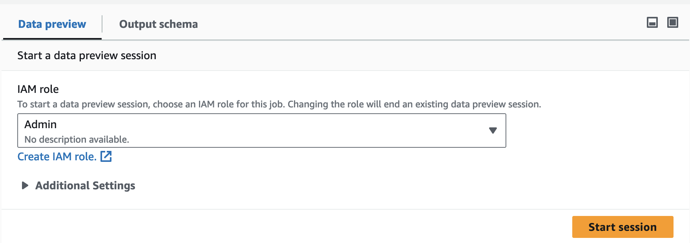
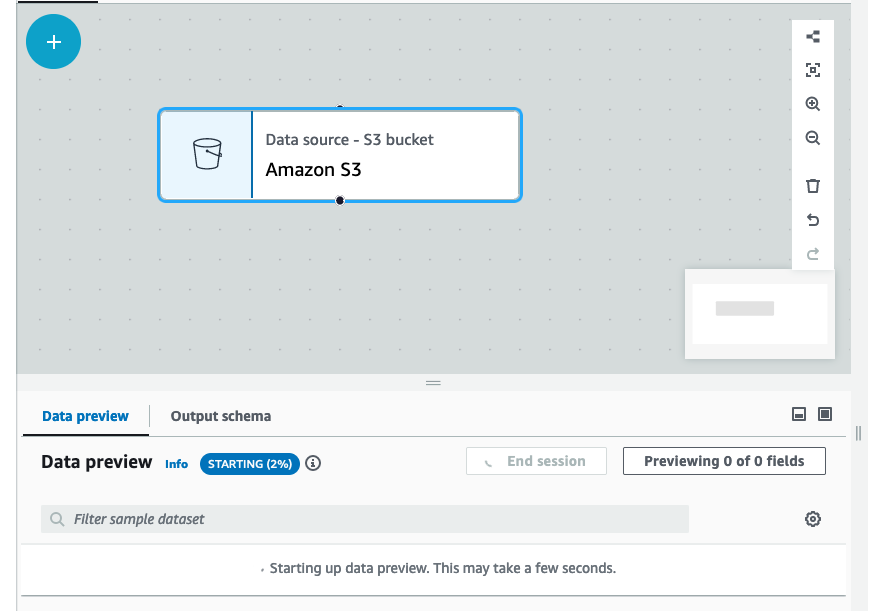
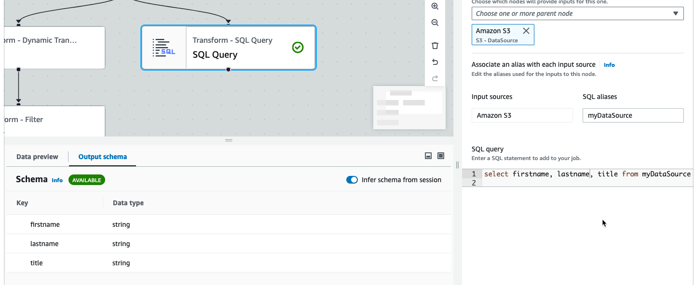
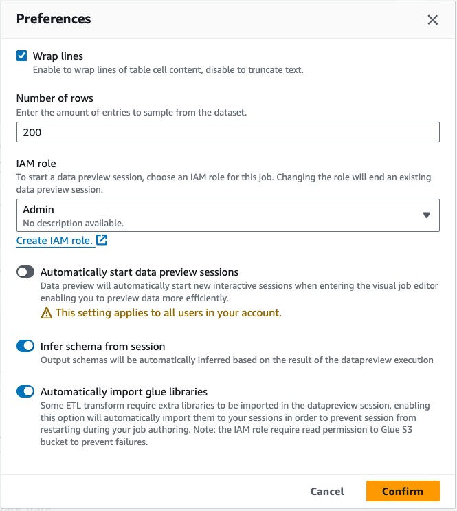
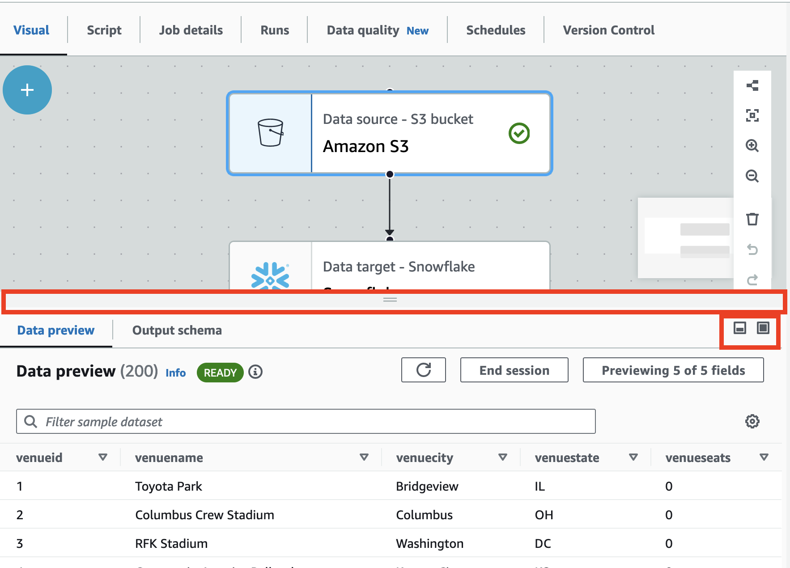

# Job editor features

The job editor provides the following features for creating and editing jobs.

- A visual diagram of your job, with a node for each job task: Data source nodes for
  reading the data; transform nodes for modifying the data; data target nodes for writing
  the data.

You can view and configure the properties of each node in the job diagram. You can
also view the schema and sample data for each node in the job diagram. These features help
you to verify that your job is modifying and transforming the data in the right way,
without having to run the job.

- A Script viewing and editing tab, where you can modify the code generated
  for your job.
- A Job details tab, where you can configure a variety of settings to customize the
  environment in which your AWS Glue ETL job runs.
- A Runs tab, where you can view the current and previous runs of the job, view the
  status of the job run, and access the logs for the job run.
- A Data quality tab, where you can apply data quality rules to your job.
- A Schedules tab, where you can configure the start time for you job, or set up
  a recurring job runs.
- A Version Control tab, where you can configure a Git service to use with your job.

## Using schema previews in the visual job editor

While creating or editing your job, you can use the
**Output schema** tab to view the schema for your data.

Before you can see the schema, the job editor needs permissions to access the data
source. You can specify an IAM role on the Job details tab of the editor or on the
**Output schema** tab for a node. If the IAM role has all the
necessary permissions to access the data source, you can then view the schema on the
**Output schema** tab for a node.

## Using data previews in the visual job editor

Data previews help you create and test your job using a sample of your data without having to repeatedly run the
job. By using data preview, you can:

- Test an IAM role to make sure you have access to your data sources or data
  targets.
- Check that the transform is modifying the data in the intended way. For
  example, if you use a Filter transform, you can make sure that the filter is selecting
  the right subset of data.
- Check your data. If your dataset contains columns with values of multiple types, the data preview
  shows a list of tuples for these columns. Each tuple contains the data type and its
  value.

###### Note

If you use a data preview session and a custom SQL or custom code node, the data preview session will execute the SQL or
code block as-is for the entire dataset.

While creating or editing your job, you can use the **Data preview** tab beneath the
job canvas to view a sample of your data. A new data preview session will start automatically when the role is
already configured on the job or a default IAM role has been set up in the account. If a role has not been
previously configured, you can start a session by selecting the role.

###### Note

The role you choose for the data preview session will also be used for the job.

You can see the status and the progress of your session as well as the session details by clicking the info icon.

When the session is ready, AWS Glue Studio will load the data for the node you selected.
You can view the **% complete** as it progresses.

As you author your visual job, AWS Glue Studio will automatically update the schema for the selected node
when you toggle **Infer schema from session** in the **Output schema** tab.

To configure your data preview preferences:

Choose the settings icon (a gear symbol) to configure your preferences for data
previews. These settings apply to all nodes in the job diagram. You can:

- Choose to wrap the text from one line to the next. This option is enabled by default
- Change the number of rows (default to 200)
- Choose an IAM role or create an IAM role if needed
- Choose to automatically start a new session when you author a job. This provisions a new interactive
  session when authoring jobs. **This setting applies at the account level.**
  Once set, it will apply to all users in your account when editing any job.
- Choose to automatically infer schema. Output schemas will be automatically inferred for the
  selected node
- Choose to automatically import AWS Glue libraries. This is useful as it will prevent
  data preview from restarting new sessions when adding new transforms that require a session restart

Additional features include the ability to:

- Choose the **Previewing x of y fields** button to select which
  columns (fields) to preview. When you preview you data using the default settings, the
  job editor shows the first 5 columns of your dataset. You can change this to show all or
  none (not recommended).
- Scroll through the data preview window both horizontally and vertically.
- Use the maximize button to expand the Data preview tab to over-lay the job graph to better view the
  data and data structures. Similarly, use the minimize button to minimize the Data preview tab.
  You can also grab the handle pane and drag up to expand the **Data preview**
  tab.

- Use **End session** to stop the data preview. When you stop the session, you can
  choose a new IAM role, and set additional settings (such as turn on or off settings to automatically
  start a new session, infer schema, or import AWS Glue libraries, and start the session again.

## Restrictions when using data previews

When using data previews, you might encounter the following restrictions or limitations.

- The first time you choose the Data preview tab you must choose IAM role. This
  role must have the necessary permissions to access the data and other resources needed
  to create the data previews.
- After you provide an IAM role, it takes a while before the data is available for
  viewing. For datasets with less than 1 GB of data, it can take up to one minute. If you
  have a large dataset, you should use partitions to improve the loading time. Loading
  data directly from Amazon S3 has the best performance.
- If you have a very large dataset, and it takes more than 15 minutes to query the
  data for the data preview, the request will time out. Data previews have a 30 minute IDLE
  timeout. To alleviate this, reduce the dataset size to use data previews.
- By default, you see the first 50 columns in the Data preview tab. If the columns
  have no data values, you will get a message that there is no data to display. You can
  increase the number of rows sampled, or selected different columns to see data
  values.
- Data previews are currently not supported for streaming data sources, or for data
  sources that use custom connectors.
- Errors on one node effect the entire job. If any one node has an error with data
  previews, the error will show up on all nodes until you correct it.
- If you change a data source for the job, then the child nodes of that data source
  might need to be updated to match the new schema. For example, if you have an
  ApplyMapping node that modifies a column, and the column does not exist in the
  replacement data source, you will need to update the ApplyMapping transform node.
- If you view the Data preview tab for a SQL query transform node, and the SQL
  query uses an incorrect field name, the Data preview tab shows an error.

## Script code generation

When you use the visual editor to create a job, the ETL code is automatically generated
for you. AWS Glue Studio creates a functional and complete job script, and saves it in an
Amazon S3 location.

There are two forms of code generated by AWS Glue Studio: the original, or Classic version, and a
newer, streamlined version. By default, the new code generator is used to create the job
script. You can generate a job script using classic code generator on the
**Script** tab by choosing the **Generate classic
script** toggle button.

Some of the differences in the new version of the generated code include:

- Large comment blocks are no longer added to the script
- Output structures in the code use the node name that you specify in the visual
  editor. In the class script, the output structures are simply named
  `DataSource0`, `DataSource1`, `Transform0`,
  `Transform1`, `DataSink0`, `DataSink1`, and so
  on.
- Long commands are split across multiple lines to remove the need to scroll across
  the page to see the entire command.

New features in AWS Glue Studio require the new version of code generation, and will not work
with the classic code script. You are prompted to update these jobs when you attempt to run
them.
