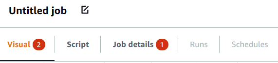
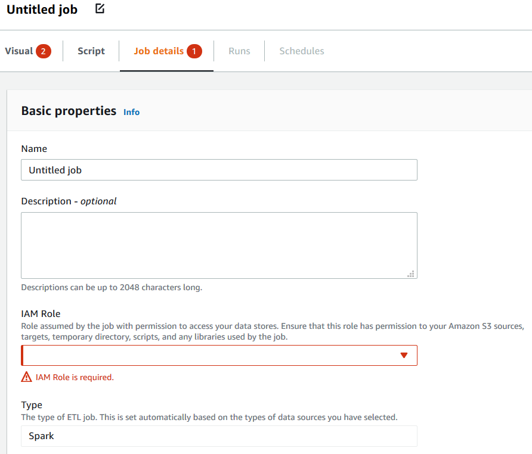

# Managing ETL jobs with AWS Glue Studio

You can use the simple graphical interface in AWS Glue Studio to manage your ETL jobs. Using the
navigation menu, choose **Jobs** to view the
**Jobs** page. On this page, you can see all the jobs that you have
created either with AWS Glue Studio or the AWS Glue console. You can view, manage, and run your jobs on this
page.

###### You can also perform the following tasks on this page:

- [Start a job run](#start-jobs "#start-jobs")
- [Schedule job runs](#schedule-jobs "#schedule-jobs")
- [Manage job schedules](#manage-schedules "#manage-schedules")
- [Stop job runs](#stop-jobs "#stop-jobs")
- [View your jobs](#view-jobs "#view-jobs")
- [View information for recent job runs](#view-job-run-details "#view-job-run-details")
- [View the job script](#view-job-script "#view-job-script")
- [Modify the job properties](#edit-jobs-properties "#edit-jobs-properties")
- [Save the job](#save-job "#save-job")
- [Clone a job](#clone-jobs "#clone-jobs")
- [Delete jobs](#delete-jobs "#delete-jobs")

## Start a job run

In AWS Glue Studio, you can run your jobs on demand. A job can run multiple times, and each time
you run the job, AWS Glue collects information about the job activities and performance. This
information is referred to as a _job run_ and is identified by a job run
ID.

You can initiate a job run in the following ways in AWS Glue Studio:

- On the **Jobs** page, choose the job you want to start, and
  then choose the **Run job** button.
- If you're viewing a job in the visual editor and the job has been saved, you can
  choose the **Run** button to start a job run.

For more information about job runs, see [Working with Jobs on the AWS Glue Console](console-jobs.md "console-jobs.md") in the
_AWS Glue Developer Guide_.

## Schedule job runs

In AWS Glue Studio, you can create a schedule to have your jobs run at specific times. You can
specify constraints, such as the number of times that the jobs run, which days of the week
they run, and at what time. These constraints are based on `cron` and have the same
limitations as `cron`. For example, if you choose to run your job on day 31 of each
month, keep in mind that some months don't have 31 days. For more information about
`cron`, see [Cron Expressions](monitor-data-warehouse-schedule.md#CronExpressions "monitor-data-warehouse-schedule.md#CronExpressions") in the _AWS Glue Developer Guide_.

###### To run jobs according to a schedule

1. Create a job schedule using one of the following methods:
   - On the **Jobs** page, choose the job you want to create
     a schedule for, choose **Actions**, and then choose
     **Schedule job**.
   - If you're viewing a job in the visual editor and the job has been saved,
     choose the **Schedules** tab. Then choose **Create
     Schedule**.

2. On the **Schedule job run** page, enter the following
   information:
   - **Name**: Enter a name for your job schedule.
   - **Frequency**: Enter the frequency for the job schedule. You can
     choose the following:
     - **Hourly**: The job will run every hour, starting at a
       specific minute. You can specify the **Minute** of the hour that
       the job should run. By default, when you choose hourly, the job runs at the
       beginning of the hour (minute 0).
     - **Daily**: The job will run every day, starting at a time.
       You can specify the **Minute** of the hour that the job should
       run and the **Start hour** for the job. Hours are specified using
       a 23-hour clock, where you use the numbers 13 to 23 for the afternoon hours. The
       default values for minute and hour are 0, which means that if you select
       **Daily**, the job by default will run at midnight.
     - **Weekly**: The job will run every week on one or more days.
       In addition to the same settings described previous for Daily, you can choose the
       days of the week on which the job will run. You can choose one or more
       days.
     - **Monthly**: The job will run every month on a specific day.
       In addition to the same settings described previous for Daily, you can choose the
       day of the month on which the job will run. Specify the day as a numeric value
       from 1 to 31. If you select a day that does not exist in a month, for example the
       30th day of February, then the job does not run that
       month.
     - **Custom**: Enter an expression for your job schedule using
       the `cron` syntax. Cron expressions allow you to create more
       complicated schedules, such as the last day of the month (instead of a specific
       day of the month) or every third month on the 7th and
       21st days of the month.

     See [Cron Expressions](monitor-data-warehouse-schedule.md#CronExpressions "monitor-data-warehouse-schedule.md#CronExpressions") in the
     _AWS Glue Developer Guide_

   - **Description**: You can optionally enter a description for your
     job schedule. If you plan to use the same schedule for multiple jobs, having a
     description makes it easier to determine what the job schedule does.

3. Choose **Create schedule** to save the job schedule.
4. After you create the schedule, a success message appears at the top of the console
   page. You can choose **Job details** in this banner to view the job
   details. This opens the visual job editor page, with the
   **Schedules** tab selected.

## Manage job schedules

After you have created schedules for a job, you can open the job in the visual editor and
choose the **Schedules** tab to manage the schedules.

On the **Schedules** tab of the visual editor, you can perform the
following tasks:

- Create a new schedule.

Choose **Create schedule**, then enter the information for your
schedule as described in [Schedule job runs](#schedule-jobs "#schedule-jobs").

- Edit an existing schedule.

Choose the schedule you want to edit, then choose **Action** followed
by **Edit schedule**. When you choose to edit an existing schedule, the
**Frequency** shows as **Custom**, and the schedule is
displayed as a `cron` expression. You can either modify the `cron`
expression, or specify a new schedule using the **Frequency** button.
When you finish with your changes, choose **Update schedule**.

- Pause an active schedule.

Choose an active schedule, and then choose **Action** followed by
**Pause schedule**. The schedule is instantly deactivated. Choose the
refresh (reload) button to see the updated job schedule status.

- Resume a paused schedule.

Choose a deactivated schedule, and then choose **Action** followed by
**Resume schedule**. The schedule is instantly activated. Choose the
refresh (reload) button to see the updated job schedule status.

- Delete a schedule.

Choose the schedule you want to remove, and then choose **Action**
followed by **Delete schedule**. The schedule is instantly deleted.
Choose the refresh (reload) button to see the updated job schedule list. The schedule will
show a status of **Deleting** until it has been completely
removed.

## Stop job runs

You can stop a job before it has completed its job run. You might choose this option if
you know that the job isn't configured correctly, or if the job is taking too long to
complete.

On the **Monitoring** page, in the
**Job runs** list, choose the job that you want to stop, choose
**Actions**, and then choose **Stop run**.

## View your jobs

You can view all your jobs on the **Jobs** page. You can access
this page by choosing **Jobs** in the navigation pane.

On the **Jobs** page, you can see all the jobs that were
created in your account. The **Your jobs** list shows the job name, its type,
the status of the last run of that job, and the dates on which the job was created and last
modified. You can choose the name of a job to see detailed information for that job.

You can also use the Monitoring dashboard to view all your jobs. You can access the
dashboard by choosing **Monitoring** in the navigation pane.

### Customize the job display

You can customize how the jobs are displayed in the **Your jobs**
section of the **Jobs** page. Also, you can enter text in the
search text field to display only jobs with a name that contains that text.

If you choose the settings icon

in the **Your jobs** section, you can customize how
AWS Glue Studio displays the information in the table. You can choose to wrap the lines of text in
the display, change the number of jobs displayed on the page, and specify which columns to
display.

## View information for recent job runs

A job can run multiple times as new data is added at the source location. Each time a job
runs, the job run is assigned a unique ID, and information about that job run is collected.
You can view this information by using the following methods:

- Choose the **Runs** tab of the visual editor to view the
  job run information for the currently displayed job.

On the **Runs** tab (the **Recent job
runs** page), there is a card for each job run. The information displayed on
the **Runs** tab includes:

    + Job run ID
    + Number of attempts to run this job
    + Status of the job run
    + Start and end time for the job run
    + The runtime for the job run
    + A link to the job log files
    + A link to the job error log files
    + The error returned for failed jobs

- You can select a job run to view additional information about the job, including the following:
  - **Input arguments**
  - **Continuous logs**
  - **Metrics** – You can see visualizations of basic metrics. For more information on
    included metrics, see [Viewing Amazon CloudWatch metrics for a
    Spark job run](view-job-runs.md#monitoring-job-run-metrics "view-job-runs.md#monitoring-job-run-metrics").
  - **Spark UI** – You can visualize Spark logs for your job in the Spark UI. For more
    information about using the Spark Web UI, see [Monitoring jobs using the Apache Spark web UI](monitor-spark-ui.md "monitor-spark-ui.md"). Enable this feature by
    following the procedure in [Enabling the Apache Spark web UI for AWS Glue jobs](monitor-spark-ui-jobs.md "monitor-spark-ui-jobs.md").

You can select **View details** to view similar information on the job run details page.
Alternatively, you can navigate to the job run details page through the **Monitoring** page. In
the navigation pane, choose **Monitoring**. Scroll down to the
**Job runs** list. Choose the job and then choose **View run details**.
The contents are described in [Viewing the details of a job run](view-job-runs.md#monitoring-job-run-details "view-job-runs.md#monitoring-job-run-details").

For more information about the job logs, see [Viewing the job run logs](view-job-runs.md#monitoring-job-run-logs "view-job-runs.md#monitoring-job-run-logs").

## View the job script

After you provide information for all the nodes in the job, AWS Glue Studio generates a script
that is used by the job to read the data from the source, transform the data, and write the
data in the target location. If you save the job, you can view this script at any time.

###### To view the generated script for your job

1. Choose **Jobs** in the navigation pane.
2. On the **Jobs** page, in the **Your Jobs**
   list, choose the name of the job you want to review. Alternatively, you can select a job
   in the list, choose the **Actions** menu, and then choose **Edit
   job**.
3. On the visual editor page, choose the **Script** tab
   at the top to view the job script.

If you want to edit the job script, see [AWS Glue programming guide](edit-script.md "edit-script.md").

## Modify the job properties

The nodes in the job diagram define the actions performed by the job, but there are several
properties that you can configure for the job as well. These properties determine the
environment that the job runs in, the resources it uses, the threshold settings, the security
settings, and more.

###### To customize the job run environment

1. Choose **Jobs** in the navigation pane.
2. On the **Jobs** page, in the **Your Jobs**
   list, choose the name of the job you want to review.
3. On the visual editor page, choose the **Job details** tab
   at the top of the job editing pane.
4. Modify the job properties, as needed.

For more information about the job properties, see [Defining Job
Properties](add-job.md#create-job "add-job.md#create-job") in the _AWS Glue Developer Guide_. 5. Expand the **Advanced properties** section if you need to specify
these additional job properties:

    * **Script filename** – The name of the file that stores the
     job script in Amazon S3.
    * **Script path** – The Amazon S3 location where the
     job script is stored.
    * **Job metrics** – (Not available for Python shell jobs)
     Turns on the creation of Amazon CloudWatch metrics when this job runs.
    * **Continuous logging** – (Not available for Python shell
     jobs) Turns on continuous logging to CloudWatch, so the logs are available for viewing
     before the job completes.
    * **Spark UI** and **Spark UI logs path** –
     (Not available for Python shell jobs) Turns on the use of Spark UI for monitoring this
     job and specifies the location for the Spark UI logs.
    * **Maximum concurrency** – Sets the maximum number of
     concurrent runs that are allowed for this job.
    * **Temporary path** – The location of a working directory
     in Amazon S3 where temporary intermediate results are written when AWS Glue runs
     the job script.
    * **Delay notification threshold (minutes)** – Specify a
     delay threshold for the job. If the job runs for a longer time than that specified by
     the threshold, then AWS Glue sends a delay notification for the job to CloudWatch.
    * **Security configuration** and **Server-side
     encryption** – Use these fields to choose the encryption options for
     the job.
    * **Use Glue Data Catalog as the Hive metastore** – Choose this
     option if you want to use the AWS Glue Data Catalog as an alternative to Apache Hive
     Metastore.
    * **Additional network connection** – For a data source in a
     VPC, you can specify a connection of type `Network` to ensure your job
     accesses your data through the VPC.
    * **Python library path**, **Dependent jars path**
     (Not available for Python shell jobs), or **Referenced files path**
     – Use these fields to specify the location of additional files used by the job
     when it runs the script.
    * **Job Parameters** – You can add a set of key-value pairs
     that are passed as named parameters to the job script. In Python calls to AWS Glue APIs,
     it's best to pass parameters explicitly by name. For more information about using
     parameters in a job script, see [Passing and Accessing Python Parameters in AWS Glue](aws-glue-programming-python-calling.md#aws-glue-programming-python-calling-parameters "aws-glue-programming-python-calling.md#aws-glue-programming-python-calling-parameters") in the
     *AWS Glue Developer Guide*.
    * **Tags** – You can add tags to the job to help you
     organize and identify them.

6. After you have modified the job properties, save the job.

### Store Spark shuffle files on Amazon S3

Some ETL jobs require reading and combining information from multiple partitions, for
example, when using a join transform. This operation is referred to as
_shuffling_. During a shuffle, data is written to disk and transferred
across the network. With AWS Glue version 3.0, you can configure Amazon S3 as a storage
location for these files. AWS Glue provides a shuffle manager which writes and reads shuffle
files to and from Amazon S3. Writing and reading shuffle files from Amazon S3 is
slower (by 5%-20%) compared to local disk (or Amazon EBS which is heavily optimized for Amazon EC2).
However, Amazon S3 provides unlimited storage capacity, so you don't have to worry
about "`No space left on device`" errors when running your job.

###### To configure your job to use Amazon S3 for shuffle files

1. On the **Jobs** page, in the **Your
   Jobs** list, choose the name of the job you want to modify.
2. On the visual editor page, choose the **Job details** tab at
   the top of the job editing pane.

Scroll down to the **Job parameters** section. 3. Specify the following key-value pairs.

    * `--write-shuffle-files-to-s3` — `true`

    This is the main parameter that configures the shuffle manager in AWS Glue to use
     Amazon S3 buckets for writing and reading shuffle data. By default, this
     parameter has a value of `false`.
    * (Optional) `--write-shuffle-spills-to-s3` —
     `true`

    This parameter allows you to offload spill files to Amazon S3 buckets,
     which provides additional resiliency to your Spark job in AWS Glue. This is only
     required for large workloads that spill a lot of data to disk. By default, this
     parameter has a value of `false`.
    * (Optional) `--conf spark.shuffle.glue.s3ShuffleBucket` —
     `S3://<`shuffle-bucket`>`

    This parameter specifies the Amazon S3 bucket to use when writing the
     shuffle files. If you do not set this parameter, the location is the
     `shuffle-data` folder in the location specified for **Temporary
     path** (`--TempDir`).

    ###### Note

    Make sure the location of the shuffle bucket is in the same AWS Region in
     which the job runs.

    Also, the shuffle service does not clean the files after the job finishes
     running, so you should configure the Amazon S3 storage life cycle policies
     on the shuffle bucket location. For more information, see [Managing your storage
     lifecycle](../../../AmazonS3/latest/userguide/object-lifecycle-mgmt.md "../../../AmazonS3/latest/userguide/object-lifecycle-mgmt.md") in the *Amazon S3 User Guide*.

## Save the job

A red **Job has not been saved** callout is displayed to the left of the
**Save** button until you save the job.

###### To save your job

1. Provide all the required information in the **Visual** and
   **Job details** tabs.
2. Choose the **Save** button.

After you save the job, the 'not saved' callout changes to display the time and date
that the job was last saved.

If you exit AWS Glue Studio before saving your job, the next time you sign in to AWS Glue Studio, a
notification appears. The notification indicates that there is an unsaved job, and asks if you
want to restore it. If you choose to restore the job, you can continue to edit it.

### Troubleshooting errors when saving a job

If you choose the **Save** button, but your job is missing some
required information, then a red callout appears on the tab where the information is
missing. The number in the callout indicates how many missing fields were detected.

- If a node in the visual editor isn't configured correctly, the
  **Visual** tab shows a red callout, and the node with the
  error displays a warning symbol
  
  .

      1. Choose the node. In the node details panel, a red callout appears on the tab
       where the missing or incorrect information is located.
      2. Choose the tab in the node details panel that shows a red callout, and then
       locate the problem fields, which are highlighted. An error message below the fields
       provides additional information about the problem.

      

- If there is a problem with the job properties, the
  **Job details** tab shows a red callout. Choose that tab and
  locate the problem fields, which are highlighted. The error messages below the fields
  provide additional information about the problem.

## Clone a job

You can use the **Clone job** action to copy an existing job into a new
job.

###### To create a new job by copying an existing job

1. On the **Jobs** page, in the **Your jobs**
   list, choose the job that you want to duplicate.
2. From the **Actions** menu, choose **Clone
   job**.
3. Enter a name for the new job. You can then save or edit the job.

## Delete jobs

You can remove jobs that are no longer needed. You can delete one or more jobs in a single
operation.

###### To remove jobs from AWS Glue Studio

1. On the **Jobs** page, in the **Your jobs** list,
   choose the jobs that you want to delete.
2. From the **Actions** menu, choose **Delete job**.
3. Verify that
   you want to delete the job by entering `delete`.

You can also delete a saved job when you're viewing the **Job details** tab for
that job in the visual editor.
