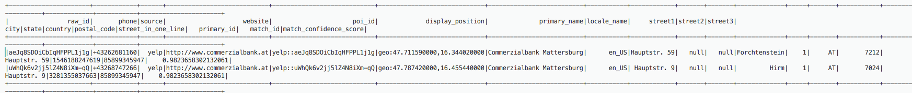
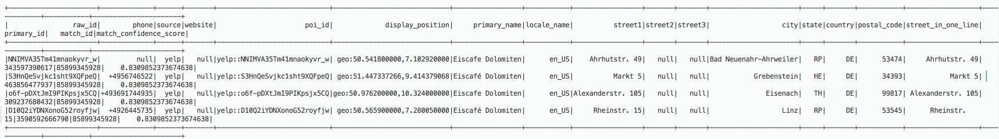
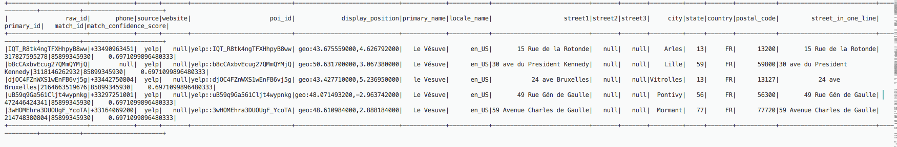

# Estimating the quality of matches using match confidence scores

Match confidence scores provide an estimate of the quality of matches found by FindMatches to distinguish between matched records in which the machine learning model is highly confident, uncertain, or unlikely. A match confidence score will be between 0 and 1, where a higher score means higher similarity. Examining match confidence scores lets you distinguish between clusters of matches in which the system is highly confident (which you may decide to merge), clusters about which the system is uncertain (which you may decide to have reviewed by a human), and clusters that the system deems to be unlikely (which you may decide to reject).

You may want to adjust your training data in situations where you see a high match confidence score, but determine there are not matches, or where you see a low score but determine there are, in fact, matches.

Confidence scores are particularly useful when there are large sized industrial datasets, where it is infeasible to review every FindMatches decision.

Match confidence scores are available in AWS Glue version 2.0 or later.

## Generating match confidence scores

You can generate match confidence scores by setting the Boolean value of `computeMatchConfidenceScores` to True when calling the `FindMatches` or `FindIncrementalMatches` API.

AWS Glue adds a new `column match_confidence_score` to the output.

## Match scoring examples

For example, consider the following matched records:

###### Score >= 0.9

Summary of matched records:

```
  primary_id  |   match_id  | match_confidence_score

3281355037663    85899345947   0.9823658302132061
1546188247619    85899345947   0.9823658302132061
```

Details:



From this example, we can see that two records are very similar and share `display_position`, `primary_name`, and `street name`.

###### Score >= 0.8 and score < 0.9

Summary of matched records:

```
  primary_id  |   match_id  | match_confidence_score

309237680432     85899345928   0.8309852373674638
3590592666790    85899345928   0.8309852373674638
343597390617     85899345928   0.8309852373674638
249108124906     85899345928   0.8309852373674638
463856477937     85899345928   0.8309852373674638
```

Details:



From this example, we can see that these records share the same `primary_name`, and `country`.

###### Score >= 0.6 and score < 0.7

Summary of matched records:

```

  primary_id  |   match_id  | match_confidence_score

2164663519676    85899345930   0.6971099896480333
 317827595278    85899345930   0.6971099896480333
 472446424341    85899345930   0.6971099896480333
3118146262932    85899345930   0.6971099896480333
 214748380804    85899345930   0.6971099896480333
```

Details:



From this example, we can see that these records share only the same `primary_name`.

For more information, see:

- [Step 5: Add and run a job with your machine
  learning transform](machine-learning-transform-tutorial.md#ml-transform-tutorial-add-job "machine-learning-transform-tutorial.md#ml-transform-tutorial-add-job")
- PySpark: [FindMatches class](aws-glue-api-crawler-pyspark-transforms-findmatches.md "aws-glue-api-crawler-pyspark-transforms-findmatches.md")
- PySpark: [FindIncrementalMatches class](aws-glue-api-crawler-pyspark-transforms-findincrementalmatches.md "aws-glue-api-crawler-pyspark-transforms-findincrementalmatches.md")
- Scala: [FindMatches class](glue-etl-scala-apis-glue-ml-findmatches.md "glue-etl-scala-apis-glue-ml-findmatches.md")
- Scala: [FindIncrementalMatches class](glue-etl-scala-apis-glue-ml-findincrementalmatches.md "glue-etl-scala-apis-glue-ml-findincrementalmatches.md")
