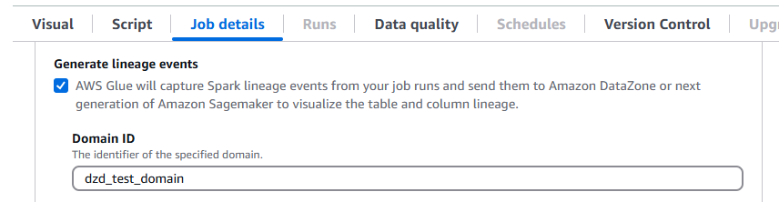

# Migrating AWS Glue for Spark jobs to

AWS Glue version 5.0

This topic describes the changes between AWS Glue versions 0.9, 1.0, 2.0, 3.0, and
4.0 to allow you to migrate your Spark applications and ETL jobs to AWS Glue
5.0. It also describes the features in AWS Glue 5.0 and the advantages of using
it.

To use this feature with your AWS Glue ETL jobs, choose
`5.0` for the `Glue version` when creating your
jobs.

###### Topics

- [New features](#migrating-version-50-features "#migrating-version-50-features")
- [Actions to migrate to
  AWS Glue 5.0](#migrating-version-50-actions "#migrating-version-50-actions")
- [Migration checklist](#migrating-version-50-checklist "#migrating-version-50-checklist")
- [AWS Glue 5.0 features](#migrating-version-50-features "#migrating-version-50-features")
- [Migrating from AWS Glue 4.0
  to AWS Glue 5.0](#migrating-version-50-from-40 "#migrating-version-50-from-40")
- [Migrating from AWS Glue 3.0
  to AWS Glue 5.0](#migrating-version-50-from-30 "#migrating-version-50-from-30")
- [Migrating from AWS Glue 2.0
  to AWS Glue 5.0](#migrating-version-50-from-20 "#migrating-version-50-from-20")
- [Logging behavior changes in AWS Glue 5.0](#enable-continous-logging-changes-glue-50 "#enable-continous-logging-changes-glue-50")
- [Connector and JDBC driver migration for AWS Glue 5.0](#migrating-version-50-connector-driver-migration "#migrating-version-50-connector-driver-migration")

## New features

This section describes new features and advantages of AWS Glue version
5.0.

- Apache Spark update from 3.3.0 in AWS Glue 4.0 to 3.5.4 in AWS Glue 5.0. See
  [Major enhancements from Spark 3.3.0 to Spark 3.5.4](#migrating-version-50-features-spark "#migrating-version-50-features-spark").
- Spark-native fine-grained access control (FGAC) using Lake Formation. This includes FGAC for Iceberg, Delta and Hudi tables.
  For more information, see [Using AWS Glue with AWS Lake Formation for fine-grained access control](security-lf-enable.md "security-lf-enable.md").

Note the following considerations or limitations for Spark-native FGAC:

    + Currently data writes are not supported
    + Writing into Iceberg through `GlueContext` using Lake Formation requires use of IAM access control instead

For a complete list of limitations and considerations when using Spark-native FGAC, see [Considerations and
limitations](security-lf-enable-considerations.md "security-lf-enable-considerations.md").

- Support for Amazon S3 Access Grants as a scalable access control solution to your Amazon S3 data from AWS Glue. For more information, see [Using Amazon S3 Access Grants with AWS Glue](security-s3-access-grants.md "security-s3-access-grants.md").
- Open Table Formats (OTF) updated to Hudi 0.15.0, Iceberg 1.7.1, and Delta Lake 3.3.0
- Amazon SageMaker Unified Studio support.
- Amazon SageMaker Lakehouse and data abstraction integration. For more information, see [Querying metastore data catalogs from AWS Glue ETL](#migrating-version-50-features-metastore "#migrating-version-50-features-metastore").
- Support to install additional Python libraries using `requirements.txt`. For more information, see [Installing additional Python libraries in AWS Glue 5.0 or above using requirements.txt](aws-glue-programming-python-libraries.md#addl-python-modules-requirements-txt "aws-glue-programming-python-libraries.md#addl-python-modules-requirements-txt").
- AWS Glue 5.0 supports data lineage in Amazon DataZone. You can configure AWS Glue to automatically collect lineage information during Spark job runs and send the lineage events to be visualized in Amazon DataZone. For more information, see [Data lineage in Amazon DataZone](../../../datazone/latest/userguide/datazone-data-lineage.md "../../../datazone/latest/userguide/datazone-data-lineage.md").

To configure this on the AWS Glue console, turn on **Generate lineage events**, and enter your Amazon DataZone domain ID on the **Job details** tab.



Alternatively, you can provide the following job parameter (provide your DataZone domain ID):

    + Key: `--conf`
    + Value:


    ```
    extraListeners=io.openlineage.spark.agent.OpenLineageSparkListener
    —conf spark.openlineage.transport.type=amazon_datazone_api
    -conf spark.openlineage.transport.domainId=<your-domain-ID>
    ```

- Connector and JDBC driver updates. For more information, see [Appendix B: JDBC driver
  upgrades](#migrating-version-50-appendix-jdbc-driver "#migrating-version-50-appendix-jdbc-driver") and [Appendix C: Connector
  upgrades](#migrating-version-50-appendix-connector "#migrating-version-50-appendix-connector").
- Java update from 8 to 17.
- Increased storage for AWS Glue `G.1X` and `G.2X` workers with disk space increasing to 94GB and 138GB respectively. Additionally, new worker types `G.12X`, `G.16X`, and memory-optimized `R.1X`, `R.2X`, `R.4X`, `R.8X` are available in AWS Glue 4.0 and later versions. For more information, see [Jobs](aws-glue-api-jobs-job.md "aws-glue-api-jobs-job.md")
- **Support for AWS SDK for Java, version 2** - AWS Glue 5.0 jobs can use the for Java versions [1.12.569](https://github.com/aws/aws-sdk-java/tree/1.12.569 "https://github.com/aws/aws-sdk-java/tree/1.12.569") or [2.28.8](https://github.com/aws/aws-sdk-java-v2/tree/2.28.8 "https://github.com/aws/aws-sdk-java-v2/tree/2.28.8") if the job supports v2. The AWS SDK for Java 2.x is a major rewrite of the version 1.x code base. It’s built on top of Java 8+ and adds several frequently requested features. These include support for non-blocking I/O, and the ability to plug in a different HTTP implementation at runtime. For more information, including a Migration Guide from SDK for Java v1 to v2, see the [AWS SDK for Java, version 2](../../../sdk-for-java.md "../../../sdk-for-java.md") guide.

###### Breaking changes

Note the following breaking changes:

- In AWS Glue 5.0, when using the S3A file system and if both `fs.s3a.endpoint` and `fs.s3a.endpoint.region` are not set, the default region
  used by S3A is `us-east-2`. This can cause issues, such as S3 upload timeout errors, especially for VPC jobs. To mitigate the issues
  caused by this change, set the `fs.s3a.endpoint.region` Spark configuration when using the S3A file system in AWS Glue 5.0.
- Lake Formation Fine-grained Access Control (FGAC)
  - AWS Glue 5.0 only supports the new Spark-native FGAC using Spark DataFrames. It does not support FGAC using AWS Glue DynamicFrames.
    - Use of FGAC in 5.0 requires migrating from AWS Glue DynamicFrames to Spark DataFrames
    - If you don't need FGAC, then it is not necessary to migrate to Spark DataFrame and GlueContext features,
      like job bookmarks and push down predicates, will continue to work.

  - Jobs with Spark-native FGAC require a minimum of 4 workers: one user driver, one system driver, one system executor, and
    one standby user executor.
  - For more information, see
    [Using AWS Glue with AWS Lake Formation for fine-grained access control](security-lf-enable.md "security-lf-enable.md").

- Lake Formation Full Table Access (FTA)
  - AWS Glue 5.0 supports FTA with Spark-native DataFrames (new) and GlueContext DynamicFrames (legacy, with limitations)
  - Spark-native FTA
    - If 4.0 script uses GlueContext, migrate to using native spark.
    - This feature is limited to hive and iceberg tables
    - For more info on configuring a 5.0 job to use Spark native FTA, see

  - GlueContext DynamicFrame FTA
    - No code change necessary
    - This feature is limited to non-OTF tables - it will not work with Iceberg, Delta Lake, and Hudi.

- [Vectorized SIMD CSV reader](aws-glue-programming-etl-format-csv-home.md#aws-glue-programming-etl-format-simd-csv-reader "aws-glue-programming-etl-format-csv-home.md#aws-glue-programming-etl-format-simd-csv-reader") is not supported.
- [Continuous logging](monitor-continuous-logging-enable.md "monitor-continuous-logging-enable.md") to output log group is not supported. Use `error` log group instead.
- The AWS Glue job run insights `job-insights-rule-driver` has been deprecated. The `job-insights-rca-driver` log stream is now located in the error log group.
- Athena-based custom/marketplace connectors are not supported.
- Adobe Marketo Engage, Facebook Ads, Google Ads, Google Analytics 4, Google Sheets, Hubspot, Instagram Ads, Intercom, Jira Cloud, Oracle NetSuite, Salesforce, Salesforce Marketing Cloud, Salesforce Marketing Cloud Account Engagement, SAP OData, ServiceNow, Slack, Snapchat Ads, Stripe, Zendesk and Zoho CRM connectors are not supported.
- Custom log4j properties are not supported in AWS Glue 5.0.

### Major enhancements from Spark 3.3.0 to Spark 3.5.4

Note the following enhancements:

- Python client for Spark Connect ([SPARK-39375](https://issues.apache.org/jira/browse/SPARK-39375 "https://issues.apache.org/jira/browse/SPARK-39375")).
- Implement support for DEFAULT values for columns in tables ([SPARK-38334](https://issues.apache.org/jira/browse/SPARK-38334 "https://issues.apache.org/jira/browse/SPARK-38334")).
- Support "Lateral Column Alias References" ([SPARK-27561](https://issues.apache.org/jira/browse/SPARK-27561 "https://issues.apache.org/jira/browse/SPARK-27561")).
- Harden SQLSTATE usage for error classes ([SPARK-41994](https://issues.apache.org/jira/browse/SPARK-41994 "https://issues.apache.org/jira/browse/SPARK-41994")).
- Enable Bloom filter Joins by default ([SPARK-38841](https://issues.apache.org/jira/browse/SPARK-38841 "https://issues.apache.org/jira/browse/SPARK-38841")).
- Better Spark UI scalability and driver stability for large applications ([SPARK-41053](https://issues.apache.org/jira/browse/SPARK-41053 "https://issues.apache.org/jira/browse/SPARK-41053")).
- Async Progress Tracking in Structured Streaming ([SPARK-39591](https://issues.apache.org/jira/browse/SPARK-39591 "https://issues.apache.org/jira/browse/SPARK-39591")).
- Python arbitrary stateful processing in structured streaming ([SPARK-40434](https://issues.apache.org/jira/browse/SPARK-40434 "https://issues.apache.org/jira/browse/SPARK-40434")).
- Pandas API coverage improvements ([SPARK-42882](https://issues.apache.org/jira/browse/SPARK-42882 "https://issues.apache.org/jira/browse/SPARK-42882")) and NumPy input support in PySpark ([SPARK-39405](https://issues.apache.org/jira/browse/SPARK-39405 "https://issues.apache.org/jira/browse/SPARK-39405")).
- Provide a memory profiler for PySpark user-defined functions ([SPARK-40281](https://issues.apache.org/jira/browse/SPARK-40281 "https://issues.apache.org/jira/browse/SPARK-40281")).
- Implement PyTorch distributor ([SPARK-41589](https://issues.apache.org/jira/browse/SPARK-41589 "https://issues.apache.org/jira/browse/SPARK-41589")).
- Publish SBOM artifacts ([SPARK-41893](https://issues.apache.org/jira/browse/SPARK-41893 "https://issues.apache.org/jira/browse/SPARK-41893")).
- Support IPv6-only environment ([SPARK-39457](https://issues.apache.org/jira/browse/SPARK-39457 "https://issues.apache.org/jira/browse/SPARK-39457")).
- Customized K8s scheduler (Apache YuniKorn and Volcano) GA ([SPARK-42802](https://issues.apache.org/jira/browse/SPARK-42802 "https://issues.apache.org/jira/browse/SPARK-42802")).
- Scala and Go client support in Spark Connect ([SPARK-42554](https://issues.apache.org/jira/browse/SPARK-42554 "https://issues.apache.org/jira/browse/SPARK-42554")) and ([SPARK-43351](https://issues.apache.org/jira/browse/SPARK-43351 "https://issues.apache.org/jira/browse/SPARK-43351")).
- PyTorch-based distributed ML Support for Spark Connect ([SPARK-42471](https://issues.apache.org/jira/browse/SPARK-42471 "https://issues.apache.org/jira/browse/SPARK-42471")).
- Structured streaming support for Spark Connect in Python and Scala ([SPARK-42938](https://issues.apache.org/jira/browse/SPARK-42938 "https://issues.apache.org/jira/browse/SPARK-42938")).
- Pandas API support for the Python Spark Connect Client ([SPARK-42497](https://issues.apache.org/jira/browse/SPARK-42497 "https://issues.apache.org/jira/browse/SPARK-42497")).
- Introduce Arrow Python UDFs ([SPARK-40307](https://issues.apache.org/jira/browse/SPARK-40307 "https://issues.apache.org/jira/browse/SPARK-40307")).
- Support Python user-defined table functions ([SPARK-43798](https://issues.apache.org/jira/browse/SPARK-43798 "https://issues.apache.org/jira/browse/SPARK-43798")).
- Migrate PySpark errors onto error classes ([SPARK-42986](https://issues.apache.org/jira/browse/SPARK-42986 "https://issues.apache.org/jira/browse/SPARK-42986")).
- PySpark test framework ([SPARK-44042](https://issues.apache.org/jira/browse/SPARK-44042 "https://issues.apache.org/jira/browse/SPARK-44042")).
- Add support for Datasketches HllSketch ([SPARK-16484](https://issues.apache.org/jira/browse/SPARK-16484 "https://issues.apache.org/jira/browse/SPARK-16484")).
- Built-in SQL function improvement ([SPARK-41231](https://issues.apache.org/jira/browse/SPARK-41231 "https://issues.apache.org/jira/browse/SPARK-41231")).
- IDENTIFIER clause ([SPARK-43205](https://issues.apache.org/jira/browse/SPARK-43205 "https://issues.apache.org/jira/browse/SPARK-43205")).
- Add SQL functions into Scala, Python and R API ([SPARK-43907](https://issues.apache.org/jira/browse/SPARK-43907 "https://issues.apache.org/jira/browse/SPARK-43907")).
- Add named argument support for SQL functions ([SPARK-43922](https://issues.apache.org/jira/browse/SPARK-43922 "https://issues.apache.org/jira/browse/SPARK-43922")).
- Avoid unnecessary task rerun on decommissioned executor lost if shuffle data migrated ([SPARK-41469](https://issues.apache.org/jira/browse/SPARK-41469 "https://issues.apache.org/jira/browse/SPARK-41469")).
- Distributed ML <> spark connect ([SPARK-42471](https://issues.apache.org/jira/browse/SPARK-42471 "https://issues.apache.org/jira/browse/SPARK-42471")).
- DeepSpeed distributor ([SPARK-44264](https://issues.apache.org/jira/browse/SPARK-44264 "https://issues.apache.org/jira/browse/SPARK-44264")).
- Implement changelog checkpointing for RocksDB state store ([SPARK-43421](https://issues.apache.org/jira/browse/SPARK-43421 "https://issues.apache.org/jira/browse/SPARK-43421")).
- Introduce watermark propagation among operators ([SPARK-42376](https://issues.apache.org/jira/browse/SPARK-42376 "https://issues.apache.org/jira/browse/SPARK-42376")).
- Introduce dropDuplicatesWithinWatermark ([SPARK-42931](https://issues.apache.org/jira/browse/SPARK-42931 "https://issues.apache.org/jira/browse/SPARK-42931")).
- RocksDB state store provider memory management enhancements ([SPARK-43311](https://issues.apache.org/jira/browse/SPARK-43311 "https://issues.apache.org/jira/browse/SPARK-43311")).

## Actions to migrate to

AWS Glue 5.0

For existing jobs, change the `Glue version` from the previous version to
`Glue 5.0` in the job configuration.

- In AWS Glue Studio, choose `Glue 5.0 - Supports Spark 3.5.4,
Scala 2, Python 3` in `Glue version`.
- In the API, choose `5.0` in the `GlueVersion`
  parameter in the [`UpdateJob`](aws-glue-api-jobs-job.md#aws-glue-api-jobs-job-UpdateJob "aws-glue-api-jobs-job.md#aws-glue-api-jobs-job-UpdateJob") API operation.

For new jobs, choose `Glue 5.0` when you create a job.

- In the console, choose `Spark 3.5.4, Python 3 (Glue Version 5.0) or Spark
3.5.4, Scala 2 (Glue Version 5.0)` in `Glue version`.
- In AWS Glue Studio, choose `Glue 5.0 - Supports Spark 3.5.4,
Scala 2, Python 3` in `Glue version`.
- In the API, choose `5.0` in the `GlueVersion`
  parameter in the [`CreateJob`](aws-glue-api-jobs-job.md#aws-glue-api-jobs-job-CreateJob "aws-glue-api-jobs-job.md#aws-glue-api-jobs-job-CreateJob") API operation.

To view Spark event logs of AWS Glue 5.0 coming from AWS Glue
2.0 or earlier, [launch an
upgraded Spark history server for AWS Glue 5.0 using AWS CloudFormation or
Docker](monitor-spark-ui-history.md "monitor-spark-ui-history.md").

## Migration checklist

Review this checklist for migration:

- Java 17 updates
- [Scala] Upgrade AWS SDK calls from v1 to v2
- Python 3.10 to 3.11 migration
- [Python] Update boto references from 1.26 to 1.34

## AWS Glue 5.0 features

This section describes AWS Glue features in more detail.

### Querying metastore data catalogs from AWS Glue ETL

You can register your AWS Glue job to access the AWS Glue Data Catalog, which makes tables and other metastore resources available to disparate consumers. The Data Catalog supports a multi-catalog hierarchy, which unifies all your data across Amazon S3 data lakes. It also provides both a Hive metastore API and an open-source Apache Iceberg API for accessing the data. These features are available to AWS Glue and other data-oriented services like Amazon EMR, Amazon Athena and Amazon Redshift.

When you create resources in the Data Catalog, you can access them from any SQL engine that supports the Apache Iceberg REST API. AWS Lake Formation manages permissions. Following configuration, you can leverage AWS Glue's capabilities to query disparate data by querying these metastore resources with familiar applications. These include Apache Spark and Trino.

#### How metadata resources are organized

Data is organized in a logical hierarchy of catalogs, databases and tables, using the AWS Glue Data Catalog:

- Catalog – A logical container that holds objects from a data store, such as schemas or tables.
- Database – Organizes data objects such as tables and views in a catalog.
- Tables and views – Data objects in a database that provide an abstraction layer with an understandable schema. They make it easy to access underlying data, which could be in various formats and in various locations.

## Migrating from AWS Glue 4.0

to AWS Glue 5.0

All existing job parameters and major features that exist in
AWS Glue 4.0 will exist in AWS Glue 5.0, except machine learning transforms.

The following new parameters were added:

- `--enable-lakeformation-fine-grained-access`: Enables the fine-grained access control (FGAC) feature in AWS Lake Formation tables.

Refer to the Spark migration documentation:

- [Migration Guide: Spark Core](https://spark.apache.org/docs/3.5.0/core-migration-guide.html "https://spark.apache.org/docs/3.5.0/core-migration-guide.html")
- [Migration Guide: SQL, Datasets and DataFrame](https://spark.apache.org/docs/3.5.0/sql-migration-guide.html "https://spark.apache.org/docs/3.5.0/sql-migration-guide.html")
- [Migration Guide: Structured Streaming](https://spark.apache.org/docs/3.5.0/ss-migration-guide.html "https://spark.apache.org/docs/3.5.0/ss-migration-guide.html")
- [Upgrading PySpark](https://spark.apache.org/docs/3.5.0/api/python/migration_guide/pyspark_upgrade.html "https://spark.apache.org/docs/3.5.0/api/python/migration_guide/pyspark_upgrade.html")

## Migrating from AWS Glue 3.0

to AWS Glue 5.0

###### Note

For migration steps related to AWS Glue 4.0, see [Migrating from AWS Glue 3.0
to AWS Glue 4.0](migrating-version-40.md#migrating-version-40-from-30 "migrating-version-40.md#migrating-version-40-from-30").

All existing job parameters and major features that exist in
AWS Glue 3.0 will exist in AWS Glue 5.0, except machine learning transforms.

## Migrating from AWS Glue 2.0

to AWS Glue 5.0

###### Note

For migration steps related to AWS Glue 4.0 and a list of migration differences between AWS Glue version 3.0 and 4.0, see [Migrating from AWS Glue 3.0
to AWS Glue 4.0](migrating-version-40.md#migrating-version-40-from-30 "migrating-version-40.md#migrating-version-40-from-30").

Also note the following migration differences between AWS Glue versions 3.0 and 2.0:

- All existing job parameters and major features that exist in AWS Glue 2.0 will exist in AWS Glue 5.0, except machine learning transforms.
- Several Spark changes alone may require revision of your scripts to ensure removed features are not being referenced. For example, Spark 3.1.1 and later does not enable Scala-untyped UDFs but Spark 2.4 does allow them.
- Python 2.7 is not supported.
- Any extra jars supplied in existing AWS Glue 2.0 jobs may bring in conflicting dependencies since there were upgrades in several dependencies. You can avoid classpath conflicts with the `--user-jars-first` job parameter.
- Changes to the behavior of loading/saving of timestamps from/to parquet files. For more details, see Upgrading from Spark SQL 3.0 to 3.1.
- Different Spark task parallelism for driver/executor configuration. You can adjust task parallelism by passing the `--executor-cores` job argument.

##

Logging behavior changes in AWS Glue 5.0

The following are changes in logging behavior in AWS Glue 5.0. For more information, see
[Logging for AWS Glue jobs](monitor-continuous-logging.md "monitor-continuous-logging.md").

- All logs (system logs, Spark daemon logs, user logs, and Glue Logger logs) are now written to the `/aws-glue/jobs/error`
  log group by default.
- The `/aws-glue/jobs/logs-v2` log group used for continuous logging in previous versions is no longer used.
- You can no longer rename or customize the log group or log stream names using the removed continuous logging arguments. Instead,
  see the new job arguments in AWS Glue 5.0.

### Two new job arguments are introduced in AWS Glue 5.0

- `––custom-logGroup-prefix`: Allows you to specify a custom prefix for the `/aws-glue/jobs/error` and
  `/aws-glue/jobs/output` log groups.
- `––custom-logStream-prefix`: Allows you to specify a custom prefix for the log stream names within the log groups.

Validation rules and limitations for custom prefixes include:

    + The entire log stream name must be between 1 and 512 characters.
    + The custom prefix for log stream names is limited to 400 characters.
    + Allowed characters in prefixes include alphanumeric characters, underscores (`\_`), hyphens (`-`), and forward slashes (`/`).

### Deprecated continuous logging arguments in AWS Glue 5.0

The following job arguments for continuous logging have been deprecated in AWS Glue 5.0

- `––enable-continuous-cloudwatch-log`
- `––continuous-log-logGroup`
- `––continuous-log-logStreamPrefix`
- `––continuous-log-conversionPattern`
- `––enable-continuous-log-filter`

## Connector and JDBC driver migration for AWS Glue 5.0

For the versions of JDBC and data lake connectors that were upgraded, see:

- [Appendix B: JDBC driver
  upgrades](#migrating-version-50-appendix-jdbc-driver "#migrating-version-50-appendix-jdbc-driver")
- [Appendix C: Connector
  upgrades](#migrating-version-50-appendix-connector "#migrating-version-50-appendix-connector")
- [Appendix D: Open table format
  upgrades](#migrating-version-50-appendix-open-table-formats "#migrating-version-50-appendix-open-table-formats")

The following changes apply to the connector or driver versions identified in the appendices for Glue 5.0.

###### Amazon Redshift

Note the following changes:

- Adds support for three-part table names to allow connector to query Redshift data sharing tables.
- Corrects mapping of Spark `ShortType` to use Redshift `SMALLINT` instead of `INTEGER` to better match expected data size.
- Added support for Custom Cluster Names (CNAME) for Amazon Redshift Serverless.

###### Apache Hudi

Note the following changes:

- Support record level index.
- Support auto generation of record keys. Now you don’t have to specify the record key field.

###### Apache Iceberg

Note the following changes:

- Support fine-grained access control with AWS Lake Formation.
- Support branching and tagging which are named references to snapshots with their own independent lifecycles.
- Added a changelog view procedure which generates a view that contains the changes made to a table over a specified period or between specific snapshots.

###### Delta Lake

Note the following changes:

- Support Delta Universal Format (UniForm) which enables seamless access through Apache Iceberg and Apache Hudi.
- Support Deletion Vectors that implements a Merge-on-Read paradigm.

###### AzureCosmos

Note the following changes:

- Added hierarchical partition key support.
- Added option to use custom Schema with StringType (raw json) for a nested property.
- Added config option `spark.cosmos.auth.aad.clientCertPemBase64` to allow using SPN (ServicePrincipal name) authentication with certificate instead of client secret.

For more information, see the [Azure Cosmos DB Spark connector change log](https://github.com/Azure/azure-sdk-for-java/blob/main/sdk/cosmos/azure-cosmos-spark_3-2_2-12/CHANGELOG.md "https://github.com/Azure/azure-sdk-for-java/blob/main/sdk/cosmos/azure-cosmos-spark_3-2_2-12/CHANGELOG.md").

###### Microsoft SQL Server

Note the following changes:

- TLS encryption is enabled by default.
- When encrypt = false but the server requires encryption, the certificate is validated based on the `trustServerCertificate` connection setting.
- `aadSecurePrincipalId` and `aadSecurePrincipalSecret` deprecated.
- `getAADSecretPrincipalId` API removed.
- Added CNAME resolution when realm is specified.

###### MongoDB

Note the following changes:

- Support for micro-batch mode with Spark Structured Streaming.
- Support for BSON data types.
- Added support for reading multiple collections when using micro-batch or continuous streaming modes.
  - If the name of a collection used in your `collection` configuration option contains a comma, the Spark Connector treats it as two different collections. To avoid this, you must escape the comma by preceding it with a backslash (\).
  - If the name of a collection used in your `collection` configuration option is "\*", the Spark Connector interprets it as a specification to scan all collections. To avoid this, you must escape the asterisk by preceding it with a backslash (\).
  - If the name of a collection used in your `collection` configuration option contains a backslash (\), the Spark Connector treats the backslash as an escape character, which might change how it interprets the value. To avoid this, you must escape the backslash by preceding it with another backslash.

For more information, see the [MongoDB connector for Spark release notes](https://www.mongodb.com/docs/spark-connector/current/release-notes/ "https://www.mongodb.com/docs/spark-connector/current/release-notes/").

###### Snowflake

Note the following changes:

- Introduced a new `trim_space` parameter that you can use to trim values of `StringType` columns automatically when saving to a Snowflake table. Default: `false`.
- Disabled the `abort_detached_query` parameter at the session level by default.
- Removed the requirement of the `SFUSER` parameter when using OAUTH.
- Removed the Advanced Query Pushdown feature. Alternatives to the feature are available. For example, instead of loading data from Snowflake tables, users can directly load data from Snowflake SQL queries.

For more information, see the [Snowflake Connector for Spark release notes](https://docs.snowflake.com/en/release-notes/clients-drivers/spark-connector-2024 "https://docs.snowflake.com/en/release-notes/clients-drivers/spark-connector-2024").

### Appendix A: Notable

dependency upgrades

The following are dependency upgrades:

| Dependency                   | Version in AWS Glue 5.0 | Version in AWS Glue 4.0 | Version in AWS Glue 3.0 | Version in AWS Glue 2.0 | Version in AWS Glue 1.0 |
| ---------------------------- | ----------------------- | ----------------------- | ----------------------- | ----------------------- | ----------------------- |
| Java                         | 17                      | 8                       | 8                       | 8                       | 8                       |
| Spark                        | 3.5.4                   | 3.3.0-amzn-1            | 3.1.1-amzn-0            | 2.4.3                   | 2.4.3                   |
| Hadoop                       | 3.4.1                   | 3.3.3-amzn-0            | 3.2.1-amzn-3            | 2.8.5-amzn-5            | 2.8.5-amzn-1            |
| Scala                        | 2.12.18                 | 2.12                    | 2.12                    | 2.11                    | 2.11                    |
| Jackson                      | 2.15.2                  | 2.12                    | 2.12                    | 2.11                    | 2.11                    |
| Hive                         | 2.3.9-amzn-4            | 2.3.9-amzn-2            | 2.3.7-amzn-4            | 1.2                     | 1.2                     |
| EMRFS                        | 2.69.0                  | 2.54.0                  | 2.46.0                  | 2.38.0                  | 2.30.0                  |
| Json4s                       | 3.7.0-M11               | 3.7.0-M11               | 3.6.6                   | 3.5.x                   | 3.5.x                   |
| Arrow                        | 12.0.1                  | 7.0.0                   | 2.0.0                   | 0.10.0                  | 0.10.0                  |
| AWS Glue Data Catalog client | 4.5.0                   | 3.7.0                   | 3.0.0                   | 1.10.0                  | N/A                     |
| AWS SDK for Java             | 2.29.52                 | 1.12                    | 1.12                    |                         |                         |
| Python                       | 3.11                    | 3.10                    | 3.7                     | 2.7 & 3.6               | 2.7 & 3.6               |
| Boto                         | 1.34.131                | 1.26                    | 1.18                    | 1.12                    | N/A                     |
| EMR DynamoDB connector       | 5.6.0                   | 4.16.0                  |                         |                         |                         |

### Appendix B: JDBC driver

upgrades

The following are JDBC driver upgrades:

| Driver               | JDBC driver version in AWS Glue 5.0 | JDBC driver version in AWS Glue 4.0 | JDBC driver version in AWS Glue 3.0 | JDBC driver version in past AWS Glue versions |
| -------------------- | ----------------------------------- | ----------------------------------- | ----------------------------------- | --------------------------------------------- |
| MySQL                | 8.0.33                              | 8.0.23                              | 8.0.23                              | 5.1                                           |
| Microsoft SQL Server | 10.2.0                              | 9.4.0                               | 7.0.0                               | 6.1.0                                         |
| Oracle Databases     | 23.3.0.23.09                        | 21.7                                | 21.1                                | 11.2                                          |
| PostgreSQL           | 42.7.3                              | 42.3.6                              | 42.2.18                             | 42.1.0                                        |
| Amazon Redshift      | redshift-jdbc42-2.1.0.29            | redshift-jdbc42-2.1.0.16            | redshift-jdbc41-1.2.12.1017         | redshift-jdbc41-1.2.12.1017                   |
| SAP Hana             | 2.20.17                             | 2.17.12                             |                                     |                                               |
| Teradata             | 20.00.00.33                         | 20.00.00.06                         |                                     |                                               |

### Appendix C: Connector

upgrades

The following are connector upgrades:

| Driver                 | Connector version in AWS Glue 5.0 | Connector version in AWS Glue 4.0 | Connector version in AWS Glue 3.0 |
| ---------------------- | --------------------------------- | --------------------------------- | --------------------------------- |
| EMR DynamoDB connector | 5.6.0                             | 4.16.0                            |                                   |
| Amazon Redshift        | 6.4.0                             | 6.1.3                             |                                   |
| OpenSearch             | 1.2.0                             | 1.0.1                             |                                   |
| MongoDB                | 10.4.0                            | 10.0.4                            | 3.0.0                             |
| Snowflake              | 3.0.0                             | 2.12.0                            |                                   |
| Google BigQuery        | 0.32.2                            | 0.32.2                            |                                   |
| AzureCosmos            | 4.33.0                            | 4.22.0                            |                                   |
| AzureSQL               | 1.3.0                             | 1.3.0                             |                                   |
| Vertica                | 3.3.5                             | 3.3.5                             |                                   |

### Appendix D: Open table format

upgrades

The following are open table format upgrades:

| OTF        | Connector version in AWS Glue 5.0 | Connector version in AWS Glue 4.0 | Connector version in AWS Glue 3.0 |
| ---------- | --------------------------------- | --------------------------------- | --------------------------------- |
| Hudi       | 0.15.0                            | 0.12.1                            | 0.10.1                            |
| Delta Lake | 3.3.0                             | 2.1.0                             | 1.0.0                             |
| Iceberg    | 1.7.1                             | 1.0.0                             | 0.13.1                            |
