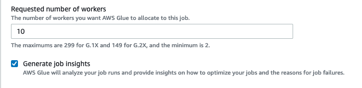
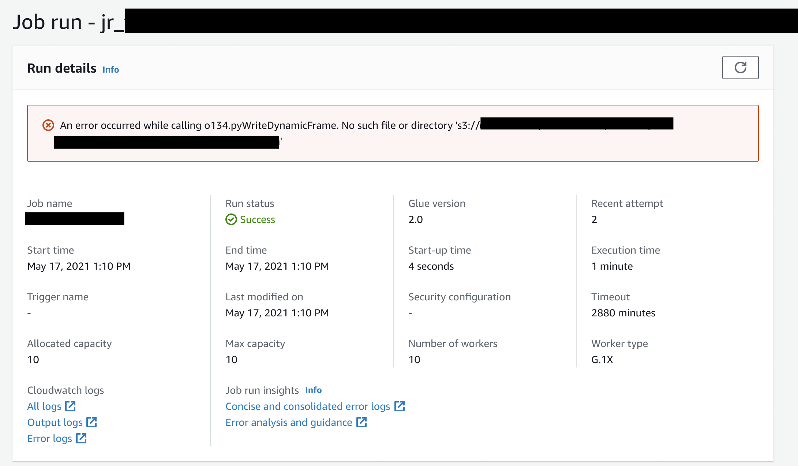
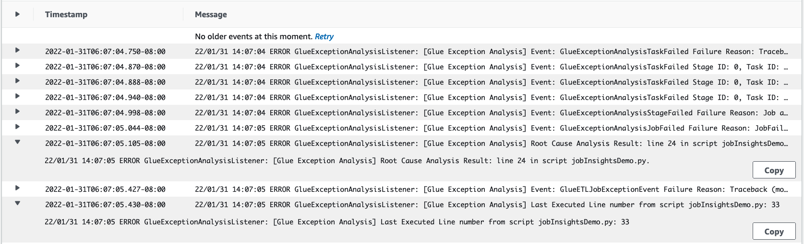
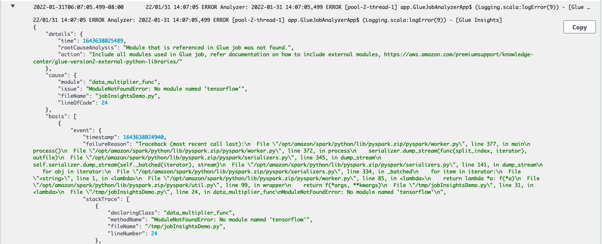

# Monitoring with AWS Glue job run insights

AWS Glue job run insights is a feature in AWS Glue that simplifies job debugging and optimization for your AWS Glue jobs. AWS Glue provides [Spark UI](monitor-spark-ui.md "monitor-spark-ui.md"), and [CloudWatch logs and metrics](monitor-cloudwatch.md "monitor-cloudwatch.md") for monitoring your AWS Glue jobs. With this feature, you get this information about your AWS Glue job's execution:

- Line number of your AWS Glue job script that had a failure.
- Spark action that executed last in the Spark query plan just before the failure of your job.
- Spark exception events related to the failure presented in a time-ordered log stream.
- Root cause analysis and recommended action (such as tuning your script) to fix the issue.
- Common Spark events (log messages relating to a Spark action) with a recommended action that addresses the root cause.
  All these insights are available to you using two new log streams in the CloudWatch logs for your AWS Glue jobs.

## Requirements

The AWS Glue job run insights feature is available for AWS Glue versions 2.0, 3.0, 4.0, and 5.0. You can follow the [migration guide](migrating-version-30.md "migrating-version-30.md") for your existing jobs to upgrade them from older AWS Glue versions.

## Enabling job run insights for an AWS Glue ETL job

You can enable job run insights through AWS Glue Studio or the CLI.

### AWS Glue Studio

When creating a job via AWS Glue Studio, you can enable or disable job run insights under the **Job Details** tab. Check that the **Generate job insights** box is selected.



### Command line

If creating a job via the CLI, you can start a job run with a single new [job parameter](aws-glue-programming-etl-glue-arguments.md "aws-glue-programming-etl-glue-arguments.md"): `--enable-job-insights = true`.

By default, the job run insights log streams are created under the same default log group used by [AWS Glue continuous logging](monitor-continuous-logging.md "monitor-continuous-logging.md"), that is, `/aws-glue/jobs/logs-v2/`. You may set up custom log group name, log filters and log group configurations using the same set of arguments for continuous logging. For more information, see [Enabling Continuous Logging for AWS Glue Jobs](monitor-continuous-logging-enable.md "monitor-continuous-logging-enable.md").

## Accessing the job run insights log streams in CloudWatch

With the job run insights feature enabled, there may be two log streams created when a job run fails. When a job finishes successfully, neither of the streams are generated.

1. _Exception analysis log stream_: `<job-run-id>-job-insights-rca-driver`. This stream provides the following:
   - Line number of your AWS Glue job script that caused the failure.
   - Spark action that executed last in the Spark query plan (DAG).
   - Concise time-ordered events from the Spark driver and executors that are related to the exception. You can find details such as complete error messages, the failed Spark task and its executors ID that help you to focus on the specific executor's log stream for a deeper investigation if needed.

2. _Rule-based insights stream_:
   - Root cause analysis and recommendations on how to fix the errors (such as using a specific job parameter to optimize the performance).
   - Relevant Spark events serving as the basis for root cause analysis and a recommended action.

###### Note

The first stream will exist only if any exception Spark events are available for a failed job run, and the second stream will exist only if any insights are available for the failed job run. For example, if your job finishes successfully, neither of the streams will be generated; if your job fails but there isn't a service-defined rule that can match with your failure scenario, then only the first stream will be generated.

If the job is created from AWS Glue Studio, the links to the above streams are also available under the job run details tab (Job run insights) as "Concise and consolidated error logs" and "Error analysis and guidance".



## Example for AWS Glue job run insights

In this section we present an example of how the job run insights feature can help you resolve an issue in your failed job. In this example, a user forgot to import the required module (tensorflow) in an AWS Glue job to analyze and build a machine learning model on their data.

```
import sys
from awsglue.transforms import *
from awsglue.utils import getResolvedOptions
from pyspark.context import SparkContext
from awsglue.context import GlueContext
from awsglue.job import Job
from pyspark.sql.types import *
from pyspark.sql.functions import udf,col

args = getResolvedOptions(sys.argv, ['JOB_NAME'])

sc = SparkContext()
glueContext = GlueContext(sc)
spark = glueContext.spark_session
job = Job(glueContext)
job.init(args['JOB_NAME'], args)

data_set_1 = [1, 2, 3, 4]
data_set_2 = [5, 6, 7, 8]

scoresDf = spark.createDataFrame(data_set_1, IntegerType())

def data_multiplier_func(factor, data_vector):
    import tensorflow as tf
    with tf.compat.v1.Session() as sess:
        x1 = tf.constant(factor)
        x2 = tf.constant(data_vector)
        result = tf.multiply(x1, x2)
        return sess.run(result).tolist()

data_multiplier_udf = udf(lambda x:data_multiplier_func(x, data_set_2), ArrayType(IntegerType(),False))
factoredDf = scoresDf.withColumn("final_value", data_multiplier_udf(col("value")))
print(factoredDf.collect())

```

Without the job run insights feature, as the job fails, you only see this message thrown by Spark:

`An error occurred while calling o111.collectToPython. Traceback (most recent call last):`

The message is ambiguous and limits your debugging experience. In this case, this feature provides with you additional insights in two CloudWatch log streams:

1. The `job-insights-rca-driver` log stream:
   - _Exception events_: This log stream provides you the Spark exception events related to the failure collected from the Spark driver and different distributed workers. These events help you understand the time-ordered propagation of the exception as faulty code executes across Spark tasks, executors, and stages distributed across the AWS Glue workers.
   - _Line numbers_: This log stream identifies line 21, which made the call to import the missing Python module that caused the failure; it also identifies line 24, the call to Spark Action `collect()`, as the last executed line in your script.

 2. The `job-insights-rule-driver` log stream:

    * *Root cause and recommendation*: In addition to the line number and last executed line number for the fault in your script, this log stream shows the root cause analysis and recommendation for you to follow the AWS Glue doc and set up the necessary job parameters in order to use an additional Python module in your AWS Glue job.
    * *Basis event*: This log stream also shows the Spark exception event that was evaluated with the service-defined rule to infer the root cause and provide a recommendation.


