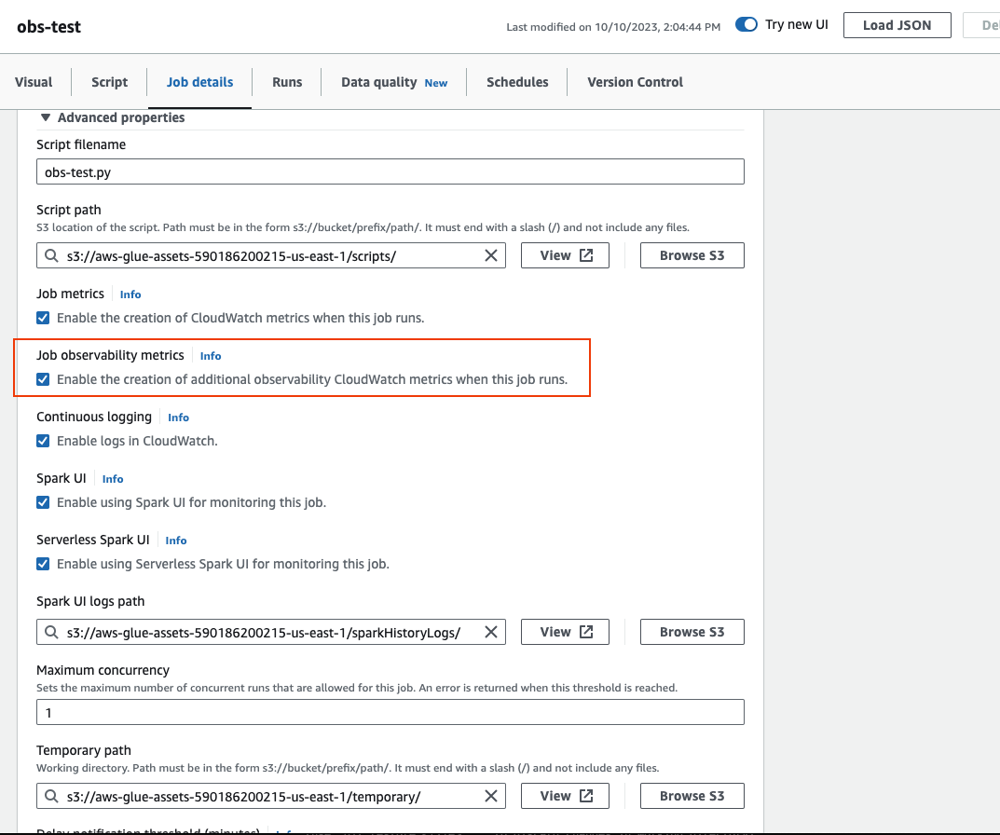
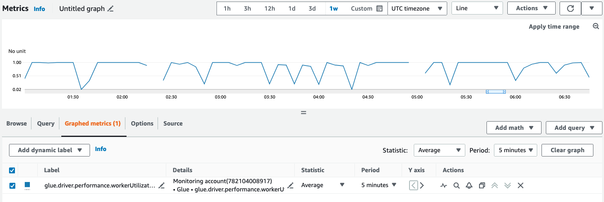

# Monitoring with AWS Glue Observability metrics

###### Note

AWS Glue Observability metrics is available on AWS Glue 4.0 and later versions.

Use AWS Glue Observability metrics to generate insights into what is happening inside your AWS Glue for
Apache Spark jobs to improve triaging and analysis of issues. Observability metrics are visualized through Amazon CloudWatch
dashboards and can be used to help perform root cause analysis for errors and for diagnosing performance bottlenecks.
You can reduce the time spent debugging issues at scale so you can focus on resolving issues faster and more effectively.

AWS Glue Observability provides Amazon CloudWatch metrics categorized in following four groups:

- **Reliability (i.e., Errors Classes)** – easily identify the most common failure reasons at given time
  range that you may want to address.
- **Performance (i.e., Skewness)** – identify a performance bottleneck and apply tuning techniques.
  For example, when you experience degraded performance due to job skewness, you may want to enable Spark Adaptive Query Execution
  and fine-tune the skew join threshold.
- **Throughput (i.e., per source/sink throughput)** – monitor trends of data reads and writes. You can also
  configure Amazon CloudWatch alarms for anomalies.
- **Resource Utilization (i.e., workers, memory and disk utilization)** – efficiently find the jobs with low
  capacity utilization. You may want to enable AWS Glue auto-scaling for those jobs.

##

Getting started with AWS Glue Observability metrics

###### Note

The new metrics are enabled by default in the AWS Glue Studio console.

###### To configure observability metrics in AWS Glue Studio:

1. Log in to the AWS Glue console and choose **ETL jobs** from the console menu.
2. Choose a job by clicking on the job name in the **Your jobs** section.
3. Choose the **Job details** tab.
4. Scroll to the bottom and choose **Advanced properties**, then **Job
   observability metrics**.



###### To enable AWS Glue Observability metrics using AWS CLI:

- Add to the `--default-arguments` map the following key-value in the input JSON file:

```
--enable-observability-metrics, true

```

## Using AWS Glue observability

Because the AWS Glue observability metrics is provided through Amazon CloudWatch, you can use the Amazon CloudWatch
console, AWS CLI, SDK or API to query the observability metrics datapoints. See
[Using Glue Observability for monitoring resource utilization to reduce cost](https://aws.amazon.com/blogs/big-data/enhance-monitoring-and-debugging-for-aws-glue-jobs-using-new-job-observability-metrics/ "https://aws.amazon.com/blogs/big-data/enhance-monitoring-and-debugging-for-aws-glue-jobs-using-new-job-observability-metrics/")  
 for an example use case when to use AWS Glue observability metrics.

###

Using AWS Glue observability in the Amazon CloudWatch console

###### To query and visualize metrics in the Amazon CloudWatch console:

1. Open the Amazon CloudWatch console and choose **All metrics**.
2. Under custom namespaces, choose **AWS Glue**.
3. Choose **Job Observability Metrics, Observability Metrics Per Source, or Observability Metrics Per Sink**
   .
4. Search for the specific metric name, job name, job run ID, and select them.
5. Under the **Graphed metrics** tab, configure your preferred statistic, period, and other options.



###### To query an Observability metric using AWS CLI:

1. Create a metric definition JSON file and replace `your-Glue-job-name`and
   `your-Glue-job-run-id` with yours.

```
$ cat multiplequeries.json
[
    {
        "Id": "avgWorkerUtil_0",
        "MetricStat": {
            "Metric": {
                "Namespace": "Glue",
                "MetricName": "glue.driver.workerUtilization",
                "Dimensions": [
                    {
                        "Name": "JobName",
                        "Value": "<your-Glue-job-name-A>"
                    },
                    {
                        "Name": "JobRunId",
                        "Value": "<your-Glue-job-run-id-A>"
                    },
                    {
                        "Name": "Type",
                        "Value": "gauge"
                    },
                    {
                        "Name": "ObservabilityGroup",
                        "Value": "resource_utilization"
                    }
                ]
            },
            "Period": 1800,
            "Stat": "Minimum",
            "Unit": "None"
        }
    },
    {
        "Id": "avgWorkerUtil_1",
        "MetricStat": {
            "Metric": {
                "Namespace": "Glue",
                "MetricName": "glue.driver.workerUtilization",
                "Dimensions": [
                    {
                        "Name": "JobName",
                        "Value": "<your-Glue-job-name-B>"
                    },
                    {
                        "Name": "JobRunId",
                        "Value": "<your-Glue-job-run-id-B>"
                    },
                    {
                        "Name": "Type",
                        "Value": "gauge"
                    },
                    {
                        "Name": "ObservabilityGroup",
                        "Value": "resource_utilization"
                    }
                ]
            },
            "Period": 1800,
            "Stat": "Minimum",
            "Unit": "None"
        }
    }
]


```

2. Run the `get-metric-data` command:

```
$ aws cloudwatch get-metric-data --metric-data-queries file: //multiplequeries.json \
     --start-time '2023-10-28T18: 20' \
     --end-time '2023-10-28T19: 10'  \
     --region us-east-1
{
    "MetricDataResults": [
        {
            "Id": "avgWorkerUtil_0",
            "Label": "<your-label-for-A>",
            "Timestamps": [
                "2023-10-28T18:20:00+00:00"
            ],
            "Values": [
                0.06718750000000001
            ],
            "StatusCode": "Complete"
        },
        {
            "Id": "avgWorkerUtil_1",
            "Label": "<your-label-for-B>",
            "Timestamps": [
                "2023-10-28T18:50:00+00:00"
            ],
            "Values": [
                0.5959183673469387
            ],
            "StatusCode": "Complete"
        }
    ],
    "Messages": []
}

```

## Observability metrics

AWS Glue Observability profiles and sends the following metrics to Amazon CloudWatch every 30 seconds,
and some of these metrics can be visible in the AWS Glue Studio Job Runs Monitoring Page.

| Metric                                      | Description                                                                                                                                                                                                                                                                                                                                                                                                                                                                                                                                                                                                                                                                                                                                                                                                                                                                                                                                                                                                                                                                                                                                                                                                                                                                                   | Category                                                                                                                                                                                                                                                                                                                                                                                                                                                                                    |
| ------------------------------------------- | --------------------------------------------------------------------------------------------------------------------------------------------------------------------------------------------------------------------------------------------------------------------------------------------------------------------------------------------------------------------------------------------------------------------------------------------------------------------------------------------------------------------------------------------------------------------------------------------------------------------------------------------------------------------------------------------------------------------------------------------------------------------------------------------------------------------------------------------------------------------------------------------------------------------------------------------------------------------------------------------------------------------------------------------------------------------------------------------------------------------------------------------------------------------------------------------------------------------------------------------------------------------------------------------- | ------------------------------------------------------------------------------------------------------------------------------------------------------------------------------------------------------------------------------------------------------------------------------------------------------------------------------------------------------------------------------------------------------------------------------------------------------------------------------------------- | ---------------------------------------- | -------------------------------------------------------------------------------------------------------------------------------- | ------------------------------------------------------------------------------------------------------------------------------------------------------------------------------------------------------------------------------------------------------------------------------------------------------------------------------------------------------------------------------------------------------------------------------------------------------------------------------------------------------------------------------------------------------------------------------------------------------------------------------------------------------------------------------------------------------------------------------------------------------------------------------------------------------------------------------------------------------------------------------------------------------------------------------------------------------------------------------------------------------------------------------------------------------------------------------------------------------------------------------------------------------------------------------------------------------------------------------------------------------------------------------------------------------------------------------------------------------------------------------------------------------- |
| glue.driver.skewness.stage                  | Metric Category: job_performance The spark stages execution Skewness: this metric is an indicator of how long the maximum task duration time in a certain stage is compared to the median task duration in this stage. It captures execution skewness, which might be caused by input data skewness or by a transformation (e.g., skewed join). The values of this metric falls into the range of [0, infinity[, where 0 means the ratio of the maximum to median tasks' execution time, among all tasks in the stage is less than a certain stage skewness factor. The default stage skewness factor is `5` and it can be overwritten via spark conf: spark.metrics.conf.driver.source.glue.jobPerformance.skewnessFactor A stage skewness value of 1 means the ratio is twice the stage skewness factor. The value of stage skewness is updated every 30 seconds to reflect the current skewness. The value at the end of the stage reflects the final stage skewness. This stage-level metric is used to calculate the job-level metric `glue.driver.skewness.job`. Valid dimensions: JobName (the name of the AWS Glue Job), JobRunId (the JobRun ID. or ALL), Type (gauge), and ObservabilityGroup (job_performance) Valid Statistics: Average, Maximum, Minimum, Percentile Unit: Count | job_performance                                                                                                                                                                                                                                                                                                                                                                                                                                                                             |
| glue.driver.skewness.job                    | Metric Category: job_performance Job skewness is the maximum of weighted skewness of all stages. The stage skewness (glue.driver.skewness.stage) is weighted with stage duration. This is to avoid the corner case when a very skewed stage is actually running for very short time relative to other stages (and thus its skewness is not significant for the overall job performance and does not worth the effort to try to address its skewness). This metric is updated upon completion of each stage, and thus the last value reflects the actual overall job skewness. Valid dimensions: JobName (the name of the AWS Glue Job), JobRunId (the JobRun ID. or ALL), Type (gauge), and ObservabilityGroup (job_performance) Valid Statistics: Average, Maximum, Minimum, Percentile Unit: Count                                                                                                                                                                                                                                                                                                                                                                                                                                                                                          | job_performance                                                                                                                                                                                                                                                                                                                                                                                                                                                                             |
| glue.succeed.ALL                            | Metric Category: error Total number of successful job runs, to complete the picture of failures categories Valid dimensions: JobName (the name of the AWS Glue Job), JobRunId (the JobRun ID. or ALL), Type (count), and ObservabilityGroup (error) Valid Statistics: SUM Unit: Count                                                                                                                                                                                                                                                                                                                                                                                                                                                                                                                                                                                                                                                                                                                                                                                                                                                                                                                                                                                                         | error                                                                                                                                                                                                                                                                                                                                                                                                                                                                                       |
| glue.error.ALL                              | Metric Category: error Total number of job run errors, to complete the picture of failures categories Valid dimensions: JobName (the name of the AWS Glue Job), JobRunId (the JobRun ID. or ALL), Type (count), and ObservabilityGroup (error) Valid Statistics: SUM Unit: Count                                                                                                                                                                                                                                                                                                                                                                                                                                                                                                                                                                                                                                                                                                                                                                                                                                                                                                                                                                                                              | error                                                                                                                                                                                                                                                                                                                                                                                                                                                                                       |
| glue.error.[error category]                 | Metric Category: error This is actually a set of metrics, that are updated only when a job run fails. The error categorization helps with triaging and debugging. When a job run fails, the error causing the failure is categorized and the corresponding error category metric is set to 1. This helps to perform over time failures analysis, as well as over all jobs error analysis to identify most common failure categories to start addressing them. AWS Glue has 28 error categories, including OUT_OF_MEMORY (driver and executor), PERMISSION, SYNTAX and THROTTLING error categories. Error categories also include COMPILATION, LAUNCH and TIMEOUT error categories. Valid dimensions: JobName (the name of the AWS Glue Job), JobRunId (the JobRun ID. or ALL), Type (count), and ObservabilityGroup (error) Valid Statistics: SUM Unit: Count                                                                                                                                                                                                                                                                                                                                                                                                                                 | error                                                                                                                                                                                                                                                                                                                                                                                                                                                                                       |
| glue.driver.workerUtilization               | Metric Category: resource_utilization The percentage of the allocated workers which are actually used. If not good, auto scaling can help. Valid dimensions: JobName (the name of the AWS Glue Job), JobRunId (the JobRun ID. or ALL), Type (gauge), and ObservabilityGroup (resource_utilization) Valid Statistics: Average, Maximum, Minimum, Percentile Unit: Percentage                                                                                                                                                                                                                                                                                                                                                                                                                                                                                                                                                                                                                                                                                                                                                                                                                                                                                                                   | resource_utilization                                                                                                                                                                                                                                                                                                                                                                                                                                                                        |
| glue.driver.memory.heap.[available          | used]                                                                                                                                                                                                                                                                                                                                                                                                                                                                                                                                                                                                                                                                                                                                                                                                                                                                                                                                                                                                                                                                                                                                                                                                                                                                                         | Metric Category: resource_utilization The driver's available / used heap memory during the job run. This helps to understand memory usage trends, especially over time, which can help avoid potential failures, in addition to debugging memory related failures. Valid dimensions: JobName (the name of the AWS Glue Job), JobRunId (the JobRun ID. or ALL), Type (gauge), and ObservabilityGroup (resource_utilization) Valid Statistics: Average Unit: Bytes                            | resource_utilization                     |
| glue.driver.memory.heap.used.percentage     | Metric Category: resource_utilization The driver's used (%) heap memory during the job run. This helps to understand memory usage trends, especially over time, which can help avoid potential failures, in addition to debugging memory related failures. Valid dimensions: JobName (the name of the AWS Glue Job), JobRunId (the JobRun ID. or ALL), Type (gauge), and ObservabilityGroup (resource_utilization) Valid Statistics: Average Unit: Percentage                                                                                                                                                                                                                                                                                                                                                                                                                                                                                                                                                                                                                                                                                                                                                                                                                                 | resource_utilization                                                                                                                                                                                                                                                                                                                                                                                                                                                                        |
| glue.driver.memory.non-heap.[available      | used]                                                                                                                                                                                                                                                                                                                                                                                                                                                                                                                                                                                                                                                                                                                                                                                                                                                                                                                                                                                                                                                                                                                                                                                                                                                                                         | Metric Category: resource_utilization The driver's available / used non-heap memory during the job run. This helps to understand memory usage trensd, especially over time, which can help avoid potential failures, in addition to debugging memory related failures. Valid dimensions: JobName (the name of the AWS Glue Job), JobRunId (the JobRun ID. or ALL), Type (gauge), and ObservabilityGroup (resource_utilization) Valid Statistics: Average Unit: Bytes                        | resource_utilization                     |
| glue.driver.memory.non-heap.used.percentage | Metric Category: resource_utilization The driver's used (%) non-heap memory during the job run. This helps to understand memory usage trends, especially over time, which can help avoid potential failures, in addition to debugging memory related failures. Valid dimensions: JobName (the name of the AWS Glue Job), JobRunId (the JobRun ID. or ALL), Type (gauge), and ObservabilityGroup (resource_utilization) Valid Statistics: Average Unit: Percentage                                                                                                                                                                                                                                                                                                                                                                                                                                                                                                                                                                                                                                                                                                                                                                                                                             | resource_utilization                                                                                                                                                                                                                                                                                                                                                                                                                                                                        |
| glue.driver.memory.total.[available         | used]                                                                                                                                                                                                                                                                                                                                                                                                                                                                                                                                                                                                                                                                                                                                                                                                                                                                                                                                                                                                                                                                                                                                                                                                                                                                                         | Metric Category: resource_utilization The driver's available / used total memory during the job run. This helps to understand memory usage trends, especially over time, which can help avoid potential failures, in addition to debugging memory related failures. Valid dimensions: JobName (the name of the AWS Glue Job), JobRunId (the JobRun ID. or ALL), Type (gauge), and ObservabilityGroup (resource_utilization) Valid Statistics: Average Unit: Bytes                           | resource_utilization                     |
| glue.driver.memory.total.used.percentage    | Metric Category: resource_utilization The driver's used (%) total memory during the job run. This helps to understand memory usage trends, especially over time, which can help avoid potential failures, in addition to debugging memory related failures. Valid dimensions: JobName (the name of the AWS Glue Job), JobRunId (the JobRun ID. or ALL), Type (gauge), and ObservabilityGroup (resource_utilization) Valid Statistics: Average Unit: Percentage                                                                                                                                                                                                                                                                                                                                                                                                                                                                                                                                                                                                                                                                                                                                                                                                                                | resource_utilization                                                                                                                                                                                                                                                                                                                                                                                                                                                                        |
| glue.ALL.memory.heap.[available             | used]                                                                                                                                                                                                                                                                                                                                                                                                                                                                                                                                                                                                                                                                                                                                                                                                                                                                                                                                                                                                                                                                                                                                                                                                                                                                                         | Metric Category: resource_utilization The executors' available/used heap memory. ALL means all executors. Valid dimensions: JobName (the name of the AWS Glue Job), JobRunId (the JobRun ID. or ALL), Type (gauge), and ObservabilityGroup (resource_utilization) Valid Statistics: Average Unit: Bytes                                                                                                                                                                                     | resource_utilization                     |
| glue.ALL.memory.heap.used.percentage        | Metric Category: resource_utilization The executors' used (%) heap memory. ALL means all executors. Valid dimensions: JobName (the name of the AWS Glue Job), JobRunId (the JobRun ID. or ALL), Type (gauge), and ObservabilityGroup (resource_utilization) Valid Statistics: Average Unit: Percentage                                                                                                                                                                                                                                                                                                                                                                                                                                                                                                                                                                                                                                                                                                                                                                                                                                                                                                                                                                                        | resource_utilization                                                                                                                                                                                                                                                                                                                                                                                                                                                                        |
| glue.ALL.memory.non-heap.[available         | used]                                                                                                                                                                                                                                                                                                                                                                                                                                                                                                                                                                                                                                                                                                                                                                                                                                                                                                                                                                                                                                                                                                                                                                                                                                                                                         | Metric Category: resource_utilization The executors' available/used non-heap memory. ALL means all executors. Valid dimensions: JobName (the name of the AWS Glue Job), JobRunId (the JobRun ID. or ALL), Type (gauge), and ObservabilityGroup (resource_utilization) Valid Statistics: Average Unit: Bytes                                                                                                                                                                                 | resource_utilization                     |
| glue.ALL.memory.non-heap.used.percentage    | Metric Category: resource_utilization The executors' used (%) non-heap memory. ALL means all executors. Valid dimensions: JobName (the name of the AWS Glue Job), JobRunId (the JobRun ID. or ALL), Type (gauge), and ObservabilityGroup (resource_utilization) Valid Statistics: Average Unit: Percentage                                                                                                                                                                                                                                                                                                                                                                                                                                                                                                                                                                                                                                                                                                                                                                                                                                                                                                                                                                                    | resource_utilization                                                                                                                                                                                                                                                                                                                                                                                                                                                                        |
| glue.ALL.memory.total.[available            | used]                                                                                                                                                                                                                                                                                                                                                                                                                                                                                                                                                                                                                                                                                                                                                                                                                                                                                                                                                                                                                                                                                                                                                                                                                                                                                         | Metric Category: resource_utilization The executors' available/used total memory. ALL means all executors. Valid dimensions: JobName (the name of the AWS Glue Job), JobRunId (the JobRun ID. or ALL), Type (gauge), and ObservabilityGroup (resource_utilization) Valid Statistics: Average Unit: Bytes                                                                                                                                                                                    | resource_utilization                     |
| glue.ALL.memory.total.used.percentage       | Metric Category: resource_utilization The executors' used (%) total memory. ALL means all executors. Valid dimensions: JobName (the name of the AWS Glue Job), JobRunId (the JobRun ID. or ALL), Type (gauge), and ObservabilityGroup (resource_utilization) Valid Statistics: Average Unit: Percentage                                                                                                                                                                                                                                                                                                                                                                                                                                                                                                                                                                                                                                                                                                                                                                                                                                                                                                                                                                                       | resource_utilization                                                                                                                                                                                                                                                                                                                                                                                                                                                                        |
| glue.driver.disk.[available_GB              | used_GB]                                                                                                                                                                                                                                                                                                                                                                                                                                                                                                                                                                                                                                                                                                                                                                                                                                                                                                                                                                                                                                                                                                                                                                                                                                                                                      | Metric Category: resource_utilization The driver's available/used disk space during the job run. This helps to understand disk usage trends, especially over time, which can help avoid potential failures, in addition to debugging not enought disk space related failures. Valid dimensions: JobName (the name of the AWS Glue Job), JobRunId (the JobRun ID. or ALL), Type (gauge), and ObservabilityGroup (resource_utilization) Valid Statistics: Average Unit: Gigabytes             | resource_utilization                     |
| glue.driver.disk.used.percentage]           | Metric Category: resource_utilization The driver's available/used disk space during the job run. This helps to understand disk usage trends, especially over time, which can help avoid potential failures, in addition to debugging not enought disk space related failures. Valid dimensions: JobName (the name of the AWS Glue Job), JobRunId (the JobRun ID. or ALL), Type (gauge), and ObservabilityGroup (resource_utilization) Valid Statistics: Average Unit: Percentage                                                                                                                                                                                                                                                                                                                                                                                                                                                                                                                                                                                                                                                                                                                                                                                                              | resource_utilization                                                                                                                                                                                                                                                                                                                                                                                                                                                                        |
| glue.ALL.disk.[available_GB                 | used_GB]                                                                                                                                                                                                                                                                                                                                                                                                                                                                                                                                                                                                                                                                                                                                                                                                                                                                                                                                                                                                                                                                                                                                                                                                                                                                                      | Metric Category: resource_utilization The executors' available/used disk space. ALL means all executors. Valid dimensions: JobName (the name of the AWS Glue Job), JobRunId (the JobRun ID. or ALL), Type (gauge), and ObservabilityGroup (resource_utilization) Valid Statistics: Average Unit: Gigabytes                                                                                                                                                                                  | resource_utilization                     |
| glue.ALL.disk.used.percentage               | Metric Category: resource_utilization The executors' available/used/used(%) disk space. ALL means all executors. Valid dimensions: JobName (the name of the AWS Glue Job), JobRunId (the JobRun ID. or ALL), Type (gauge), and ObservabilityGroup (resource_utilization) Valid Statistics: Average Unit: Percentage                                                                                                                                                                                                                                                                                                                                                                                                                                                                                                                                                                                                                                                                                                                                                                                                                                                                                                                                                                           | resource_utilization                                                                                                                                                                                                                                                                                                                                                                                                                                                                        |
| glue.driver.bytesRead                       | Metric Category: throughput The number of bytes read per input source in this job run, as well as well as for ALL sources. This helps understand the data volume and its changes over time, which helps addressing issues such as data skewness. Valid dimensions: JobName (the name of the AWS Glue Job), JobRunId (the JobRun ID. or ALL), Type (gauge), ObservabilityGroup (resource_utilization), and Source (source data location) Valid Statistics: Average Unit: Bytes                                                                                                                                                                                                                                                                                                                                                                                                                                                                                                                                                                                                                                                                                                                                                                                                                 | throughput                                                                                                                                                                                                                                                                                                                                                                                                                                                                                  |
| glue.driver.[recordsRead                    | filesRead]                                                                                                                                                                                                                                                                                                                                                                                                                                                                                                                                                                                                                                                                                                                                                                                                                                                                                                                                                                                                                                                                                                                                                                                                                                                                                    | Metric Category: throughput The number of records/files read per input source in this job run, as well as well as for ALL sources. This helps understand the data volume and its changes over time, which helps addressing issues such as data skewness. Valid dimensions: JobName (the name of the AWS Glue Job), JobRunId (the JobRun ID. or ALL), Type (gauge), ObservabilityGroup (resource_utilization), and Source (source data location) Valid Statistics: Average Unit: Count       | throughput                               |
| glue.driver.partitionsRead                  | Metric Category: throughput The number of partitions read per Amazon S3 input source in this job run, as well as well as for ALL sources. Valid dimensions: JobName (the name of the AWS Glue Job), JobRunId (the JobRun ID. or ALL), Type (gauge), ObservabilityGroup (resource_utilization), and Source (source data location) Valid Statistics: Average Unit: Count                                                                                                                                                                                                                                                                                                                                                                                                                                                                                                                                                                                                                                                                                                                                                                                                                                                                                                                        | throughput                                                                                                                                                                                                                                                                                                                                                                                                                                                                                  |
| glue.driver.bytesWrittten                   | Metric Category: throughput The number of bytes written per output sink in this job run, as well as well as for ALL sinks. This helps understand the data volume and how it evolves over time, which helps addressing issues such as processing skewness. Valid dimensions: JobName (the name of the AWS Glue Job), JobRunId (the JobRun ID. or ALL), Type (gauge), ObservabilityGroup (resource_utilization), and Sink (sink data location) Valid Statistics: Average Unit: Bytes                                                                                                                                                                                                                                                                                                                                                                                                                                                                                                                                                                                                                                                                                                                                                                                                            | throughput                                                                                                                                                                                                                                                                                                                                                                                                                                                                                  |
| glue.driver.[recordsWritten                 | filesWritten]                                                                                                                                                                                                                                                                                                                                                                                                                                                                                                                                                                                                                                                                                                                                                                                                                                                                                                                                                                                                                                                                                                                                                                                                                                                                                 | Metric Category: throughput The nnumber of records/files written per output sink in this job run, as well as well as for ALL sinks. This helps understand the data volume and how it evolves over time, which helps addressing issues such as processing skewness. Valid dimensions: JobName (the name of the AWS Glue Job), JobRunId (the JobRun ID. or ALL), Type (gauge), ObservabilityGroup (resource_utilization), and Sink (sink data location) Valid Statistics: Average Unit: Count | throughput                               | ## Error categories                                                                                                              |
| Error categories                            | Description                                                                                                                                                                                                                                                                                                                                                                                                                                                                                                                                                                                                                                                                                                                                                                                                                                                                                                                                                                                                                                                                                                                                                                                                                                                                                   |                                                                                                                                                                                                                                                                                                                                                                                                                                                                                             | ---                                      | ---                                                                                                                              |
| COMPILATION_ERROR                           | Errors arise during the compilation of Scala code.                                                                                                                                                                                                                                                                                                                                                                                                                                                                                                                                                                                                                                                                                                                                                                                                                                                                                                                                                                                                                                                                                                                                                                                                                                            |                                                                                                                                                                                                                                                                                                                                                                                                                                                                                             | CONNECTION_ERROR                         | Errors arise during connecting to a service/remote host/database service, etc.                                                   |
| DISK_NO_SPACE_ERROR                         | Errors arise when there is no space left in disk on driver/executor.                                                                                                                                                                                                                                                                                                                                                                                                                                                                                                                                                                                                                                                                                                                                                                                                                                                                                                                                                                                                                                                                                                                                                                                                                          |                                                                                                                                                                                                                                                                                                                                                                                                                                                                                             | OUT_OF_MEMORY_ERROR                      | Errors arise when there is no space left in memory on driver/executor.                                                           |
| IMPORT_ERROR                                | Errors arise when import dependencies.                                                                                                                                                                                                                                                                                                                                                                                                                                                                                                                                                                                                                                                                                                                                                                                                                                                                                                                                                                                                                                                                                                                                                                                                                                                        |                                                                                                                                                                                                                                                                                                                                                                                                                                                                                             | INVALID_ARGUMENT_ERROR                   | Errors arise when the input arguments are invalid/illegal.                                                                       |
| PERMISSION_ERROR                            | Errors arise when lacking the permission to service, data, etc.                                                                                                                                                                                                                                                                                                                                                                                                                                                                                                                                                                                                                                                                                                                                                                                                                                                                                                                                                                                                                                                                                                                                                                                                                               |                                                                                                                                                                                                                                                                                                                                                                                                                                                                                             | RESOURCE_NOT_FOUND_ERROR                 | Errors arise when data, location, etc does not exit.                                                                             |
| QUERY_ERROR                                 | Errors arise from Spark SQL query execution.                                                                                                                                                                                                                                                                                                                                                                                                                                                                                                                                                                                                                                                                                                                                                                                                                                                                                                                                                                                                                                                                                                                                                                                                                                                  |                                                                                                                                                                                                                                                                                                                                                                                                                                                                                             | SYNTAX_ERROR                             | Errors arise when there is syntax error in the script.                                                                           |
| THROTTLING_ERROR                            | Errors arise when hitting service concurrency limitation or execeding service quota limitaion.                                                                                                                                                                                                                                                                                                                                                                                                                                                                                                                                                                                                                                                                                                                                                                                                                                                                                                                                                                                                                                                                                                                                                                                                |                                                                                                                                                                                                                                                                                                                                                                                                                                                                                             | DATA_LAKE_FRAMEWORK_ERROR                | Errors arise from AWS Glue native-supported data lake framework like Hudi, Iceberg, etc.                                         |
| UNSUPPORTED_OPERATION_ERROR                 | Errors arise when making unsupported operation.                                                                                                                                                                                                                                                                                                                                                                                                                                                                                                                                                                                                                                                                                                                                                                                                                                                                                                                                                                                                                                                                                                                                                                                                                                               |                                                                                                                                                                                                                                                                                                                                                                                                                                                                                             | RESOURCES_ALREADY_EXISTS_ERROR           | Errors arise when a resource to be created or added already exists.                                                              |
| GLUE_INTERNAL_SERVICE_ERROR                 | Errors arise when there is a AWS Glue internal service issue.                                                                                                                                                                                                                                                                                                                                                                                                                                                                                                                                                                                                                                                                                                                                                                                                                                                                                                                                                                                                                                                                                                                                                                                                                                 |                                                                                                                                                                                                                                                                                                                                                                                                                                                                                             | GLUE_OPERATION_TIMEOUT_ERROR             | Errors arise when a AWS Glue operation is timeout.                                                                               |
| GLUE_VALIDATION_ERROR                       | Errors arise when a required value could not be validated for AWS Glue job.                                                                                                                                                                                                                                                                                                                                                                                                                                                                                                                                                                                                                                                                                                                                                                                                                                                                                                                                                                                                                                                                                                                                                                                                                   |                                                                                                                                                                                                                                                                                                                                                                                                                                                                                             | GLUE_JOB_BOOKMARK_VERSION_MISMATCH_ERROR | Errors arise when same job exon the same source bucket and write to the same/different destination concurrently (concurrency >1) |
| LAUNCH_ERROR                                | Errors arise during the AWS Glue job launch phase.                                                                                                                                                                                                                                                                                                                                                                                                                                                                                                                                                                                                                                                                                                                                                                                                                                                                                                                                                                                                                                                                                                                                                                                                                                            |                                                                                                                                                                                                                                                                                                                                                                                                                                                                                             | DYNAMODB_ERROR                           | Generic errors arise from Amazon DynamoDB service.                                                                               |
| GLUE_ERROR                                  | Generic Errors arise from AWS Glue service.                                                                                                                                                                                                                                                                                                                                                                                                                                                                                                                                                                                                                                                                                                                                                                                                                                                                                                                                                                                                                                                                                                                                                                                                                                                   |                                                                                                                                                                                                                                                                                                                                                                                                                                                                                             | LAKEFORMATION_ERROR                      | Generic Errors arise from AWS Lake Formation service.                                                                            |
| REDSHIFT_ERROR                              | Generic Errors arise from Amazon Redshift service.                                                                                                                                                                                                                                                                                                                                                                                                                                                                                                                                                                                                                                                                                                                                                                                                                                                                                                                                                                                                                                                                                                                                                                                                                                            |                                                                                                                                                                                                                                                                                                                                                                                                                                                                                             | S3_ERROR                                 | Generic Errors arise from Amazon S3 service.                                                                                     |
| SYSTEM_EXIT_ERROR                           | Generic system exit error.                                                                                                                                                                                                                                                                                                                                                                                                                                                                                                                                                                                                                                                                                                                                                                                                                                                                                                                                                                                                                                                                                                                                                                                                                                                                    |                                                                                                                                                                                                                                                                                                                                                                                                                                                                                             | TIMEOUT_ERROR                            | Generic errors arise when job failed by operation time out.                                                                      |
| UNCLASSIFIED_SPARK_ERROR                    | Generic errors arise from Spark.                                                                                                                                                                                                                                                                                                                                                                                                                                                                                                                                                                                                                                                                                                                                                                                                                                                                                                                                                                                                                                                                                                                                                                                                                                                              |                                                                                                                                                                                                                                                                                                                                                                                                                                                                                             | UNCLASSIFIED_ERROR                       | Default error category.                                                                                                          | ## Limitations ###### Note `glueContext` must be initialized to publish the metrics. In the Source Dimension, the value is either Amazon S3 path or table name, depending on the source type. In addition, if the source is JDBC and the query option is used, the query string is set in the source dimension. If the value is longer than 500 characters, it is trimmed within 500 characters.The following are limitations in the value: <br>• Non-ASCII characters will be removed. <br>• If the source name doesn’t contain any ASCII character, it is converted to <non-ASCII input>. ### Limitations and considerations for throughput metrics <br>• DataFrame and DataFrame-based DynamicFrame (e.g. JDBC, reading from parquet on Amazon S3) are supported, however, RDD-based DynamicFrame (e.g. reading csv, json on Amazon S3, etc.) is not supported. Technically, all reads and writes visible on Spark UI are supported. <br>• The `recordsRead` metric will be emitted if the data source is catalog table and the format is JSON, CSV, text, or Iceberg. <br>• `glue.driver.throughput.recordsWritten`, `glue.driver.throughput.bytesWritten`, and `glue.driver.throughput.filesWritten` metrics are not available in JDBC and Iceberg tables. <br>• Metrics may be delayed. If the job finishes in about one minute, there may be no throughput metrics in Amazon CloudWatch Metrics. |
