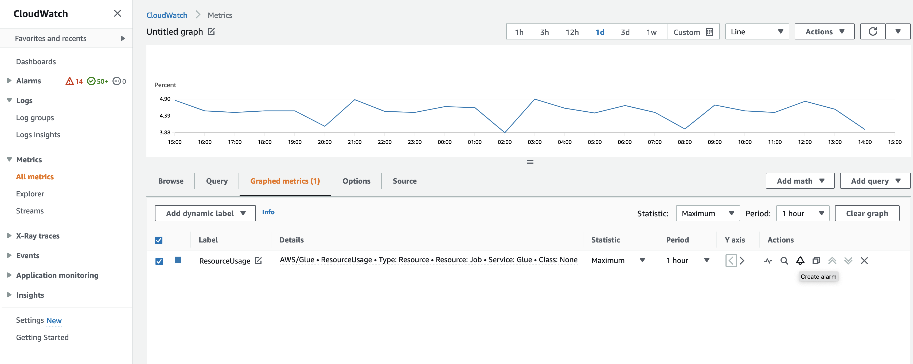

# Monitoring AWS Glue resources

AWS Glue has service limits to protect customers from unexpected excessive provisioning and from malicious actions intended to increase your bill. The limits also protect the service. Logging into the AWS Service Quota console, customers can view their current resource limits and request an increase (where appropriate).

AWS Glue allows you to view the service's resource usage as a percentage in Amazon CloudWatch and to configure CloudWatch alarms on it to monitor usage. Amazon CloudWatch provides monitoring for AWS resources and the customer applications running on the Amazon infrastructure. The metrics are free of charge to you. The following metrics are supported:

- Number of workflows per account
- Number of triggers per account
- Number of jobs per account
- Number of concurrent job runs per account
- Number of blueprints per account
- Number of interactive sessions per account

## Configuring and using resource metrics

To use this feature, you can go to the Amazon CloudWatch console to view the metrics and configure alarms. The metrics are under the AWS/Glue namespace and are a percentage of the actual resource usage count divided by the resource quota. The CloudWatch metrics are delivered to your accounts, which will be no cost for you. For example, if you have 10 workflows created, and your service quota allows you to have 200 workflows in maximum, then your usage is 10/200 = 5%, and in graph, you will see a datapoint of 5 as a percentage. To be more specific:

```
Namespace: AWS/Glue
Metric name: ResourceUsage
Type: Resource
Resource: Workflow (or Trigger, Job, JobRun, Blueprint, InteractiveSession)
Service: Glue
Class: None

```



To create an alarm on a metric in the CloudWatch console:

1. Once you locate the metric, go to **Graphed metrics**.
2. Click **Create alarm** under **Actions**.
3. Configure the alarm as needed.

We emit metrics whenever your resource usage has a change (such as an increase or decrease). But if your resource usage doesn't change, we emit metrics hourly, so that you have a continuous CloudWatch graph. To avoid having missing data points, we do not recommend you to configure a period less than 1 hour.

You can also configure alarms using AWS CloudFormation as in the following example. In this example, once the workflow resource usage reaches 80%, it triggers an alarm to send a message to the existing SNS topic, where you can subscribe to it to get notifications.

```
{
	"Type": "AWS::CloudWatch::Alarm",
	"Properties": {
		"AlarmName": "WorkflowUsageAlarm",
		"ActionsEnabled": true,
		"OKActions": [],
		"AlarmActions": [
			"arn:aws:sns:af-south-1:085425700061:Default_CloudWatch_Alarms_Topic"
		],
		"InsufficientDataActions": [],
		"MetricName": "ResourceUsage",
		"Namespace": "AWS/Glue",
		"Statistic": "Maximum",
		"Dimensions": [{
				"Name": "Type",
				"Value": "Resource"
			},
			{
				"Name": "Resource",
				"Value": "Workflow"
			},
			{
				"Name": "Service",
				"Value": "Glue"
			},
			{
				"Name": "Class",
				"Value": "None"
			}
		],
		"Period": 3600,
		"EvaluationPeriods": 1,
		"DatapointsToAlarm": 1,
		"Threshold": 80,
		"ComparisonOperator": "GreaterThanThreshold",
		"TreatMissingData": "notBreaching"
	}
}
```
