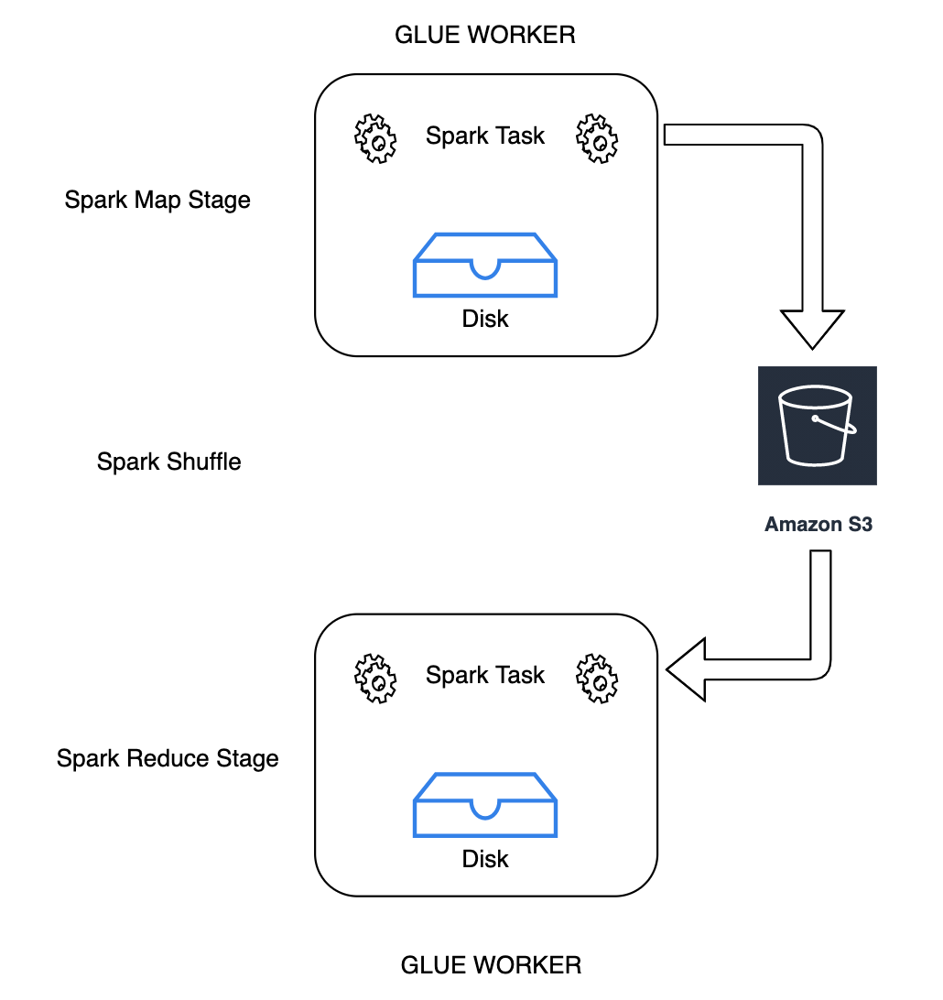

# Storing Spark shuffle data

Shuffling is an important step in a Spark job whenever data is rearranged between
partitions. This is required because wide transformations such as `join`, `groupByKey`, `reduceByKey`, and `repartition` require information
from other partitions to complete processing. Spark gathers the required data from each
partition and combines it into a new partition. During a shuffle, data is written to disk and
transferred across the network. As a result, the shuffle operation is bound to local disk
capacity. Spark throws a `No space left on device` or `MetadataFetchFailedException` error when there is not enough disk space left on the
executor and there is no recovery.

###### Note

AWS Glue Spark shuffle plugin with Amazon S3 is only supported for AWS Glue ETL jobs.

###### Solution

With AWS Glue, you can now use Amazon S3 to store Spark shuffle data. Amazon S3 is an
object storage service that offers industry-leading scalability, data availability, security,
and performance. This solution disaggregates compute and storage for your Spark jobs, and
gives complete elasticity and low-cost shuffle storage, allowing you to run your most
shuffle-intensive workloads reliably.


We are introducing a new Cloud Shuffle Storage Plugin for Apache Spark to use Amazon S3. You can
turn on Amazon S3 shuffling to run your AWS Glue jobs reliably without failures if they
are known to be bound by the local disk capacity for large shuffle operations. In some cases,
shuffling to Amazon S3 is marginally slower than local disk (or EBS) if you have a large number of
small partitions or shuffle files written out to Amazon S3.

## Prerequisites for using Cloud Shuffle

Storage Plugin

In order to use the Cloud Shuffle Storage Plugin with AWS Glue ETL jobs, you need the following:

- An Amazon S3 bucket located in the same region as your job run, for storing the
  intermediate shuffle and spilled data. The Amazon S3 prefix of shuffle storage can be specified
  with `--conf spark.shuffle.glue.s3ShuffleBucket=s3://`shuffle-bucket`/`prefix`/`, as in the following example:

```
--conf spark.shuffle.glue.s3ShuffleBucket=s3://glue-shuffle-123456789-us-east-1/glue-shuffle-data/
```

- Set the Amazon S3 storage lifecycle policies on the _prefix_ (such
  as `glue-shuffle-data`) as the shuffle manager does not clean the files after
  the job is done. The intermediate shuffle and spilled data should be deleted after a job
  is finished. Users can set a short lifecycle policies on the prefix. Instructions for
  setting up an Amazon S3 lifecycle policy are available at [Setting
  lifecycle configuration on a bucket](../../../AmazonS3/latest/userguide/how-to-set-lifecycle-configuration-intro.md "../../../AmazonS3/latest/userguide/how-to-set-lifecycle-configuration-intro.md") in the Amazon Simple Storage Service User Guide.

## Using AWS Glue Spark

shuffle manager from the AWS console

To set up the AWS Glue Spark shuffle manager using the AWS Glue
console or AWS Glue Studio when configuring a job: choose the **--write-shuffle-files-to-s3** job parameter to turn on Amazon S3 shuffling for the job.


## Using AWS Glue Spark shuffle

plugin

The following job parameters turn on and tune the AWS Glue shuffle manager. These parameters are flags, so any values provided are not considered.

- `--write-shuffle-files-to-s3` — The main flag, which enables the AWS Glue Spark shuffle manager to use Amazon S3 buckets for writing and
  reading shuffle data. When the flag is not specified, the shuffle manager is not used.
- `--write-shuffle-spills-to-s3` — (Supported only on AWS Glue
  version 2.0). An optional flag that allows you to offload spill files to Amazon S3
  buckets, which provides additional resiliency to your Spark job. This is only required for
  large workloads that spill a lot of data to disk. When the flag is not specified, no intermediate spill files
  are written.
- `--conf spark.shuffle.glue.s3ShuffleBucket=s3://<shuffle-bucket>`
  — Another optional flag that specifies the Amazon S3 bucket where you write the shuffle
  files. By default, `--TempDir`/shuffle-data. AWS Glue 3.0+ supports writing
  shuffle files to multiple buckets by specifying buckets with comma delimiter, as in `--conf spark.shuffle.glue.s3ShuffleBucket=s3://`shuffle-bucket-1`/`prefix`,s3://`shuffle-bucket-2`/`prefix`/`.
  Using multiple buckets improves performance.

You need to provide security configuration settings to enable encryption at-rest for the shuffle data. For
more information about security configurations, see [Setting up encryption in AWS Glue](set-up-encryption.md "set-up-encryption.md"). AWS Glue
supports all other shuffle related configurations provided by Spark.

###### Software binaries for the Cloud Shuffle Storage plugin

You can also download the software binaries of the Cloud Shuffle Storage Plugin for
Apache Spark under the Apache 2.0 license and run it on any Spark environment. The new
plugin comes with out-of-the box support for Amazon S3, and can also be easily configured to use
other forms of cloud storage such as [Google
Cloud Storage and Microsoft Azure Blob Storage](https://github.com/aws-samples/aws-glue-samples/blob/master/docs/cloud-shuffle-plugin/README.md "https://github.com/aws-samples/aws-glue-samples/blob/master/docs/cloud-shuffle-plugin/README.md"). For more information, see [Cloud Shuffle Storage Plugin for
Apache Spark](cloud-shuffle-storage-plugin.md "cloud-shuffle-storage-plugin.md").

###### Notes and limitations

The following are notes or limitations for the AWS Glue shuffle manager:

- AWS Glue shuffle manager doesn't automatically delete the (temporary) shuffle data files stored
  in your Amazon S3 bucket after a job is completed. To ensure data protection, follow the instructions
  in [Prerequisites for using Cloud Shuffle
  Storage Plugin](#monitor-spark-shuffle-manager-prereqs "#monitor-spark-shuffle-manager-prereqs")
  before enabling the Cloud Shuffle Storage Plugin.
- You can use this feature if your data is skewed.
