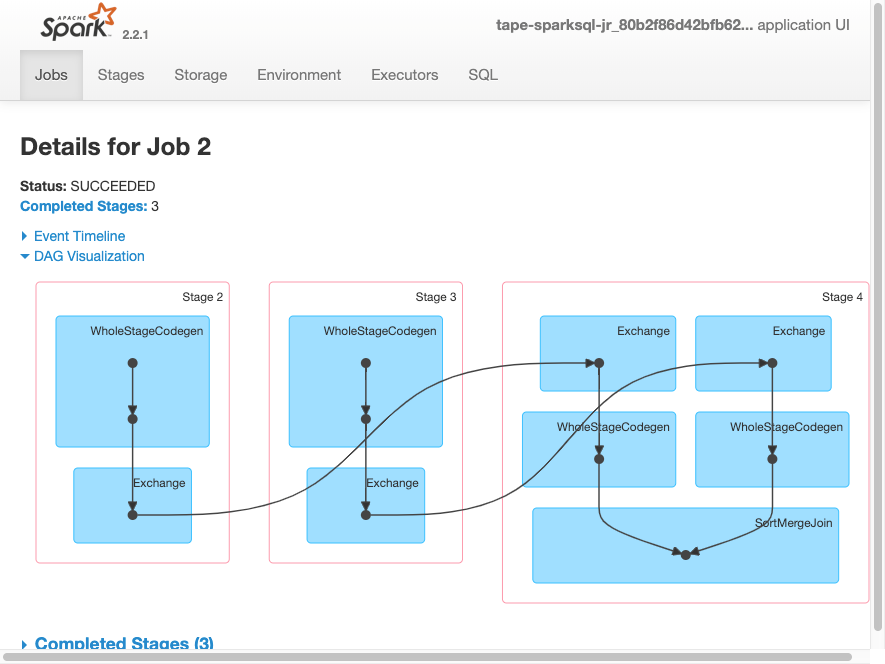
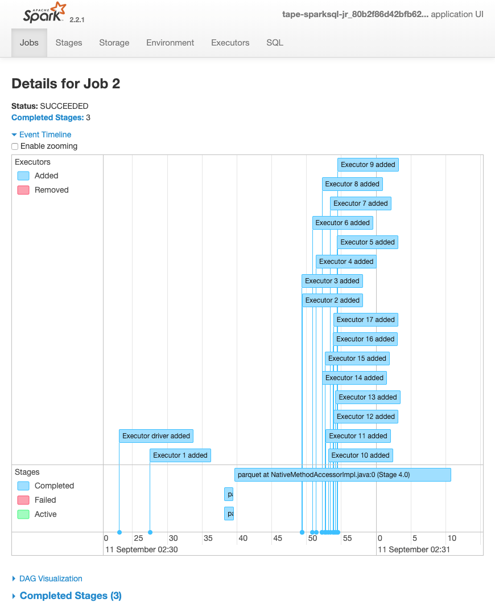
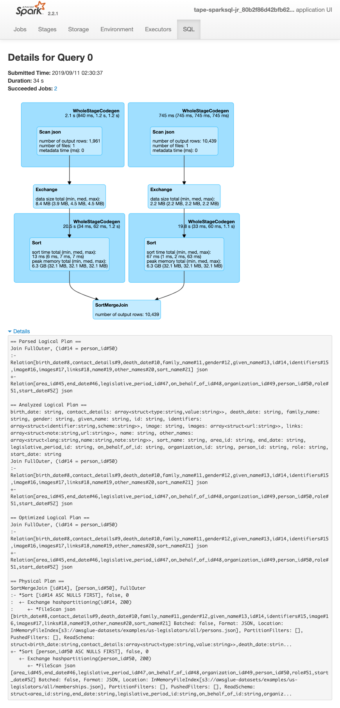

# Monitoring jobs using the Apache Spark web UI

You can use the Apache Spark web UI to monitor and debug AWS Glue ETL jobs running on the AWS Glue
job system, and also Spark applications running on AWS Glue development endpoints. The Spark UI
enables you to check the following for each job:

- The event timeline of each Spark stage
- A directed acyclic graph (DAG) of the job
- Physical and logical plans for SparkSQL queries
- The underlying Spark environmental variables for each job
  For more information about using the
  Spark Web UI, see [Web UI](https://spark.apache.org/docs/3.3.0/web-ui.html "https://spark.apache.org/docs/3.3.0/web-ui.html") in the Spark
  documentation. For guidance on how to interpret Spark UI results to improve the performance of your job,
  see [Best practices for performance tuning AWS Glue for Apache Spark jobs](../../../prescriptive-guidance/latest/tuning-aws-glue-for-apache-spark/introduction.md "../../../prescriptive-guidance/latest/tuning-aws-glue-for-apache-spark/introduction.md") in AWS Prescriptive Guidance.

You can see the Spark UI in the AWS Glue console. This is available when an AWS Glue job runs on AWS Glue 3.0 or later versions with logs
generated in the Standard (rather than legacy) format, which is the default for newer jobs. If you have log files greater than
0.5 GB, you can enable rolling log support for job runs on AWS Glue 4.0 or later versions to simplify log archiving,
analysis, and troubleshooting.

You can enable the Spark UI by using the AWS Glue console or the AWS Command Line Interface (AWS CLI). When you enable
the Spark UI, AWS Glue ETL jobs and Spark applications on AWS Glue development endpoints can
back up Spark event logs to a location that you specify in Amazon Simple Storage Service (Amazon S3). You can use the backed up event logs in
Amazon S3 with the Spark UI, both in real time as the job is operating and after the job is complete. While the logs
remain in Amazon S3, the Spark UI in the AWS Glue console can view them.

## Permissions

In order to use the Spark UI in the AWS Glue console, you can use `UseGlueStudio` or
add all the individual service APIs. All APIs are needed to use the
Spark UI completely, however users can access SparkUI features by adding its service APIs in their IAM permission for
fine-grained access.

`RequestLogParsing` is the most critical as it performs the parsing of logs.
The remaining APIs are for reading the respective parsed data. For example, `GetStages` provides access to the
data about all stages of a Spark job.

The list of Spark UI service APIs mapped to `UseGlueStudio` are below in the sample policy.
The policy below provides access to use only Spark UI features. To add more permissions like Amazon S3 and IAM see
[Creating Custom IAM Policies for AWS Glue Studio.](getting-started-min-privs.md#getting-started-all-gs-privs.html "getting-started-min-privs.md#getting-started-all-gs-privs.html")

The list of Spark UI service APIs mapped to `UseGlueStudio` is below in the sample policy.
When using a Spark UI service API, use the following namespace: `glue:<ServiceAPI>`.

JSON

```
`{
 "Version":"2012-10-17",
 "Statement": [
 {
 "Sid": "AllowGlueStudioSparkUI",
 "Effect": "Allow",
 "Action": [
 "glue:RequestLogParsing",
 "glue:GetLogParsingStatus",
 "glue:GetEnvironment",
 "glue:GetJobs",
 "glue:GetJob",
 "glue:GetStage",
 "glue:GetStages",
 "glue:GetStageFiles",
 "glue:BatchGetStageFiles",
 "glue:GetStageAttempt",
 "glue:GetStageAttemptTaskList",
 "glue:GetStageAttemptTaskSummary",
 "glue:GetExecutors",
 "glue:GetExecutorsThreads",
 "glue:GetStorage",
 "glue:GetStorageUnit",
 "glue:GetQueries",
 "glue:GetQuery"
 ],
 "Resource": [
 "*"
 ]
 }
 ]
}`

```

## Limitations

- Spark UI in the AWS Glue console is not available for job runs that occurred before 20 Nov 2023 because they are in
  the legacy log format.
- Spark UI in the AWS Glue console supports rolling logs for AWS Glue 4.0, such as those generated by default in streaming jobs.
  The maximum sum of all generated rolled log event files is 2 GB. For AWS Glue jobs without rolled log support, the
  maximum log event file size supported for SparkUI is 0.5 GB.
- Serverless Spark UI is not available for Spark event logs stored in an Amazon S3 bucket that can only be accessed by your VPC.

## Example: Apache Spark web UI

This example shows you how to use the Spark UI to understand your job performance. Screen shots show the Spark
web UI as provided by a self-managed Spark history server. Spark UI in the AWS Glue console provides similar views.
For more information about using the Spark Web UI, see [Web UI](https://spark.apache.org/docs/3.3.0/web-ui.html "https://spark.apache.org/docs/3.3.0/web-ui.html") in the Spark documentation.

The following is an example of a Spark application that reads from two data sources, performs a join transform,
and writes it out to Amazon S3 in Parquet format.

```
import sys
from awsglue.transforms import *
from awsglue.utils import getResolvedOptions
from pyspark.context import SparkContext
from awsglue.context import GlueContext
from awsglue.job import Job
from pyspark.sql.functions import count, when, expr, col, sum, isnull
from pyspark.sql.functions import countDistinct
from awsglue.dynamicframe import DynamicFrame

args = getResolvedOptions(sys.argv, ['JOB_NAME'])

sc = SparkContext()
glueContext = GlueContext(sc)
spark = glueContext.spark_session

job = Job(glueContext)
job.init(args['JOB_NAME'])

df_persons = spark.read.json("s3://awsglue-datasets/examples/us-legislators/all/persons.json")
df_memberships = spark.read.json("s3://awsglue-datasets/examples/us-legislators/all/memberships.json")

df_joined = df_persons.join(df_memberships, df_persons.id == df_memberships.person_id, 'fullouter')
df_joined.write.parquet("s3://aws-glue-demo-sparkui/output/")

job.commit()
```

The following DAG visualization shows the different stages in this Spark job.



The following event timeline for a job shows the start, execution, and termination of
different Spark
executors.



The
following screen shows the details of the SparkSQL query plans:

- Parsed logical plan
- Analyzed logical plan
- Optimized logical plan
- Physical plan for execution



###### Topics

- [Enabling the Apache Spark web UI for AWS Glue jobs](monitor-spark-ui-jobs.md "monitor-spark-ui-jobs.md")
- [Launching the Spark history server](monitor-spark-ui-history.md "monitor-spark-ui-history.md")
