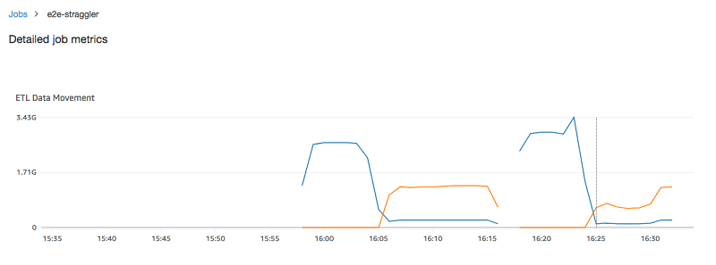
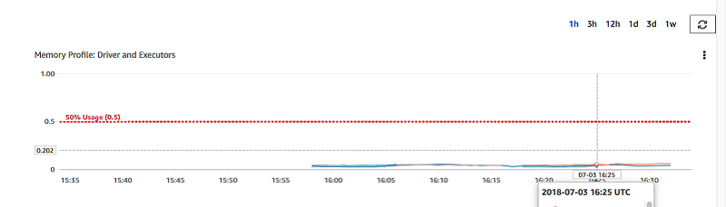
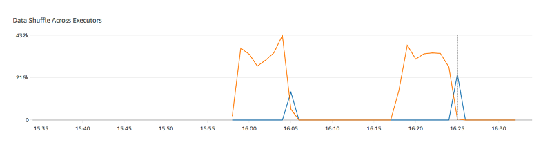
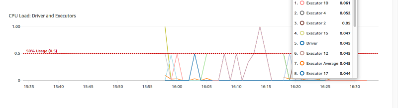
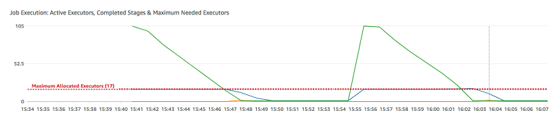

# Monitoring AWS Glue Spark jobs

###### Topics

- [Spark Metrics available in AWS Glue Studio](#console-jobs-details-metrics-spark "#console-jobs-details-metrics-spark")
- [Monitoring jobs using the Apache Spark web UI](monitor-spark-ui.md "monitor-spark-ui.md")
- [Monitoring with AWS Glue job run insights](monitor-job-insights.md "monitor-job-insights.md")
- [Monitoring with Amazon CloudWatch](monitor-cloudwatch.md "monitor-cloudwatch.md")
- [Job monitoring and
  debugging](monitor-profile-glue-job-cloudwatch-metrics.md "monitor-profile-glue-job-cloudwatch-metrics.md")

## Spark Metrics available in AWS Glue Studio

The **Metrics** tab shows metrics collected when a job runs and profiling is turned on.
The following graphs are shown in Spark jobs:

- ETL Data Movement
- Memory Profile: Driver and Executors

Choose **View additional metrics** to show the following graphs:

- ETL Data Movement
- Memory Profile: Driver and Executors
- Data Shuffle Across Executors
- CPU Load: Driver and Executors
- Job Execution: Active Executors, Completed Stages & Maximum Needed Executors

Data for these graphs is pushed to CloudWatch metrics if the job is configured to collect metrics.
For more information about how to turn on metrics and interpret the graphs, see
[Job monitoring and
debugging](monitor-profile-glue-job-cloudwatch-metrics.md "monitor-profile-glue-job-cloudwatch-metrics.md").

###### Example ETL data movement graph

The ETL Data Movement graph shows the following metrics:

- The number of bytes read from Amazon S3 by all executors—[glue.ALL.s3.filesystem.read_bytes](monitoring-awsglue-with-cloudwatch-metrics.md#glue.ALL.s3.filesystem.read_bytes "monitoring-awsglue-with-cloudwatch-metrics.md#glue.ALL.s3.filesystem.read_bytes")
- The number of bytes written to Amazon S3 by all executors—[glue.ALL.s3.filesystem.write_bytes](monitoring-awsglue-with-cloudwatch-metrics.md#glue.ALL.s3.filesystem.write_bytes "monitoring-awsglue-with-cloudwatch-metrics.md#glue.ALL.s3.filesystem.write_bytes")

###### Example Memory profile graph

The Memory Profile graph shows the following metrics:

- The fraction of memory used by the JVM heap for this driver (scale: 0–1) by the driver,
  an executor identified by _executorId_, or all
  executors—
  - [glue.driver.jvm.heap.usage](monitoring-awsglue-with-cloudwatch-metrics.md#glue.driver.jvm.heap.usage "monitoring-awsglue-with-cloudwatch-metrics.md#glue.driver.jvm.heap.usage")
  - [glue.executorId.jvm.heap.usage](monitoring-awsglue-with-cloudwatch-metrics.md#glue.executorId.jvm.heap.usage "monitoring-awsglue-with-cloudwatch-metrics.md#glue.executorId.jvm.heap.usage")
  - [glue.ALL.jvm.heap.usage](monitoring-awsglue-with-cloudwatch-metrics.md#glue.ALL.jvm.heap.usage "monitoring-awsglue-with-cloudwatch-metrics.md#glue.ALL.jvm.heap.usage")

###### Example Data shuffle across executors graph

The Data Shuffle Across Executors graph shows the following metrics:

- The number of bytes read by all executors to shuffle data between them—[glue.driver.aggregate.shuffleLocalBytesRead](monitoring-awsglue-with-cloudwatch-metrics.md#glue.driver.aggregate.shuffleLocalBytesRead "monitoring-awsglue-with-cloudwatch-metrics.md#glue.driver.aggregate.shuffleLocalBytesRead")
- The number of bytes written by all executors to shuffle data between
  them—[glue.driver.aggregate.shuffleBytesWritten](monitoring-awsglue-with-cloudwatch-metrics.md#glue.driver.aggregate.shuffleBytesWritten "monitoring-awsglue-with-cloudwatch-metrics.md#glue.driver.aggregate.shuffleBytesWritten")

###### Example CPU load graph

The CPU Load graph shows the following metrics:

- The fraction of CPU system load used (scale: 0–1) by the driver, an executor identified
  by _executorId_, or all executors—
  - [glue.driver.system.cpuSystemLoad](monitoring-awsglue-with-cloudwatch-metrics.md#glue.driver.system.cpuSystemLoad "monitoring-awsglue-with-cloudwatch-metrics.md#glue.driver.system.cpuSystemLoad")
  - [glue.executorId.system.cpuSystemLoad](monitoring-awsglue-with-cloudwatch-metrics.md#glue.executorId.system.cpuSystemLoad "monitoring-awsglue-with-cloudwatch-metrics.md#glue.executorId.system.cpuSystemLoad")
  - [glue.ALL.system.cpuSystemLoad](monitoring-awsglue-with-cloudwatch-metrics.md#glue.ALL.system.cpuSystemLoad "monitoring-awsglue-with-cloudwatch-metrics.md#glue.ALL.system.cpuSystemLoad")

###### Example Job execution graph

The Job Execution graph shows the following metrics:

- The number of actively running executors—[glue.driver.ExecutorAllocationManager.executors.numberAllExecutors](monitoring-awsglue-with-cloudwatch-metrics.md#glue.driver.ExecutorAllocationManager.executors.numberAllExecutors "monitoring-awsglue-with-cloudwatch-metrics.md#glue.driver.ExecutorAllocationManager.executors.numberAllExecutors")
- The number of completed stages—[glue.aggregate.numCompletedStages](monitoring-awsglue-with-cloudwatch-metrics.md#glue.driver.aggregate.numCompletedStages "monitoring-awsglue-with-cloudwatch-metrics.md#glue.driver.aggregate.numCompletedStages")
- The number of maximum needed executors—[glue.driver.ExecutorAllocationManager.executors.numberMaxNeededExecutors](monitoring-awsglue-with-cloudwatch-metrics.md#glue.driver.ExecutorAllocationManager.executors.numberMaxNeededExecutors "monitoring-awsglue-with-cloudwatch-metrics.md#glue.driver.ExecutorAllocationManager.executors.numberMaxNeededExecutors")

