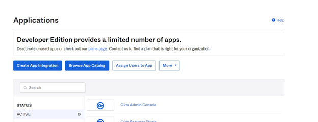

# Okta New Account and Developer App creation steps

Create a developer account on Okta for getting access to the Okta API.
A free Okta developer account gives access to most key developer features required for accessing Okt API.

###### To create a developer account on Okta

1. Navigate to [https://developer.okta.com/signup/](https://console.cloud.google.com "https://console.cloud.google.com").
2. Enter account information email, first name, last name and country/region. Choose **I’m not a robot** and then, **Signup**.
3. A verification mail is sent to your registered mail id. You will receive a link in your email for activating your
   Okta developer account. Choose **Activate**.
4. You will be redirected to password reset page. Enter the new password twice and choose **Reset password**.
5. You will be redirected to your Okta developer account dashboard.

###### To create a client app and OAuth 2.0 credentials

1. In the developer dashboard, choose create app integration.

 2. The **Create a new app Integration** window will appear and present various sign-in methods.
Select **OIDC –OpenID Connect**. 3. Scroll down to the Application type section. Select as a **Web Application**
and choose **Next**. 4. On the "New Web App Integration" screen, fill following information:

    * App integration name - Enter the name of the app.
    * Grant type - Choose **Authorization Code** and **Refresh Token**
     from the list.
    * Sign-in redirect URIs - Choose **Add URI**  and add
     `https://{regioncode}.console.aws.amazon.com/appflow/oauth`. For example, if you are using
     `us-west-2 (Oregon)` you can add
     `https://us-east-1.console.aws.amazon.com/appflow/oauth`.
    * Controlled Access - Assign the app to your user groups as you require and choose **Save**.

5. Your Client Id and Client Secret is generated.
