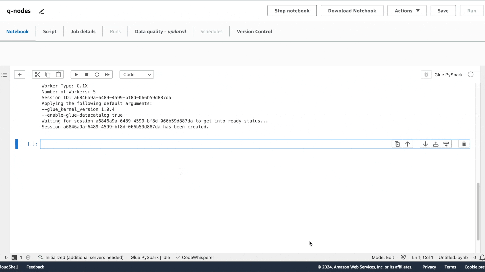
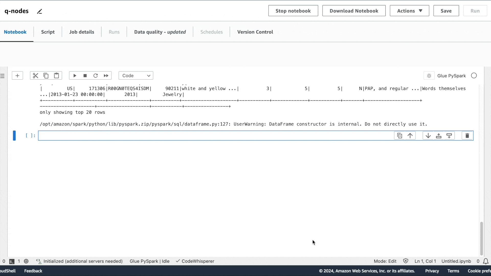
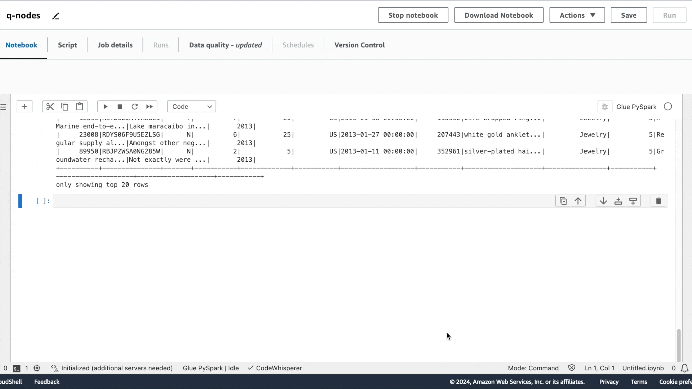
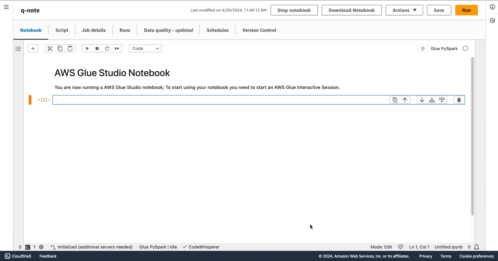

# Example interactions

Amazon Q data integration in AWS Glue allows you enter your question in the Amazon Q panel. You can enter a question regarding data integration functionality provided by AWS Glue. A detailed answer, together with reference documents, will be returned.

Another use case is generating AWS Glue ETL job scripts. You can ask a question regarding how to perform a data extract, transform, load job. A generated PySpark script will be returned.

###### Topics

- [Amazon Q chat interactions](#q-using-example-interactions "#q-using-example-interactions")
- [AWS Glue Studio notebook interactions](#q-using-example-interactions-notebooks "#q-using-example-interactions-notebooks")

## Amazon Q chat interactions

On the AWS Glue console, start authoring a new job, and ask Amazon Q:
_"Create a Glue ETL flow connect to two Glue catalog tables venue and event in my database glue_db, join the results
on the venue's venueid and event's e_venueid, and then filter on venue state with condition as venuestate=='DC' and write
to s3://amzn-s3-demo-bucket/codegen/BDB-9999/output/ in CSV format.""_

You will notice that the code is generated. With this response, you can learn and understand how you can author AWS Glue code for your
purpose. You can copy/paste the generated code to the script editor and configure placeholders. After you configure an IAM role
and AWS Glue connections on the job, save and run the job. When the job is complete, you can verify the summary data is persisted to
Amazon S3 as expected and can be used by your downstream workloads.

## AWS Glue Studio notebook interactions

###### Note

The Amazon Q Data integration experience in AWS Glue Studio notebook still focuses on DynamicFrame-based data integration flow.

Add a new cell and enter your comment to describe what you want to achieve. After you press **Tab** and **Enter**, the recommended code is shown.

First intent is to extract the data: _"Give me code that reads a Glue Data Catalog table"_, followed by _"Give me code to apply a filter transform with star_rating>3"_ and _"Give me code that writes the frame into S3 as Parquet"_.

Similar to the Amazon Q chat experience, the code is recommended. If you press **Tab**, then the recommended code is chosen.

You can run each cell by filling in the appropriate options for your sources in the generated code. At any point in the runs, you can also preview a sample of your dataset by using the `show()` method.

You can run the notebook as a job, either programmatically or by choosing **Run**.

### Complex prompts

You can generate a full script with a single complex prompt. _"I have JSON data in S3 and data in Oracle that needs combining. Please provide a Glue script that reads from both sources, does a join, and then writes results to Redshift."_

You may notice that, on the notebook, Amazon Q data integration in AWS Glue generated the same code snippet that was generated in the Amazon Q chat.

You can run the notebook as a job, either by choosing **Run** or programmatically.
