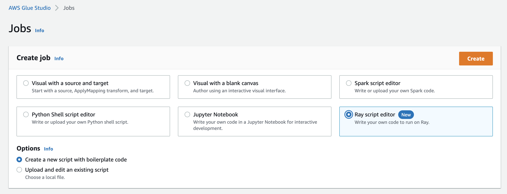

# Working with Ray jobs in AWS Glue

This section provides information about using AWS Glue for Ray jobs. For more information about writing AWS Glue for
Ray scripts, consult the [Programming Ray scripts](aws-glue-programming-ray.md "aws-glue-programming-ray.md") section.

###### Topics

- [Getting started with AWS Glue for Ray](#author-job-ray-using "#author-job-ray-using")
- [Supported Ray runtime environments](#author-job-ray-runtimes "#author-job-ray-runtimes")
- [Accounting for workers in Ray jobs](#author-job-ray-worker-accounting "#author-job-ray-worker-accounting")
- [Using job parameters in Ray jobs](author-job-ray-job-parameters.md "author-job-ray-job-parameters.md")
- [Monitoring Ray jobs with metrics](author-job-ray-monitor.md "author-job-ray-monitor.md")

## Getting started with AWS Glue for Ray

To work with AWS Glue for Ray, you use the same AWS Glue jobs and interactive sessions that you use with AWS Glue for
Spark. AWS Glue jobs are designed for running the same script on a recurring cadence, while interactive sessions
are designed to let you run snippets of code sequentially against the same provisioned resources.

AWS Glue ETL and Ray are different underneath, so in your script, you have access to different tools, features,
and configuration. As a new computation framework managed by AWS Glue, Ray has a different architecture and uses
different vocabulary to describe what it does. For more information, see [Architecture Whitepapers](https://docs.ray.io/en/latest/ray-contribute/whitepaper.html "https://docs.ray.io/en/latest/ray-contribute/whitepaper.html") in the Ray
documentation.

###### Note

AWS Glue for Ray is available in US East (N. Virginia), US East (Ohio), US West (Oregon), Asia Pacific (Tokyo), and Europe (Ireland).

### Ray jobs in the AWS Glue Studio console

On the **Jobs** page in the AWS Glue Studio console, you can select a new option when you're
creating a job in AWS Glue Studio—**Ray script editor**. Choose this option to create a Ray
job in the console. For more information about jobs and how they're used, see [Building visual ETL jobs](author-job-glue.md "author-job-glue.md").

### Ray jobs in the AWS CLI and SDK

Ray jobs in the AWS CLI use the same SDK actions and parameters as other jobs. AWS Glue for Ray introduces new
values for certain parameters. For more information in the Jobs API, see [Jobs](aws-glue-api-jobs-job.md "aws-glue-api-jobs-job.md").

## Supported Ray runtime environments

In Spark jobs, `GlueVersion` determines the versions of Apache Spark and Python available in an
AWS Glue for Spark job. The Python version indicates the version that is supported for jobs of type Spark. This is
not how Ray runtime environments are configured.

For Ray jobs, you should set `GlueVersion` to `4.0` or greater. However, the versions of
Ray, Python, and additional libraries that are available in your Ray job are determined by the
`Runtime` field in the job definition.

The `Ray2.4` runtime environment will be available for a minimum of 6 months after release. As Ray
rapidly evolves, you will be able to incorporate Ray updates and improvements through future runtime environment
releases.

Valid values: `Ray2.4`

| Runtime value                | Ray and Python versions |
| ---------------------------- | ----------------------- |
| `Ray2.4` (for AWS Glue 4.0+) | Ray 2.4.0 Python 3.9    |

**Additional information**

- For release notes that accompany AWS Glue on Ray releases, see [AWS Glue versions](release-notes.md#release-notes-versions "release-notes.md#release-notes-versions").
- For Python libraries that are provided in a runtime environment, see [Modules provided with Ray jobs](edit-script-ray-env-dependencies.md#edit-script-ray-modules-provided "edit-script-ray-env-dependencies.md#edit-script-ray-modules-provided").

## Accounting for workers in Ray jobs

AWS Glue runs Ray jobs on new Graviton-based EC2 worker types, which are only available for Ray jobs. To
appropriately provision these workers for the workloads Ray is designed for, we provide a different ratio of
compute resources to memory resources from most workers. In order to account for these resources, we use the
memory-optimized data processing unit (M-DPU) rather than the standard data processing unit (DPU).

- One M-DPU corresponds to 4 vCPUs and 32 GB of memory.
- One DPU corresponds to 4 vCPUs and 16 GB of memory. DPUs are used to account for resources in
  AWS Glue with Spark jobs and corresponding workers.

Ray jobs currently have access to one worker type, `Z.2X`. The `Z.2X` worker maps to 2
M-DPUs (8 vCPUs, 64 GB of memory) and has 128 GB of disk space. A `Z.2X` machine provides
8 Ray workers (one per vCPU).

The number of M-DPUs that you can use concurrently in an account is subject to a service quota. For more
information about your AWS Glue account limits, see [AWS Glue endpoints and quotas](../../../general/latest/gr/glue.md "../../../general/latest/gr/glue.md").

You specify the number of worker nodes that are available to a Ray job with `--number-of-workers
 (NumberOfWorkers)` in the job definition. For more information about Ray values in the Jobs API, see [Jobs](aws-glue-api-jobs-job.md "aws-glue-api-jobs-job.md").

You can further specify a minimum number of workers that a Ray job must allocate with the
`--min-workers` job parameter. For more information about job parameters, see [Reference](author-job-ray-job-parameters.md#author-job-ray-parameters-reference "author-job-ray-job-parameters.md#author-job-ray-parameters-reference").
