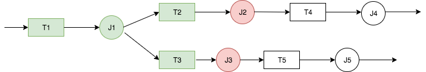
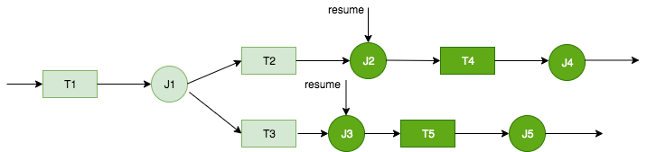
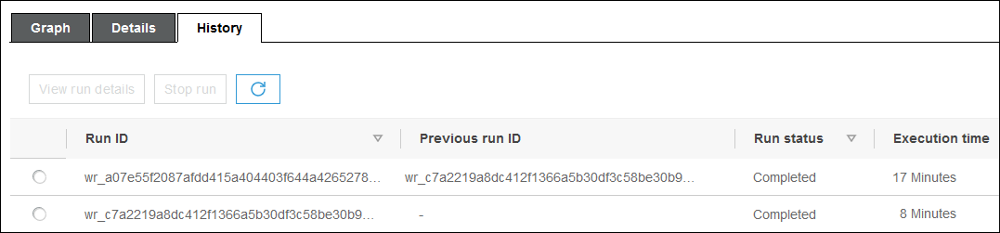
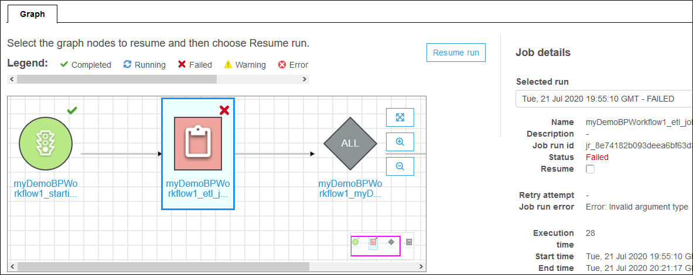
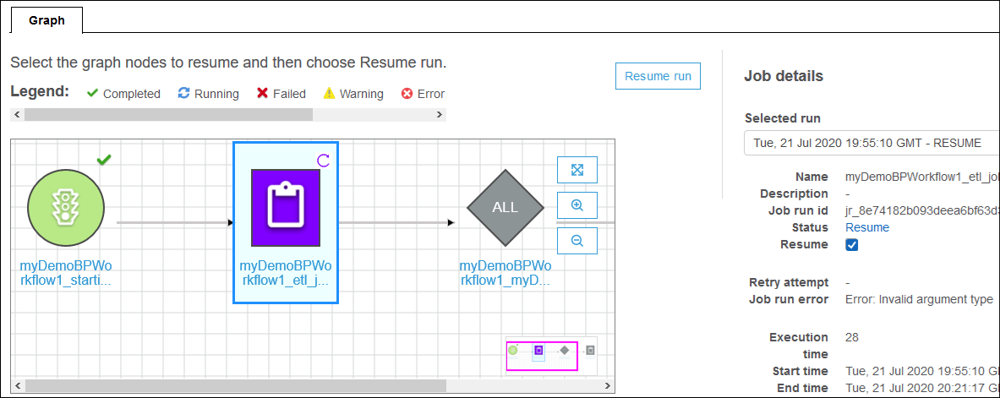

# Repairing and resuming a workflow run

If one or more nodes (jobs or crawlers) in a workflow do not successfully complete, this
means that the workflow only partially ran. After you find the root causes and make
corrections, you can select one or more nodes to resume the workflow run from, and then
resume the workflow run. The selected nodes and all nodes that are downstream from those
nodes are then run.

###### Topics

- [Resuming a workflow run: How it
  works](#resume-workflow-howitworks "#resume-workflow-howitworks")
- [Resuming a workflow run](#how-to-resume-workflow "#how-to-resume-workflow")
- [Notes and limitations for resuming workflow
  runs](#resume-workflow-notes "#resume-workflow-notes")

## Resuming a workflow run: How it

works

Consider the workflow W1 in the following diagram.



The workflow run proceeds as follows:

1. Trigger T1 starts job J1.
2. Successful completion of J1 fires triggers T2 and T3, which run jobs J2 and
   J3, respectively.
3. Jobs J2 and J3 fail.
4. Triggers T4 and T5 depend on the successful completion of J2 and J3, so they
   don't fire, and jobs J4 and J5 don't run. Workflow W1 is only partially
   run.

Now assume that the issues that caused J2 and J3 to fail are corrected. J2 and J3 are
selected as the starting points to resume the workflow run from.



The workflow run resumes as follows:

1. Jobs J2 and J3 run successfully.
2. Triggers T4 and T5 fire.
3. Jobs J4 and J5 run successfully.

The resumed workflow run is tracked as a separate workflow run with a new run ID. When
you view the workflow history, you can view the previous run ID for any workflow run. In
the example in the following screenshot, the workflow run with run ID
`wr_c7a22...` (the second row) had a node that did not complete. The user
fixed the problem and resumed the workflow run, which resulted in run ID
`wr_a07e55...` (the first row).



###### Note

For the rest of this discussion, the term "resumed workflow run" refers to the
workflow run that was created when the previous workflow run was resumed. The
"original workflow run" refers to the workflow run that only partially ran and that
needed to be resumed.

###### Resumed workflow run graph

In a resumed workflow run, although only a subset of nodes are run, the run graph
is a complete graph. That is, the nodes that didn't run in the resumed workflow are
copied from the run graph of the original workflow run. Copied job and crawler nodes
that ran in the original workflow run include run details.

Consider again the workflow W1 in the previous diagram. When the workflow run is
resumed starting with J2 and J3, the run graph for the resumed workflow run shows all
jobs, J1 though J5, and all triggers, T1 through T5. The run details for J1 are copied
from the original workflow run.

###### Workflow run snapshots

When a workflow run is started, AWS Glue takes a snapshot of the workflow design
graph at that point in time. That snapshot is used for the duration of the workflow
run. If you make changes to any triggers after the run starts, those changes don't
affect the current workflow run. Snapshots ensure that workflow runs proceed in a
consistent manner.

Snapshots make only triggers immutable. Changes that you make to downstream jobs and
crawlers during the workflow run take effect for the current run.

## Resuming a workflow run

Follow these steps to resume a workflow run. You can resume a workflow run by using
the AWS Glue console, API, or AWS Command Line Interface (AWS CLI).

###### To resume a workflow run (console)

1. Open the AWS Glue console at
   [https://console.aws.amazon.com/glue/](https://console.aws.amazon.com/glue/ "https://console.aws.amazon.com/glue/").

Sign in as a user who has permissions to view workflows and resume workflow
runs.

###### Note

To resume workflow runs, you need the `glue:ResumeWorkflowRun`
AWS Identity and Access Management (IAM) permission. 2. In the navigation pane, choose **Workflows**. 3. Select a workflow, and then choose the **History**
tab. 4. Select the workflow run that only partially ran, and then choose
**View run details**. 5. In the run graph, select the first (or only) node that you want to restart and
that you want to resume the workflow run from. 6. In the details pane to the right of the graph, select the
**Resume** check box.



The node changes color and shows a small resume icon at the upper
right.

 7. Complete the previous two steps for any additional nodes to restart. 8. Choose **Resume run**.

###### To resume a workflow run (AWS CLI)

1. Ensure that you have the `glue:ResumeWorkflowRun` IAM
   permission.
2. Retrieve the node IDs for the nodes that you want to restart.
   1. Run the `get-workflow-run` command for the original
      workflow run. Supply the workflow name and run ID, and add the
      `--include-graph` option, as shown in the following
      example. Get the run ID from the **History** tab on the
      console, or by running the `get-workflow` command.

   ```
   aws glue get-workflow-run --name cloudtrailtest1 --run-id wr_a07e55f2087afdd415a404403f644a4265278f68b13ba3da08c71924ebe3c3a8 --include-graph

   ```

   The command returns the nodes and edges of the graph as a large JSON
   object. 2. Locate the nodes of interest by the `Type` and
   `Name` properties of the node objects.

   The following is an example node object from the output.

   ```
   {
       "Type": "JOB",
       "Name": "test1_post_failure_4592978",
       "UniqueId": "wnode_d1b2563c503078b153142ee76ce545fe5ceef66e053628a786ddd74a05da86fd",
       "JobDetails": {
           "JobRuns": [
               {
                   "Id": "jr_690b9f7fc5cb399204bc542c6c956f39934496a5d665a42de891e5b01f59e613",
                   "Attempt": 0,
                   "TriggerName": "test1_aggregate_failure_649b2432",
                   "JobName": "test1_post_failure_4592978",
                   "StartedOn": 1595358275.375,
                   "LastModifiedOn": 1595358298.785,
                   "CompletedOn": 1595358298.785,
                   "JobRunState": "FAILED",
                   "PredecessorRuns": [],
                   "AllocatedCapacity": 0,
                   "ExecutionTime": 16,
                   "Timeout": 2880,
                   "MaxCapacity": 0.0625,
                   "LogGroupName": "/aws-glue/python-jobs"
               }
           ]
       }
   }
   ```

   3. Get the node ID from the `UniqueId` property of the node
      object.

3. Run the `resume-workflow-run` command. Provide the workflow name,
   run ID, and list of node IDs separated by spaces, as shown in the following
   example.

```
aws glue resume-workflow-run --name cloudtrailtest1 --run-id wr_a07e55f2087afdd415a404403f644a4265278f68b13ba3da08c71924ebe3c3a8 --node-ids wnode_ca1f63e918fb855e063aed2f42ec5762ccf71b80082ae2eb5daeb8052442f2f3  wnode_d1b2563c503078b153142ee76ce545fe5ceef66e053628a786ddd74a05da86fd
```

The command outputs the run ID of the resumed (new) workflow run and a list of
nodes that will be started.

```
{
    "RunId": "wr_2ada0d3209a262fc1156e4291134b3bd643491bcfb0ceead30bd3e4efac24de9",
    "NodeIds": [
        "wnode_ca1f63e918fb855e063aed2f42ec5762ccf71b80082ae2eb5daeb8052442f2f3"
    ]
}

```

Note that although the example `resume-workflow-run` command listed
two nodes to restart, the example output indicated that only one node would be
restarted. This is because one node was downstream of the other node, and the
downstream node would be restarted anyway by the normal flow of the
workflow.

## Notes and limitations for resuming workflow

runs

Keep the following notes and limitations in mind when resuming workflow runs.

- You can resume a workflow run only if it's in the `COMPLETED`
  state.

###### Note

Even if one ore more nodes in a workflow run don't complete, the workflow
run state is shown as `COMPLETED`. Be sure to check the run graph
to discover any nodes that didn't successfully complete.

- You can resume a workflow run from any job or crawler node that the original
  workflow run attempted to run. You can't resume a workflow run from a trigger
  node.
- Restarting a node does not reset its state. Any data that was partially
  processed is not rolled back.
- You can resume the same workflow run multiple times. If a resumed workflow run
  only partially runs, you can address the issue and resume the resumed
  run.
- If you select two nodes to restart and they're dependent upon each other, the
  upstream node is run before the downstream node. In fact, selecting the
  downstream node is redundant, because it will be run according to the normal
  flow of the workflow.
