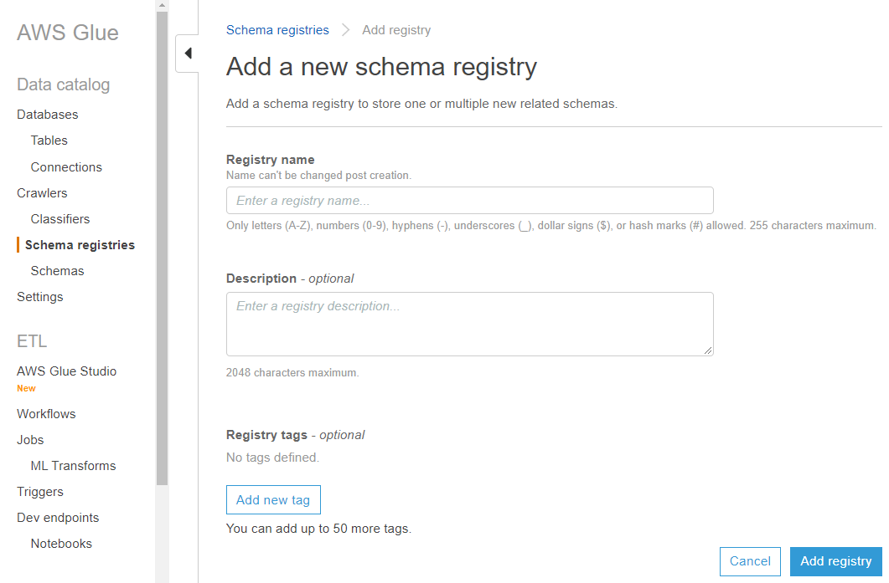

# Creating a registry

You may use the default registry or create as many new registries as necessary using the AWS Glue APIs or AWS Glue console.

###### AWS Glue APIs

You can use these steps to perform this task using the AWS Glue APIs.

To use the AWS CLI for the AWS Glue Schema Registry APIs, make sure to update your AWS CLI to the latest version.

To add a new registry, use the
[CreateRegistry action (Python: create_registry)](aws-glue-api-schema-registry-api.md#aws-glue-api-schema-registry-api-CreateRegistry "aws-glue-api-schema-registry-api.md#aws-glue-api-schema-registry-api-CreateRegistry")
API. Specify `RegistryName` as the name of the registry to be created, with a max length of 255, containing
only letters, numbers, hyphens, underscores, dollar signs, or hash marks.

Specify a `Description` as a string not more than 2048 bytes long, matching the
[URI address multi-line string pattern](aws-glue-api-common.md#aws-glue-api-common-_string-patterns "aws-glue-api-common.md#aws-glue-api-common-_string-patterns").

Optionally, specify one or more `Tags` for your registry, as a map array of key-value pairs.

```
aws glue create-registry --registry-name registryName1 --description description
```

When your registry is created it is assigned an Amazon Resource Name (ARN), which you can view in the `RegistryArn` of the API response. Now that you've created a registry, create one or more schemas for that registry.

###### AWS Glue console

To add a new registry in the AWS Glue console:

1. Sign in to the AWS Management Console and open the AWS Glue console at [https://console.aws.amazon.com/glue/](<https://console.aws.amazon.com/glue\ "https://console.aws.amazon.com/glue">).
2. In the navigation pane, under **Data catalog**, choose **Schema registries**.
3. Choose **Add registry**.
4. Enter a **Registry name** for the registry, consisting of letters, numbers, hyphens, or underscores. This name cannot be changed.
5. Enter a **Description** (optional) for the registry.
6. Optionally, apply one or more tags to your registry. Choose **Add new tag** and specify a **Tag key** and optionally a **Tag value**.
7. Choose **Add registry**.


When your registry is created it is assigned an Amazon Resource Name (ARN), which you can view by choosing the registry from the list in **Schema registries**. Now that you've created a registry, create one or more schemas for that registry.
