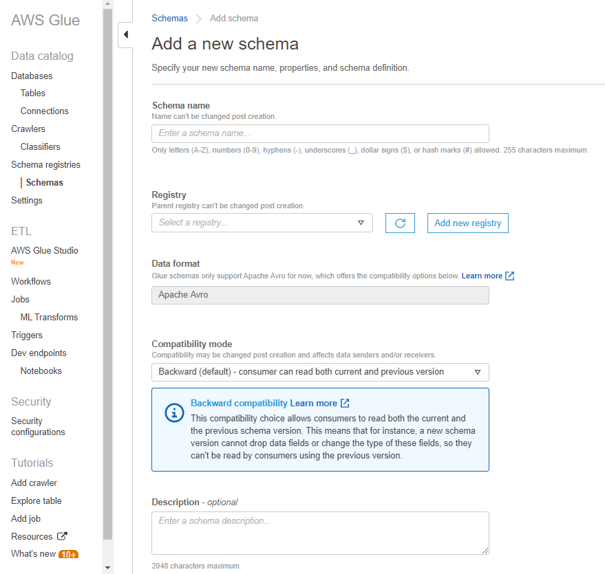
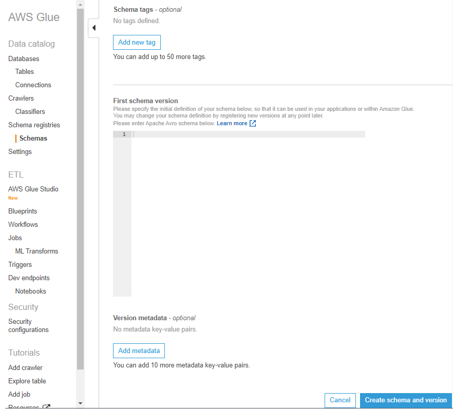

# Creating a schema

You can create a schema using the AWS Glue APIs or the AWS Glue console.

###### AWS Glue APIs

You can use these steps to perform this task using the AWS Glue APIs.

To add a new schema, use the [CreateSchema action (Python: create_schema)](aws-glue-api-schema-registry-api.md#aws-glue-api-schema-registry-api-CreateSchema "aws-glue-api-schema-registry-api.md#aws-glue-api-schema-registry-api-CreateSchema") API.

Specify a `RegistryId` structure to indicate a registry for the schema. Or, omit the `RegistryId` to use the default registry.

Specify a `SchemaName` consisting of letters, numbers, hyphens, or underscores, and `DataFormat` as `AVRO` or `JSON`. `DataFormat` once set on a schema is not changeable.

Specify a `Compatibility` mode:

- _Backward (recommended)_ — Consumer can read both current and previous version.
- _Backward all_ — Consumer can read current and all previous versions.
- _Forward_ — Consumer can read both current and subsequent version.
- _Forward all_ — Consumer can read both current and all subsequent versions.
- _Full_ — Combination of Backward and Forward.
- _Full all_ — Combination of Backward all and Forward all.
- _None_ — No compatibility checks are performed.
- _Disabled_ — Prevent any versioning for this schema.
  Optionally, specify `Tags` for your schema.

Specify a `SchemaDefinition` to define the schema in Avro, JSON, or Protobuf data format. See the examples.

For Avro data format:

```
aws glue create-schema --registry-id RegistryName="registryName1" --schema-name testschema --compatibility NONE --data-format AVRO --schema-definition "{\"type\": \"record\", \"name\": \"r1\", \"fields\": [ {\"name\": \"f1\", \"type\": \"int\"}, {\"name\": \"f2\", \"type\": \"string\"} ]}"
```

```
aws glue create-schema --registry-id RegistryArn="arn:aws:glue:us-east-2:901234567890:registry/registryName1" --schema-name testschema --compatibility NONE --data-format AVRO  --schema-definition "{\"type\": \"record\", \"name\": \"r1\", \"fields\": [ {\"name\": \"f1\", \"type\": \"int\"}, {\"name\": \"f2\", \"type\": \"string\"} ]}"
```

For JSON data format:

```
aws glue create-schema --registry-id RegistryName="registryName" --schema-name testSchemaJson --compatibility NONE --data-format JSON --schema-definition "{\"$schema\": \"http://json-schema.org/draft-07/schema#\",\"type\":\"object\",\"properties\":{\"f1\":{\"type\":\"string\"}}}"
```

```
aws glue create-schema --registry-id RegistryArn="arn:aws:glue:us-east-2:901234567890:registry/registryName" --schema-name testSchemaJson --compatibility NONE --data-format JSON --schema-definition "{\"$schema\": \"http://json-schema.org/draft-07/schema#\",\"type\":\"object\",\"properties\":{\"f1\":{\"type\":\"string\"}}}"
```

For Protobuf data format:

```
aws glue create-schema --registry-id RegistryName="registryName" --schema-name testSchemaProtobuf --compatibility NONE --data-format PROTOBUF --schema-definition "syntax = \"proto2\";package org.test;message Basic { optional int32 basic = 1;}"
```

```
aws glue create-schema --registry-id RegistryArn="arn:aws:glue:us-east-2:901234567890:registry/registryName" --schema-name testSchemaProtobuf --compatibility NONE --data-format PROTOBUF --schema-definition "syntax = \"proto2\";package org.test;message Basic { optional int32 basic = 1;}"
```

###### AWS Glue console

To add a new schema using the AWS Glue console:

1. Sign in to the AWS Management Console and open the AWS Glue console at
   [https://console.aws.amazon.com/glue/](<https://console.aws.amazon.com/glue\ "https://console.aws.amazon.com/glue">).
2. In the navigation pane, under **Data catalog**, choose **Schemas**.
3. Choose **Add schema**.
4. Enter a **Schema name**, consisting of letters, numbers, hyphens, underscores, dollar signs, or hashmarks. This name cannot be changed.
5. Choose the **Registry** where the schema will be stored from the drop-down menu. The parent registry cannot be changed post-creation.
6. Leave the **Data format** as _Apache Avro_ or _JSON_. This format applies to all versions of this schema.
7. Choose a **Compatibility mode**.
   - _Backward (recommended)_ — receiver can read both current and previous versions.
   - _Backward All_ — receiver can read current and all previous versions.
   - _Forward_ — sender can write both current and previous versions.
   - _Forward All_ — sender can write current and all previous versions.
   - _Full_ — combination of Backward and Forward.
   - _Full All_ — combination of Backward All and Forward All.
   - _None_ — no compatibility checks performed.
   - _Disabled_ — prevent any versioning for this schema.

8. Enter an optional **Description** for the registry of up to 250 characters.

 9. Optionally, apply one or more tags to your schema. Choose **Add new tag** and specify a **Tag key** and optionally a **Tag value**. 10. In the **First schema version** box, enter or paste your initial schema. .

For Avro format, see [Working with Avro data format](#schema-registry-avro "#schema-registry-avro")

For JSON format, see [Working with JSON data format](#schema-registry-json "#schema-registry-json") 11. Optionally, choose **Add metadata** to add version metadata to annotate or classify your schema version. 12. Choose **Create schema and version**.


The schema is created and appears in the list under **Schemas**.

## Working with Avro data format

Avro provides data serialization and data exchange services. Avro stores the data definition in JSON format making it easy to read and interpret. The data itself is stored in binary format.

For information on defining an Apache Avro schema, see the [Apache Avro specification](http://avro.apache.org/docs/current/spec.html "http://avro.apache.org/docs/current/spec.html").

## Working with JSON data format

Data can be serialized with JSON format. [JSON Schema format](https://json-schema.org/ "https://json-schema.org/") defines the standard for JSON Schema format.
