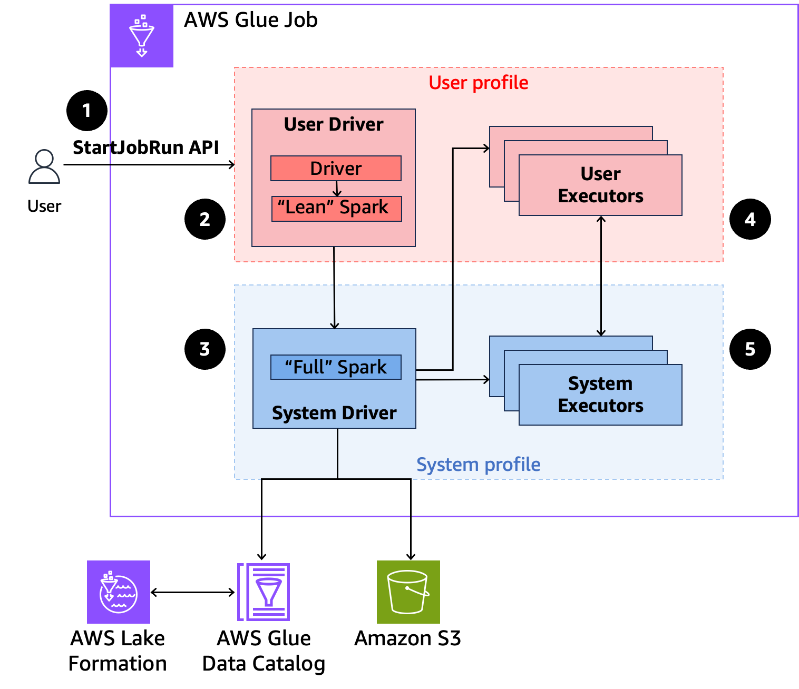

# Using AWS Glue with AWS Lake Formation for fine-grained access control

## Overview

With AWS Glue version 5.0 and higher, you can leverage AWS Lake Formation to apply fine-grained access controls on
Data Catalog tables that are backed by S3. This capability lets you configure table, row, column,
and cell level access controls for read queries within your
AWS Glue for Apache Spark jobs. See the following sections to learn more about Lake Formation and how to use it with AWS Glue.

`GlueContext`-based table-level access control with AWS Lake Formation permissions supported in Glue 4.0 or before is not supported in Glue 5.0. Use the new Spark native fine-grained access control (FGAC) in Glue 5.0. Note the following details:

- If you need fine grained access control (FGAC) for row/column/cell access control, you will need to migrate from `GlueContext`/Glue DynamicFrame in Glue 4.0 and prior to Spark dataframe in Glue 5.0. For examples, see [Migrating from GlueContext/Glue DynamicFrame to Spark DataFrame](security-lf-migration-spark-dataframes.md "security-lf-migration-spark-dataframes.md")
- If you need Full Table Access control (FTA), you can leverage FTA with DynamicFrames in AWS Glue 5.0. You can also migrate to native Spark
  approach for additional capabilities such as Resilient Distributed Datasets (RDDs), custom libraries, and User Defined Functions (UDFs)
  with AWS Lake Formation tables. For examples, see [Migrating from AWS Glue 4.0 to AWS Glue 5.0](migrating-version-50.md "migrating-version-50.md").
- If you don't need FGAC, then no migration to Spark dataframe is necessary and `GlueContext` features like job bookmarks, push down predicates will continue to work.
- Jobs with FGAC require a minimum of 4 workers: one user driver, one system driver, one system executor, and one standby user executor.

Using AWS Glue with AWS Lake Formation incurs additional charges.

## How AWS Glue works with

AWS Lake Formation

Using AWS Glue with Lake Formation lets you enforce a layer of permissions on each Spark
job to apply Lake Formation permissions control when AWS Glue executes jobs.
AWS Glue uses [Spark resource profiles](https://spark.apache.org/docs/latest/api/java/org/apache/spark/resource/ResourceProfile.html "https://spark.apache.org/docs/latest/api/java/org/apache/spark/resource/ResourceProfile.html") to create two profiles to effectively execute
jobs. The user profile executes user-supplied code, while the system profile enforces
Lake Formation policies. For more information, see [What is AWS Lake Formation](../../../lake-formation/latest/dg/what-is-lake-formation.md "../../../lake-formation/latest/dg/what-is-lake-formation.md")
and [Considerations and limitations](security-lf-enable-considerations.md "security-lf-enable-considerations.md").

The following is a high-level overview of how AWS Glue gets access to data
protected by Lake Formation security policies.



1. A user calls the `StartJobRun` API on an AWS Lake Formation-enabled AWS Glue job.
2. AWS Glue sends the job to a user driver and runs the job in the user profile.
   The user driver runs a lean version of Spark that has no ability to launch tasks, request
   executors, access S3 or the Glue Catalog. It builds a job plan.
3. AWS Glue sets up a second driver called the system driver and runs it in the system profile
   (with a privileged identity). AWS Glue sets up an encrypted TLS channel between the
   two drivers for communication. The user driver uses the channel to send the
   job plans to the system driver. The system driver does not run user-submitted code.
   It runs full Spark and communicates with S3,
   and the Data Catalog for data access. It request executors and compiles the Job Plan into a
   sequence of execution stages.
4. AWS Glue then runs the stages on executors with the user driver or system driver. User code
   in any stage is run exclusively on user profile executors.
5. Stages that read data from Data Catalog tables protected by AWS Lake Formation or those that
   apply security filters are delegated to system executors.

## Minimum worker requirement

A Lake Formation-enabled job in AWS Glue requires a minimum of 4 workers: one user driver, one system driver, one system executor, and one standby User Executor. This is up from the minimum of 2 workers required for standard AWS Glue jobs.

A Lake Formation-enabled job in AWS Glue utilizes two Spark drivers—one for the system profile and another for the user profile. Similarly, the executors are also divided into two profiles:

- System executors: handle tasks where Lake Formation data filters are applied.
- User executors: are requested by the system driver as needed.

As Spark jobs are lazy in nature, AWS Glue reserves 10% of the total workers (minimum of 1), after deducting the two drivers, for user executors.

All Lake Formation-enabled jobs have auto-scaling enabled, meaning the user executors will only start when needed.

For an example configuration, see [Considerations and limitations](security-lf-enable-considerations.md "security-lf-enable-considerations.md").

## Job runtime role IAM

permissions

Lake Formation permissions control access to AWS Glue Data Catalog resources, Amazon S3 locations, and the
underlying data at those locations. IAM permissions control access to the Lake Formation and
AWS Glue APIs and resources. Although you might have the Lake Formation permission to access a table
in the Data Catalog (SELECT), your operation fails if you don’t have the IAM permission on
the `glue:Get*` API operation.

The following is an example policy of how to provide IAM permissions to access a
script in S3, uploading logs to S3, AWS Glue API permissions, and permission to access
Lake Formation.

JSON

```
`{
 "Version":"2012-10-17",
 "Statement": [
 {
 "Sid": "ScriptAccess",
 "Effect": "Allow",
 "Action": [
 "s3:GetObject",
 "s3:ListBucket"
 ],
 "Resource": [
 "arn:aws:s3:::*.amzn-s3-demo-bucket/scripts",
 "arn:aws:s3:::*.amzn-s3-demo-bucket/*"
 ]
 },
 {
 "Sid": "LoggingAccess",
 "Effect": "Allow",
 "Action": [
 "s3:PutObject"
 ],
 "Resource": [
 "arn:aws:s3:::amzn-s3-demo-bucket/logs/*"
 ]
 },
 {
 "Sid": "GlueCatalogAccess",
 "Effect": "Allow",
 "Action": [
 "glue:Get*",
 "glue:Create*",
 "glue:Update*"
 ],
 "Resource": [
 "*"
 ]
 },
 {
 "Sid": "LakeFormationAccess",
 "Effect": "Allow",
 "Action": [
 "lakeformation:GetDataAccess"
 ],
 "Resource": [
 "*"
 ]
 }
 ]
}`

```

## Setting up Lake Formation permissions

for job runtime role

First, register the location of your Hive table with Lake Formation. Then create permissions for
your job runtime role on your desired table. For more details about Lake Formation, see [What is AWS Lake Formation?](../../../lake-formation/latest/dg/what-is-lake-formation.md "../../../lake-formation/latest/dg/what-is-lake-formation.md") in the _AWS Lake Formation Developer Guide_.

After you set up the Lake Formation permissions, you can submit Spark jobs on
AWS Glue.

## Submitting a job run

After you finish setting up the Lake Formation grants, you can submit Spark jobs on AWS Glue. To run Iceberg jobs, you must
provide the following Spark configurations. To configure through Glue job parameters, put the following parameter:

- Key:

```
--conf
```

- Value:

```
spark.sql.catalog.spark_catalog=org.apache.iceberg.spark.SparkSessionCatalog
					  --conf spark.sql.catalog.spark_catalog.warehouse=<S3_DATA_LOCATION>
					  --conf spark.sql.catalog.spark_catalog.glue.account-id=<`ACCOUNT_ID`>
					  --conf spark.sql.catalog.spark_catalog.client.region=<`REGION`>
					  --conf spark.sql.catalog.spark_catalog.glue.endpoint=https://glue.<`REGION`>.amazonaws.com
```

## Using an Interactive Session

After you finish setting up the AWS Lake Formation grants, you can use Interactive Sessions on AWS Glue. You must provide the following
Spark configurations via the `%%configure` magic prior to executing code.

```
%%configure
{
    "--enable-lakeformation-fine-grained-access": "true",
    "--conf": "spark.sql.catalog.spark_catalog=org.apache.iceberg.spark.SparkSessionCatalog --conf spark.sql.catalog.spark_catalog.warehouse=<S3_DATA_LOCATION> --conf spark.sql.catalog.spark_catalog.catalog-impl=org.apache.iceberg.aws.glue.GlueCatalog --conf spark.sql.catalog.spark_catalog.io-impl=org.apache.iceberg.aws.s3.S3FileIO --conf spark.sql.extensions=org.apache.iceberg.spark.extensions.IcebergSparkSessionExtensions --conf spark.sql.catalog.spark_catalog.client.region=<REGION> --conf spark.sql.catalog.spark_catalog.glue.account-id=<ACCOUNT_ID> --conf spark.sql.catalog.spark_catalog.glue.endpoint=https://glue.<REGION>.amazonaws.com"
}
```

## FGAC for AWS Glue 5.0 Notebook or interactive sessions

To enable Fine-Grained Access Control (FGAC) in AWS Glue you must specify the Spark confs required for Lake Formation as part of the %%configure magic before you create first cell.

Specifying it later using the calls `SparkSession.builder().conf("").get()` or `SparkSession.builder().conf("").create()` will not be enough. This is a change from the AWS Glue 4.0 behavior.

## Open-table format

support

AWS Glue version 5.0 or later includes support for fine-grained access control based on Lake Formation.
AWS Glue supports Hive and Iceberg table types. The following table describes all of the
supported operations.

| Operations          | Hive                                | Iceberg                                                                                                                                                                                                  |
| ------------------- | ----------------------------------- | -------------------------------------------------------------------------------------------------------------------------------------------------------------------------------------------------------- |
| DDL commands        | With IAM role permissions only      | With IAM role permissions only                                                                                                                                                                           |
| Incremental queries | Not applicable                      | Fully supported                                                                                                                                                                                          |
| Time travel queries | Not applicable to this table format | Fully supported                                                                                                                                                                                          |
| Metadata tables     | Not applicable to this table format | Supported, but certain tables are hidden. See [considerations and limitations](security-lf-enable-considerations.md "security-lf-enable-considerations.md") for more information.                        |
| `DML INSERT`        | With IAM permissions only           | With IAM permissions only                                                                                                                                                                                |
| DML UPDATE          | Not applicable to this table format | With IAM permissions only                                                                                                                                                                                |
| `DML DELETE`        | Not applicable to this table format | With IAM permissions only                                                                                                                                                                                |
| Read operations     | Fully supported                     | Fully supported                                                                                                                                                                                          |
| Stored procedures   | Not applicable                      | Supported with the exceptions of `register_table` and `migrate`. See [considerations and limitations](security-lf-enable-considerations.md "security-lf-enable-considerations.md") for more information. |
