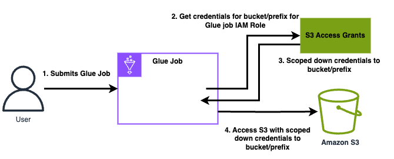

# Using Amazon S3 Access Grants with AWS Glue

With Glue version 5.0, Amazon S3 Access Grants provide a scalable access control solution that you can use to augment access to your Amazon S3 data from AWS Glue. If you have a complex or large permission configuration for your S3 data, you can use S3 Access Grants to scale S3 data permissions for users and roles.

Use S3 Access Grants to augment access to Amazon S3 data beyond the permissions that are granted by the runtime role or the IAM roles that are attached to the identities with access to your AWS Glue job. For more information, see [Managing access with S3 Access Grants](../../../AmazonS3/latest/userguide/access-grants.md "../../../AmazonS3/latest/userguide/access-grants.md") in the _Amazon S3 User Guide_.

## How AWS Glue works with S3 Access Grants

AWS Glue versions 5.0 and higher provide a native integration with S3 Access Grants. You can enable S3 Access Grants on AWS Glue and run Spark jobs. When a Spark job makes a request for S3 data, Amazon S3 provides temporary credentials that are scoped to the specific bucket, prefix, or object.

The following is a high-level overview of how AWS Glue gets access to data that S3 Access Grants manages access to.



1. A user submits an AWS Glue Spark job that uses data stored in Amazon S3.
2. AWS Glue makes a request for S3 Access Grants to vend temporary credentials for the user that give access to the bucket, prefix, or object.
3. AWS Glue returns temporary credentials in the form of an AWS Security Token Service (STS) token for the user. The token is scoped to access the S3 bucket, prefix, or object.
4. AWS Glue uses the STS token to retrieve data from S3.
5. AWS Glue receives the data from S3 and returns the results to the user.

## S3 Access Grants considerations with AWS Glue

Take note of the following behaviors and limitations when you use S3 Access Grants with AWS Glue.

**Feature support**

- S3 Access Grants is supported with AWS Glue versions 5.0 and higher.
- Spark is the only supported job type when you use S3 Access Grants with AWS Glue.
- Delta Lake and Hudi are the only supported open-table formats when you use S3 Access Grants with AWS Glue.
- The following capabilities are not supported for use with S3 Access Grants:
  - Apache Iceberg tables
  - AWS CLI requests to Amazon S3 that use IAM roles
  - S3 access through the open-source S3A protocol

**Behavioral considerations**

- AWS Glue provides a credentials cache to ensure that a user doesn't need to make repeated requests for the same credentials within a Spark job. Therefore, AWS Glue always requests the default-level privilege when it requests credentials. For more information, see [Request access to S3 data](../../../AmazonS3/latest/userguide/access-grants-credentials.md "../../../AmazonS3/latest/userguide/access-grants-credentials.md") in the _Amazon S3 User Guide_.

## Set up S3 Access Grants with AWS Glue

###### Prerequisites

The caller or admin has created an S3 Access Grants instance.

###### Set up AWS Glue policies and job configuration

To set up S3 Access Grants with AWS Glue you must configure trust and IAM policies, and pass the configuration through job parameters.

1. Configure the following minimal trust and IAM policies on the role used for grants (the AWS Glue role that runs sessions or jobs).

Trust policy:

```
{
            "Sid": "Stmt1234567891011",
            "Action": [
                "sts:AssumeRole",
                "sts:SetSourceIdentity",
                "sts:SetContext"
            ],
            "Effect": "Allow",
            "Principal": {
                "Service": "access-grants.s3.amazonaws.com"
            },
            "Condition": {
                "StringEquals": {
                    "aws:SourceAccount": "123456789012",
                    "aws:SourceArn": "arn:aws:s3:`<region>`:123456789012:access-grants/default"
                }
            }
        }
```

IAM policy:

```
{
            "Sid": "S3Grants",
            "Effect": "Allow",
            "Action": [
                "s3:GetDataAccess",
                "s3:GetAccessGrantsInstanceForPrefix"
            ],
            "Resource": "arn:aws:s3:`<region>`:123456789012:access-grants/default"
        },
        {
            "Sid": "BucketLevelReadPermissions",
            "Effect": "Allow",
            "Action": [
                "s3:ListBucket"
            ],
            "Resource": [
                "arn:aws:s3:::*"
            ],
            "Condition": {
                "StringEquals": {
                    "aws:ResourceAccount": "123456789012"
                },
                "ArnEquals": {
                    "s3:AccessGrantsInstanceArn": [
                        "arn:aws:s3:`<region>`:123456789012:access-grants/default"
                    ]
                }
            }
        },
        {
            "Sid": "ObjectLevelReadPermissions",
            "Effect": "Allow",
            "Action": [
                "s3:GetObject",
                "s3:GetObjectVersion",
                "s3:GetObjectAcl",
                "s3:GetObjectVersionAcl",
                "s3:ListMultipartUploadParts"
            ],
            "Resource": [
                "arn:aws:s3:::*"
            ],
            "Condition": {
                "StringEquals": {
                    "aws:ResourceAccount": "123456789012"
                },
                "ArnEquals": {
                    "s3:AccessGrantsInstanceArn": [
                        "arn:aws:s3:`<region>`:123456789012:access-grants/default"
                    ]
                }
            }
        }
```

2. In your AWS Glue job, pass the following Spark configuration either through AWS Glue job parameters or `SparkConf`.

```
--conf spark.hadoop.fs.s3.s3AccessGrants.enabled=true \
--conf spark.hadoop.fs.s3.s3AccessGrants.fallbackToIAM=false
```
