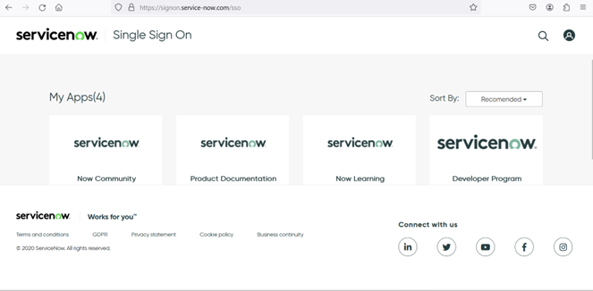

# Configuring ServiceNow

Before you can use AWS Glue to transfer data from ServiceNow, you must meet these requirements:

## Minimum requirements

The following are minimum requirements:

- You have a ServiceNow account with email and password. For more information, see [Creating a ServiceNow account](#servicenow-configuring-creating-servicenow-account "#servicenow-configuring-creating-servicenow-account").
- Your ServiceNow account is enabled for API access. All use of the ServiceNow API is available at no additional cost.

If you meet these requirements, you’re ready to connect AWS Glue to your ServiceNow account.

## Creating a ServiceNow account

To create a ServiceNow account:

1. Navigate to the sign up page on servicenow.com, enter your details, and click **Continue**.
2. When you receive a verification code in your registered mail, enter that code and choose **Verify**.
3. Set up multi-factor authentication or skip doing so.

Your account is created and ServiceNow displays your profile.

## Creating a ServiceNow developer instance

Request a developer instance after logging in to ServiceNow.

1. At the [ServiceNow login page](https://signon.service-now.com/x_snc_sso_auth.do?pageId=username "https://signon.service-now.com/x_snc_sso_auth.do?pageId=username"), enter your account credentials.
2. Choose the **ServiceNow Developer Program**.

 3. Choose **Request Instance** in the top right. 4. Enter your job responsibilities. Indicate your agreement to the terms of use, and choose **Finish setup**. 5. Once the instance is created, note your instance URL and credentials.

## Retrieving BasicAuth credentials

To retrieve Basic Auth credentials for a free account:

1. At the [ServiceNow login page](https://signon.service-now.com/x_snc_sso_auth.do?pageId=username "https://signon.service-now.com/x_snc_sso_auth.do?pageId=username"), enter your account credentials.
2. On the home page choose the edit profile section (top right corner) and choose **Manage Instance Password**.
3. Retrieve the login credentials such as username, password, and instance URL.

###### Note

If MFA is enabled for the account, append the MFA token to the end of the user's password in the basic auth: <username>:<password><MFA Token>

For more information, see [Building applications](https://docs.servicenow.com/bundle/xanadu-application-development/page/build/custom-application/concept/build-applications.html "https://docs.servicenow.com/bundle/xanadu-application-development/page/build/custom-application/concept/build-applications.html") in the ServiceNow documentation.

## Creating OAuth 2.0 credentials

To use OAuth2.0 in ServiceNow connector, you need to create an inbound client) to generate the Client ID and Client Secret:

1. At the [ServiceNow login page](https://signon.service-now.com/x_snc_sso_auth.do?pageId=username "https://signon.service-now.com/x_snc_sso_auth.do?pageId=username"), enter your account credentials.
2. On the home page choose **Start Building**.
3. On the App Engine Studio page, search for **Application Registry**.
4. Choose **New** in the top right.
5. Choose the **Create an OAuth API endpoint for external clients** option.
6. Make any required changes to the OAuth configuration and choose **Update**.

Example for Redirect URL: https://us-east-1.console.aws.amazon.com/gluestudio/oauth 7. Select the newly created OAuth client app to retrieve the Client ID and Client Secret. 8. Store the Client ID and Client Secret for further processing.

To configure OAuth in a non-production developer account:

1. Create an authentication profile using the [Create an authentication profile](https://docs.servicenow.com/bundle/washingtondc-platform-security/page/integrate/authentication/task/create-an-authentication-profile.html "https://docs.servicenow.com/bundle/washingtondc-platform-security/page/integrate/authentication/task/create-an-authentication-profile.html") topic in the ServiceNow documentation.
2. In the Authentication Profile for OAuth, select **Type** as OAuth and select the above-created inbound client to set the **OAuth Entity**.
3. If there are multiple clients, then you need to create multiple authentication profiles to set the required OAuth entity in the authentication profile.
4. If not configured, create a REST API access policy, to give access to the TABLE API. See [Create REST API access policy](https://docs.servicenow.com/bundle/washingtondc-platform-security/page/integrate/authentication/task/create-api-access-policy.html "https://docs.servicenow.com/bundle/washingtondc-platform-security/page/integrate/authentication/task/create-api-access-policy.html").
