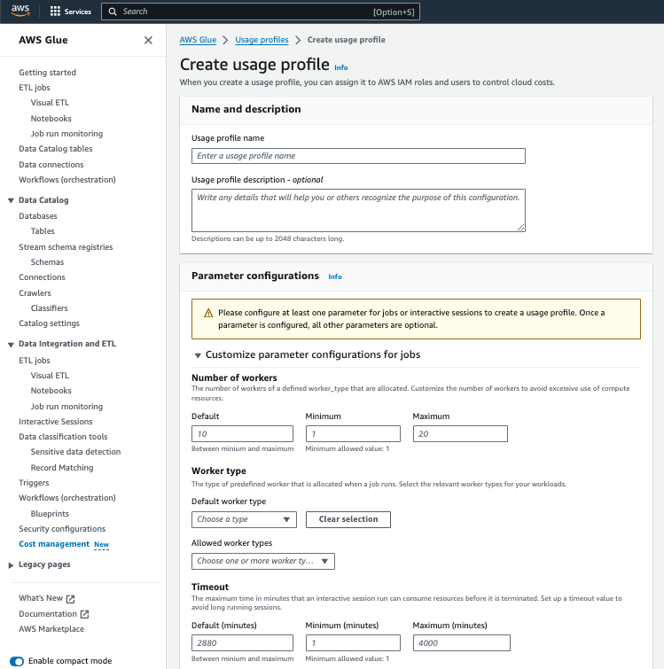
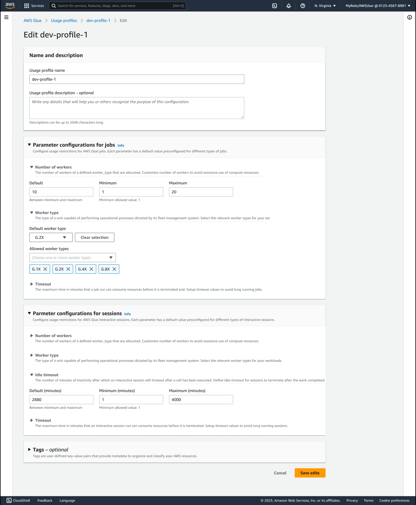
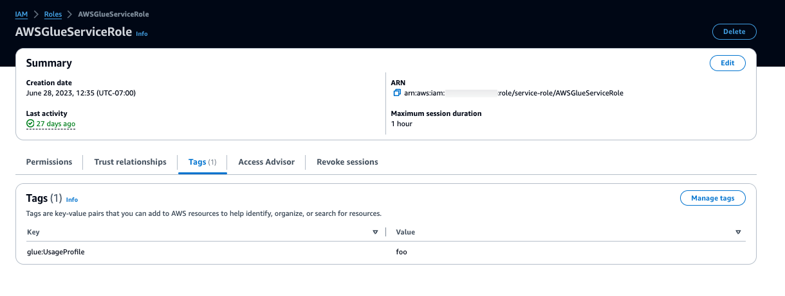
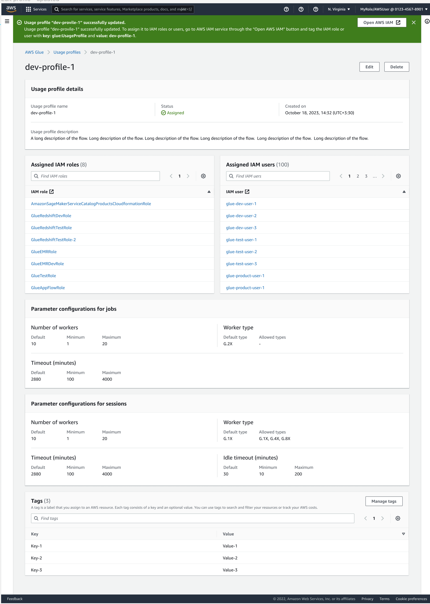

# Creating and managing usage profiles

## Creating an AWS Glue usage profile

Admins should create usage profiles and then assign them to the various users. When creating a usage profile, you specify default values as well as a range of allowed values for various job and session parameters. You must configure at least one parameter for jobs or interactive sessions. You can customize the default value to be used when a
parameter value is not provided for the job, and/or set up a range limit or a set of allowed values for
validation if a user provides a parameter value when using this profile.

_Defaults_ are a best practice set by the admin to assist job authors. When a user creates a new job and doesn't set a timeout value, the usage profile's default timeout will apply. If the author doesn’t have a profile, then the AWS Glue service defaults would apply and be saved in the job's definition. At runtime, AWS Glue enforces the limits set in the profile (min, max, allowed workers).

Once a parameter is configured, all other parameters are optional. Parameters that can be customized for jobs or interactive sessions are:

- **Number of workers** – restrict the number of workers to avoid excessive use of
  compute resources. You can set a default, minimum, and maximum value. The minimum is 1.
- **Worker type** – restrict the relevant worker types for your workloads. You can
  set a default type and allow worker types for a user profile.
- **Timeout** – define the maximum time a job or interactive session can run and consume resources
  before it is terminated. Set up timeout values to avoid long-running jobs.

You can set a default, minimum, and maximum value in minutes. The minimum is 1 (minute). While the AWS Glue default time out is 2880 minutes, you can set any default value in the usage profile.

It is a best practice to set a value for 'default'. This value will be used for the job or session creation if no value was set by the user.

- **Idle timeout** – define the number of minutes an interactive session is inactive before
  timing out after a cell has been run. Define idle timeout for interactive sessions to terminate after the work completed. Idle timeout range should be within the limit of timeout.

You can set a default, minimum, and maximum value in minutes. The minimum is 1 (minute). While the AWS Glue default time out is 2880 minutes, you can set any default value in the usage profile.

It is a best practice to set a value for 'default'. This value will be used for the session creation if no value was set by the user.

###### To create an AWS Glue usage profile as an admin (console)

1. In the left navigation menu, choose **Cost management**.
2. Choose **Create usage profile**.
3. Enter the **Usage profile name** for the usage profile.
4. Enter an optional description that will help others recognize the purpose of the usage profile.
5. Define at least one parameter in the profile. Any field in the form is a parameter. For example, the session idle timeout minimum.
6. Define any optional tags that apply to the usage profile.
7. Choose **Save**.



###### To create a usage profile (AWS CLI)

1. Enter the following command.

```
aws glue create-usage-profile --name `profile-name` --configuration `file://config.json` --tags `list-of-tags`
```

where the config.json can define parameter values for interactive sessions (`SessionConfiguration`) and jobs (`JobConfiguration`):

```
//config.json (There is a separate blob for session/job configuration
{
    "SessionConfiguration": {
        "timeout": {
            "DefaultValue": "2880",
            "MinValue": "100",
            "MaxValue": "4000"
        },
        "idleTimeout": {
            "DefaultValue": "30",
            "MinValue": "10",
            "MaxValue": "4000"
        },
        "workerType": {
            "DefaultValue": "G.2X",
            "AllowedValues": [
                "G.1X",
                "G.2X",
                "G.4X",
                "G.8X",
                "G.12X",
                "G.16X",
                "R.1X",
                "R.2X",
                "R.4X",
                "R.8X"
            ]
        },
        "numberOfWorkers": {
            "DefaultValue": "10",
            "MinValue": "1",
            "MaxValue": "10"
        }
    },
    "JobConfiguration": {
        "timeout": {
            "DefaultValue": "2880",
            "MinValue": "100",
            "MaxValue": "4000"
        },
        "workerType": {
            "DefaultValue": "G.2X",
            "AllowedValues": [
                "G.1X",
                "G.2X",
                "G.4X",
                "G.8X",
                "G.12X",
                "G.16X",
                "R.1X",
                "R.2X",
                "R.4X",
                "R.8X"
            ]
        },
        "numberOfWorkers": {
            "DefaultValue": "10",
            "MinValue": "1",
            "MaxValue": "10"
        }
    }
}
```

2. Enter the following command to see the usage profile created:

```
aws glue get-usage-profile --name `profile-name`
```

The response:

```
{
    "ProfileName": "foo",
    "Configuration": {
        "SessionConfiguration": {
            "numberOfWorkers": {
                "DefaultValue": "10",
                "MinValue": "1",
                "MaxValue": "10"
            },
            "workerType": {
                "DefaultValue": "G.2X",
                "AllowedValues": [
                    "G.1X",
                    "G.2X",
                    "G.4X",
                    "G.8X",
                    "G.12X",
                    "G.16X",
                    "R.1X",
                    "R.2X",
                    "R.4X",
                    "R.8X"
                ]
            },
            "timeout": {
                "DefaultValue": "2880",
                "MinValue": "100",
                "MaxValue": "4000"
            },
            "idleTimeout": {
                "DefaultValue": "30",
                "MinValue": "10",
                "MaxValue": "4000"
            }
        },
        "JobConfiguration": {
            "numberOfWorkers": {
                "DefaultValue": "10",
                "MinValue": "1",
                "MaxValue": "10"
            },
            "workerType": {
                "DefaultValue": "G.2X",
                "AllowedValues": [
                    "G.1X",
                    "G.2X",
                    "G.4X",
                    "G.8X",
                    "G.12X",
                    "G.16X",
                    "R.1X",
                    "R.2X",
                    "R.4X",
                    "R.8X"
                ]
            },
            "timeout": {
                "DefaultValue": "2880",
                "MinValue": "100",
                "MaxValue": "4000"
            }
        }
    },
    "CreatedOn": "2024-01-19T23:15:24.542000+00:00"
}
```

Additional CLI commands used to manage usage profiles:

- aws glue list-usage-profiles
- aws glue update-usage-profile --name `profile-name` --configuration `file://config.json`
- aws glue delete-usage-profile --name `profile-name`

## Editing a usage profile

Admins can edit usage profiles that they have created, to change the profile parameter values for jobs and interactive sessions.

To edit a usage profile:

###### To edit an AWS Glue usage profile as an admin (console)

1. In the left navigation menu, choose **Cost management**.
2. Choose a usage profile that you have permissions to edit and choose **Edit**.
3. Make changes as needed to the profile. By default, the parameters that already have values are expanded.
4. Choose **Save Edits**.



###### To edit a usage profile (AWS CLI)

- Enter the following command. The same `--configuration` file syntax is used as shown above in the create command.

```
aws glue update-usage-profile --name `profile-name` --configuration `file://config.json`
```

where the config.json defines parameter values for interactive sessions (`SessionConfiguration`) and jobs (`JobConfiguration`):

## Assigning a usage profile

The **Utilization status** column in the **Usage profiles** page shows whether a usage profile is assigned to users. Hovering over the status shows the assigned IAM entities.

The admin can assign an AWS Glue usage profile to users/roles who create AWS Glue resources. Assigning a profile is a combination of two actions:

- Updating the IAM user/role tag with the `glue:UsageProfile` key, then
- Updating the IAM policy of the user/role.

For users who use AWS Glue Studio to create jobs/interactive sessions, the admin tags the following roles:

- For restrictions on jobs, the admin tags the logged in console role
- For restrictions on interactive sessions, the admin tags the role the user provides when they create the notebook

The following is example policy that admin needs to update on the IAM users/roles who create AWS Glue resources:

```
{
    "Effect": "Allow",
    "Action": [
        "glue:GetUsageProfile"
    ],
    "Resource": [
        "arn:aws:glue:us-east-1:123456789012:usageProfile/foo"
    ]
}
```

AWS Glue validates job, job run, and session requests based on the values specified in the AWS Glue usage profile and raises an exception if the request is disallowed. For synchronous APIs, an error will be thrown to the user. For asynchronous paths, a failed job run is created with the error message that the input parameter is outside of the allowed range for the assigned profile of the user/role.

To assign a usage profile to a user/role:

1. Open the (Identity and Access Management) IAM console.
2. In the left navigation, choose **Users** or **Roles**.
3. Choose a user or role.
4. Choose the **Tags** tab.
5. Choose **Add new tag**
6. Add a tag with the **Key** of `glue:UsageProfile` and the **Value** of the name of your usage profile.
7. Choose **Save changes**



## Viewing your assigned usage profile

Users can view their assigned usage profiles and use them when making API calls to create AWS Glue job and session resources, or starting a job.

Profile permissions are provided in IAM policies. As long as the caller policy has the `glue:UsageProfile` permission, a user can see the profile. Otherwise, you will get an access denied error.

To view an assigned usage profile:

1. In the left navigation menu, choose **Cost management**.
2. Choose a usage profile that you have permissions to view.


