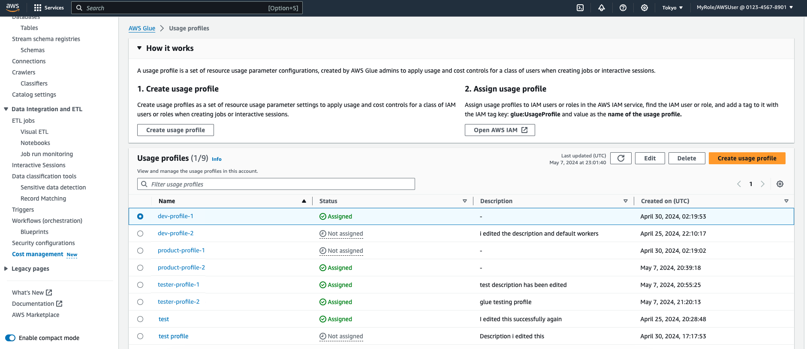

# Setting up AWS Glue usage profiles

One of the main advantages of using a cloud platform is its flexibility. However, with this ease of creating compute resources comes a risk of spiraling cloud costs when left unmanaged and without guardrails. As a result, admins need to balance avoiding high infrastructure costs while at the same time allowing users to work without unnecessary friction.

With AWS Glue usage profiles, admins can create different profiles for various classes of users within the account, such as developers, testers, and product teams. Each profile is a unique set of parameters that can be assigned to different types of users.
For example, developers may need more workers and can have a higher number of maximum workers while product teams may need fewer workers and a lower timeout or idle timeout value.

###### Example of jobs and job runs behavior

Suppose that a job is created by user A with profile A. The job is saved with certain parameter values. User B with profile B will try to run the job.

When user A authored the job, if he didn’t set a specific number of workers, the default set in user A's profile was applied and was saved with the job's definitions.

When user B runs the job, it run with whatever values were saved for it. If user B's own profile is more restrictive and not allowed to run with that many workers, the job run will fail.

###### Usage profile as a resource

An AWS Glue usage profile is a resource identified by an Amazon Resource Name (ARN). All the default IAM (Identity and Access Management) controls apply, including action-based and resource-based authorization. Admins should update the IAM policy of users who create AWS Glue resources, granting them access to use the profiles.

###### Topics

- [Creating and managing usage profiles](start-usage-profiles-managing.md "start-usage-profiles-managing.md")
- [Usage profiles and jobs](start-usage-profiles-jobs.md "start-usage-profiles-jobs.md")
