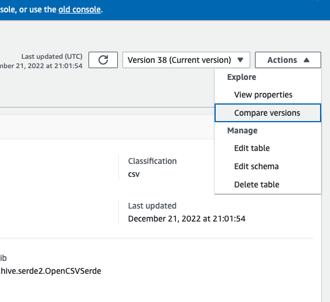

# Creating tables

Even though running a crawler is the recommended method to take inventory of the data in
your data stores, you can add metadata tables to the AWS Glue Data Catalog manually. This approach
allows you to have more control over the metadata definitions and customize them according
them to your specific requirements.

You can also add tables to the Data Catalog manually in the following ways:

- Use the AWS Glue console to manually create a table in the AWS Glue Data Catalog. For more
  information, see [Creating tables using the console](#console-tables "#console-tables").
- Use the `CreateTable` operation in the [AWS Glue API](aws-glue-api.md "aws-glue-api.md") to create a table in the AWS Glue Data Catalog. For more
  information, see [CreateTable action (Python: create_table)](aws-glue-api-catalog-tables.md#aws-glue-api-catalog-tables-CreateTable "aws-glue-api-catalog-tables.md#aws-glue-api-catalog-tables-CreateTable").
- Use AWS CloudFormation templates. For more information, see [AWS CloudFormation for AWS Glue](populate-with-cloudformation-templates.md "populate-with-cloudformation-templates.md").
  When you define a table manually using the console or an API, you specify the table schema
  and the value of a classification field that indicates the type and format of the data in
  the data source. If a crawler creates the table, the data format and schema are determined
  by either a built-in classifier or a custom classifier. For more information about creating
  a table using the AWS Glue console, see [Creating tables using the console](#console-tables "#console-tables").

###### Topics

- [Table partitions](#tables-partition "#tables-partition")
- [Table resource links](#tables-resource-links "#tables-resource-links")
- [Creating tables using the console](#console-tables "#console-tables")
- [Creating partition indexes](partition-indexes.md "partition-indexes.md")
- [Updating manually created Data Catalog tables using
  crawlers](#update-manual-tables "#update-manual-tables")
- [Data Catalog table properties](#table-properties "#table-properties")

## Table partitions

An AWS Glue table definition of an Amazon Simple Storage Service (Amazon S3) folder can describe a partitioned
table. For example, to improve query performance, a partitioned table might separate
monthly data into different files using the name of the month as a key. In AWS Glue, table
definitions include the partitioning key of a table. When AWS Glue evaluates the data in
Amazon S3 folders to catalog a table, it determines whether an individual table or a
partitioned table is added.

You can create partition indexes on a table to fetch a subset of the partitions instead of loading all the partitions in the table. For information about working with partition indexes, see [Creating partition indexes](partition-indexes.md "partition-indexes.md") .

All the following conditions must be true for AWS Glue to create a partitioned table for
an Amazon S3 folder:

- The schemas of the files are similar, as determined by AWS Glue.
- The data format of the files is the same.
- The compression format of the files is the same.

For example, you might own an Amazon S3 bucket named `my-app-bucket`, where you
store both iOS and Android app sales data. The data is partitioned by year, month, and
day. The data files for iOS and Android sales have the same schema, data format, and
compression format. In the AWS Glue Data Catalog, the AWS Glue crawler creates one table definition
with partitioning keys for year, month, and day.

The following Amazon S3 listing of `my-app-bucket` shows some of the partitions.
The `=` symbol is used to assign partition key values.

```

   my-app-bucket/Sales/year=2010/month=feb/day=1/iOS.csv
   my-app-bucket/Sales/year=2010/month=feb/day=1/Android.csv
   my-app-bucket/Sales/year=2010/month=feb/day=2/iOS.csv
   my-app-bucket/Sales/year=2010/month=feb/day=2/Android.csv
   ...
   my-app-bucket/Sales/year=2017/month=feb/day=4/iOS.csv
   my-app-bucket/Sales/year=2017/month=feb/day=4/Android.csv

```

## Table resource links

|                                                                                                                            |
| -------------------------------------------------------------------------------------------------------------------------- |
| The AWS Glue console was recently updated.<br>The current version of the console<br>does not support Table Resource Links. |

The Data Catalog can also contain _resource links_ to tables. A table
resource link is a link to a local or shared table. Currently, you can create resource
links only in AWS Lake Formation. After you create a resource link to a table, you can use the
resource link name wherever you would use the table name. Along with tables that you own
or that are shared with you, table resource links are returned by
`glue:GetTables()` and appear as entries on the
**Tables** page of the AWS Glue console.

The Data Catalog can also contain database resource links.

For more information about resource links, see [Creating Resource
Links](../../../lake-formation/latest/dg/creating-resource-links.md "../../../lake-formation/latest/dg/creating-resource-links.md") in the _AWS Lake Formation Developer Guide_.

## Creating tables using the console

A table in the AWS Glue Data Catalog is the metadata definition that represents the data in a data
store. You create tables when you run a crawler, or you can create a table manually in the
AWS Glue console. The **Tables** list in the AWS Glue console displays values
of your table's metadata. You use table definitions to specify sources and targets when you
create ETL (extract, transform, and load) jobs.

###### Note

With recent changes to the AWS management console, you may need to modify your existing IAM roles to have the [`SearchTables`](aws-glue-api-catalog-tables.md#aws-glue-api-catalog-tables-SearchTables "aws-glue-api-catalog-tables.md#aws-glue-api-catalog-tables-SearchTables") permission. For new role creation, the `SearchTables` API permission has already been added as default.

To get started, sign in to the AWS Management Console and open the AWS Glue console at [https://console.aws.amazon.com/glue/](https://console.aws.amazon.com/glue/ "https://console.aws.amazon.com/glue/").
Choose the **Tables** tab, and use the **Add tables**
button to create tables either with a crawler or by manually typing attributes.

### Adding tables on the console

To use a crawler to add tables, choose **Add tables**, **Add
tables using a crawler**. Then follow the instructions in the **Add
crawler** wizard. When the crawler runs, tables are added to the AWS Glue Data Catalog.
For more information, see [Using crawlers to populate the Data Catalog](add-crawler.md "add-crawler.md") .

If you know the attributes that are required to create an Amazon Simple Storage Service (Amazon S3) table
definition in your Data Catalog, you can create it with the table wizard. Choose
**Add tables**, **Add table manually**, and follow
the instructions in the **Add table** wizard.

When adding a table manually through the console, consider the following:

- If you plan to access the table from Amazon Athena, then provide a name with only alphanumeric and underscore characters. For more information,
  see [Athena names](../../../athena/latest/ug/tables-databases-columns-names.md#ate-table-database-and-column-names-allow-only-underscore-special-characters "../../../athena/latest/ug/tables-databases-columns-names.md#ate-table-database-and-column-names-allow-only-underscore-special-characters").
- The location of your source data must be an Amazon S3 path.
- The data format of the data must match one of the listed formats in the
  wizard. The corresponding classification, SerDe, and other table properties are
  automatically populated based on the format chosen. You can define tables with
  the following formats:

**Avro**

Apache Avro JSON binary format.

**CSV**

Character separated values. You also specify the delimiter of
either comma, pipe, semicolon, tab, or Ctrl-A.

**JSON**

JavaScript Object Notation.

**XML**

Extensible Markup Language format. Specify the XML tag that
defines a row in the data. Columns are defined within row
tags.

**Parquet**

Apache Parquet columnar storage.

**ORC**

Optimized Row Columnar (ORC) file format. A format designed to efficiently store Hive data.

- You can define a partition key for the table.
- Currently, partitioned tables that you create with the console cannot be used
  in ETL jobs.

### Table attributes

The following are some important attributes of your table:

**Name**

The name is determined when the table is created, and you can't change it.
You refer to a table name in many AWS Glue operations.

**Database**

The container object where your table resides. This object contains an
organization of your tables that exists within the AWS Glue Data Catalog and might
differ from an organization in your data store. When you delete a database,
all tables contained in the database are also deleted from the Data Catalog.

**Description**

The description of the table. You can write a description to help you
understand the contents of the table.

**Table format**

Specify creating a standard AWS Glue table, or a table in Apache Iceberg format.

The Data Catalog provides following table optimization options to manage table
storage and improve query performance for Iceberg tables.

- **Compaction** – Data
  files are merged and rewritten remove obsolete data and consolidate
  fragmented data into larger, more efficient files.
- **Snapshot retention** – Snapshots are timestamped versions
  of an Iceberg table. Snapshot retention configurations allow customers to enforce how long
  to retain snapshots and how many snapshots to retain. Configuring a snapshot retention
  optimizer can help manage storage overhead by removing older, unnecessary snapshots and
  their associated underlying files.
- **Orphan file deletion** – Orphan files are files that are no longer referenced by the Iceberg table metadata. These files can
  accumulate over time, especially after operations like table deletions or failed ETL jobs.
  Enabling orphan file deletion allows AWS Glue to periodically identify and remove these
  unnecessary files, freeing up storage.

For more information, see [Optimizing Iceberg tables](table-optimizers.md "table-optimizers.md").

**Optimization configuration**
You can either use the default settings or customize the settings for enabling the table
optimizers.

**IAM role**
To run the table optimizers, the service assumes an IAM role on your behalf. You can choose
an IAM role using the drop-down. Ensure that the role has the permissions
required to enable compaction.

To learn more about the required permissions for the IAM role, see [Table optimization prerequisites](optimization-prerequisites.md "optimization-prerequisites.md") .

**Location**

The pointer to the location of the data in a data store that this table
definition represents.

**Classification**

A categorization value provided when the table was created. Typically,
this is written when a crawler runs and specifies the format of the source
data.

**Last updated**

The time and date (UTC) that this table was updated in the Data Catalog.

**Date added**

The time and date (UTC) that this table was added to the Data Catalog.

**Deprecated**

If AWS Glue discovers that a table in the Data Catalog no longer exists in its
original data store, it marks the table as deprecated in the data catalog.
If you run a job that references a deprecated table, the job might fail.
Edit jobs that reference deprecated tables to remove them as sources and
targets. We recommend that you delete deprecated tables when they are no
longer needed.

**Connection**

If AWS Glue requires a connection to your data store, the name of the
connection is associated with the table.

### Viewing and managing table details

To see the details of an existing table, choose the table name in the list, and then
choose **Action, View details**.

The table details include properties of your table and its schema.

This view displays the schema of the table, including column names in the order defined
for the table, data types, and key columns for partitions.
If a column is a complex type,
you can choose **View properties** to display details of the structure
of that field, as shown in the following example:

```
{
"StorageDescriptor":
    {
      "cols": {
         "FieldSchema": [
           {
             "name": "primary-1",
             "type": "CHAR",
             "comment": ""
           },
           {
             "name": "second ",
             "type": "STRING",
             "comment": ""
           }
         ]
      },
      "location": "s3://aws-logs-111122223333-us-east-1",
      "inputFormat": "",
      "outputFormat": "org.apache.hadoop.hive.ql.io.HiveIgnoreKeyTextOutputFormat",
      "compressed": "false",
      "numBuckets": "0",
      "SerDeInfo": {
           "name": "",
           "serializationLib": "org.apache.hadoop.hive.serde2.OpenCSVSerde",
           "parameters": {
               "separatorChar": "|"
            }
      },
      "bucketCols": [],
      "sortCols": [],
      "parameters": {},
      "SkewedInfo": {},
      "storedAsSubDirectories": "false"
    },
    "parameters": {
       "classification": "csv"
    }
}
```

For more information about the properties of a table, such as `StorageDescriptor`, see
[StorageDescriptor structure](aws-glue-api-catalog-tables.md#aws-glue-api-catalog-tables-StorageDescriptor "aws-glue-api-catalog-tables.md#aws-glue-api-catalog-tables-StorageDescriptor").

To change the schema of a table, choose **Edit schema** to add and
remove columns, change column names, and change data types.

To compare different versions of a table, including its schema, choose **Compare versions** to see a side-by-side comparison
of two versions of the schema for a table. For more information, see
[Comparing table schema versions](#console-tables-schema-comparison "#console-tables-schema-comparison") .

To display the files that make up an Amazon S3 partition, choose **View
partition**. For Amazon S3 tables, the **Key** column displays
the partition keys that are used to partition the table in the source data store.
Partitioning is a way to divide a table into related parts based on the values of a key
column, such as date, location, or department. For more information about partitions,
search the internet for information about "hive partitioning."

###### Note

To get step-by-step guidance for viewing the details of a table, see the
**Explore table** tutorial in the console.

###

Comparing table schema versions

When you compare two versions of table schemas, you can compare nested row changes by expanding and collapsing nested rows,
compare schemas of two versions side-by-side, and view table properties side-by-side.

To compare versions

1. From the AWS Glue console, choose **Tables**, then **Actions** and choose
   **Compare versions**.

 2. Choose a version to compare by choosing the version drop-down menu. When comparing schemas, the Schema tab is highlighted in orange. 3. When you compare tables between two versions, the table schemas are presented to you on the left and right side of the screen. This enables you
to determine changes visually by comparing the Column name, data type, key, and comment fields side-by-side. When there is a change, a colored
icon displays the type of change that was made.

    * Deleted – displayed by a red icon indicates where the column was removed from a previous version of the table schema.
    * Edited or Moved – displayed by a blue icon indicates where the column was modified or moved in a newer version of the table schema.
    * Added – displayed by a green icon indicates where the column was added to a newer version of the table schema.
    * Nested changes – displayed by a yellow icon indicates where the nested column contains changes. Choose the column to expand
     and view the columns that have either been deleted, edited, moved, or added.

 4. Use the filter fields search bar to display fields based on the characters you enter here. If you enter a column name in either table
version, the filtered fields are displayed in both table versions to show you where the changes have occurred. 5. To compare properties, choose the **Properties tab**. 6. To stop comparing versions, choose **Stop comparing** to return to the list of tables.

## Updating manually created Data Catalog tables using

crawlers

You might want to create AWS Glue Data Catalog tables manually and then keep them updated with
AWS Glue crawlers. Crawlers running on a schedule can add new partitions and update the
tables with any schema changes. This also applies to tables migrated from an Apache Hive
metastore.

To do this, when you define a crawler, instead of specifying one or more data stores
as the source of a crawl, you specify one or more existing Data Catalog tables. The crawler
then crawls the data stores specified by the catalog tables. In this case, no new tables
are created; instead, your manually created tables are updated.

The following are other reasons why you might want to manually create catalog tables
and specify catalog tables as the crawler source:

- You want to choose the catalog table name and not rely on the catalog table
  naming algorithm.
- You want to prevent new tables from being created in the case where files with
  a format that could disrupt partition detection are mistakenly saved in the data
  source path.

For more information, see [Step 2: Choose data sources and classifiers](define-crawler-choose-data-sources.md "define-crawler-choose-data-sources.md").

## Data Catalog table properties

Table properties, or parameters, as they are known in the AWS CLI, are unvalidated key and value
strings. You can set your own properties on the table to support uses of the Data Catalog outside of AWS Glue.
Other services using the Data Catalog may do so as well. AWS Glue sets some table properties when running jobs
or crawlers. Unless otherwise described, these properties are for internal use, we do not support that
they will continue to exist in their current form, or support product behavior if these properties are manually changed.

For more information about table properties set by AWS Glue crawlers, see [Parameters set on Data Catalog tables by crawler](table-properties-crawler.md "table-properties-crawler.md").
