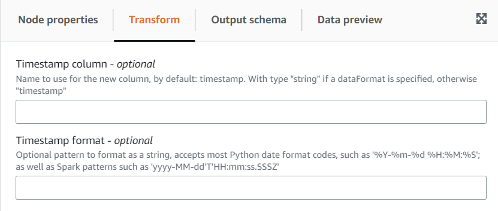

# Using the Add Current Timestamp transform

The **Add Current Timestamp** transform allows you to mark the rows with the time on which the data was processed.
This is useful for auditing purposes or to track latency in the data pipeline. You can add this new column as a timestamp data type
or a formatted string.

###### To add a Add Current Timestamp transform:

1. Open the Resource panel and then choose
   **Add Current Timestamp** to add a new transform to your job diagram. The node selected at the time of adding the
   node will be its parent.
2. (Optional) On the **Node properties** tab, you can enter a name for the node in the job diagram. If a node parent
   is not already selected, then choose a node from the Node parents list to use as the input source for the transform.

 3. (Optional) On the **Transform** tab, enter a custom name for the new column and a format if you rather the column
to be a formatted date string.
