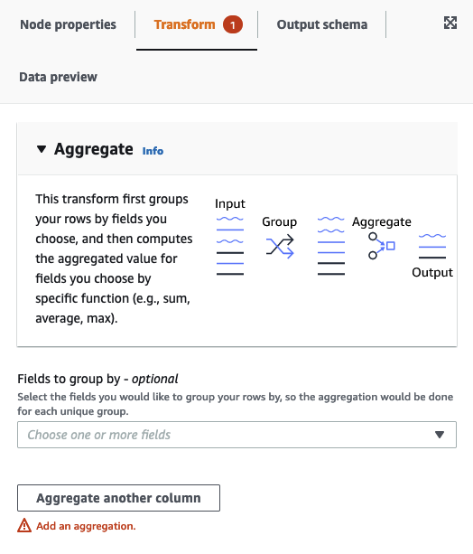
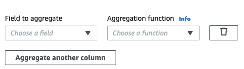

# Using Aggregate to perform summary

calculations on selected fields

###### To use the Aggregate transform

1. Add the Aggregate node to the job diagram.
2. On the **Node properties** tab, choose fields to group
   together by selecting the drop-down field (optional). You can select more than one field
   at a time or search for a field name by typing in the search bar.

When fields are selected, the name and datatype are shown. To remove a field,
choose 'X' on the field.

 3. Choose **Aggregate another column**. It is required to select at
least one field.

 4. Choose a field in the **Field to aggregate** drop-down. 5. Choose the aggregation function to apply to the chosen field:

    * avg - calculates the average
    * countDistinct - calculates the number of unique non-null values
    * count - calculates the number of non-null values
    * first - returns the first value that satisfies the 'group by' criteria
    * last - returns the last value that satisfies the 'group by' criteria
    * kurtosis - calculates the the sharpness of the peak of a frequency-distribution
     curve
    * max - returns the highest value that satisfies the 'group by' criteria
    * min - returns the lowest value that satisfies the 'group by' criteria
    * skewness - measure of the asymmetry of the probability distribution of a normal
     distribution
    * stddev\_pop - calculates the population standard deviation and returns the
     square root of the population variance
    * sum - the sum of all values in the group
    * sumDistinct - the sum of distinct values in the group
    * var\_samp - the sample variance of the group (ignores nulls)
    * var\_pop - the population variance of the group (ignores nulls)
