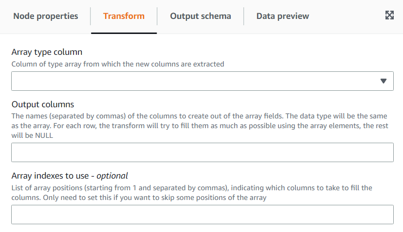

# Using the Array To Columns transform to extract the elements of an array into

top level columns

The Array To Columns transform allows you extract some or all the elements of a column of type array into new columns. The transform will fill
the new columns as much as possible if the array has enough values to extract, optionally taking the elements in the positions specified.

For instance, if you have an array column “subnet”, which was the result of applying the “Split String” transform on a ip v4 subnet, you can
extract the first and forth positions into new columns “first_octect” and “forth_octect”.
The output of the transform in this example would be (notice the last two rows have shorter arrays than expected):

| subnet              | first_octect | fourth_octect |
| ------------------- | ------------ | ------------- | ----------------------------------------------------------------------------------------------------------------------------------------------------------------------------------------------------------------------------------------------------------------------------------------------------------------------------------------------------------------------------------------------------------------------------------------------------------------------------------------------------------------------------------------------------------------------------------------------------------------------------------------------------------------------------------------------------------------------------------------------------------------------------------------------------------------------------------------------------------------------------------------------------------------------------------------------------------------------------------------------------------------------------------------------------------------------------------------------------------------------------------------------------------------------------------------------------------------------- |
| [54, 240, 197, 238] | 54           | 238           |
| [192, 168, 0, 1]    | 192          | 1             |
| [192, 168]          | 192          |               |
| []                  |              |               | ###### To add a Array To Columns transform: 1. Open the Resource panel and then choose **Array To Columns** to add a new transform to your job diagram. The node selected at the time of adding the node will be its parent. 2. (Optional) On the **Node properties** tab, you can enter a name for the node in the job diagram. If a node parent is not already selected, then choose a node from the Node parents list to use as the input source for the transform. 3. On the **Transform** tab, choose the array column to extract and enter the list of new columns for the tokens extracted.  4. (Optional) If you don’t want to take the array tokens in order to assign to columns, you can specify the indexes to take which will be assigned to the list of columns in the same order specified. For instance if the output columns are “column1, column2, column3” and the indexes “4, 1, 3”, the forth element of the array will go to column1, the first to column2 and the third to column3 (if the array is shorter than the index number, a NULL value will be set). |
