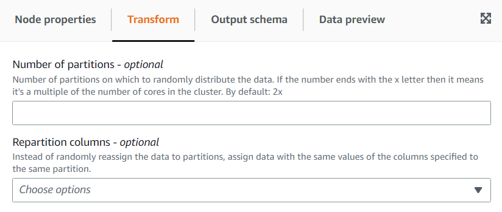

# Using the Autobalance Processing transform to optimize your runtime

The **Autobalance Processing** transform redistributes the data among the workers for better performance.
This helps in cases where
the data is unbalanced or as it comes from the source doesn’t allow enough parallel processing on it. This is common where the source is
gzipped or is JDBC. The redistribution of data has a modest performance cost, so the optimization might not always compensate that effort
if the data was already well balanced. Underneath, the transform uses Apache Spark repartition to randomly reassign data among a number of
partitions optimal for the cluster capacity. For advanced users, it’s possible to enter a number of partitions manually. In addition,
it can be used to optimize the writing of partitioned tables by reorganizing the data based on specified columns. This results in output
files that are more consolidated.

######

1. Open the Resource panel and then choose
   **Autobalance Processing** to add a new transform to your job diagram. The node selected at the time of adding the
   node will be its parent.
2. (Optional) On the **Node properties** tab, you can enter a name for the node in the job diagram. If a node parent
   is not already selected, then choose a node from the Node parents list to use as the input source for the transform.
3. (Optional) On the **Transform** tab, you can enter a number of partitions. In general, it’s recommended that you
   let the system decide this value, however you can tune the multiplier or enter a specific value if you need to control this.
   If you are going to save the data partitioned by columns, you can choose the same columns as repartition columns.
   This way it will minimize the number of files on each partition and avoid having many files per partitions, which would hinder the
   performance of the tools querying that data.

