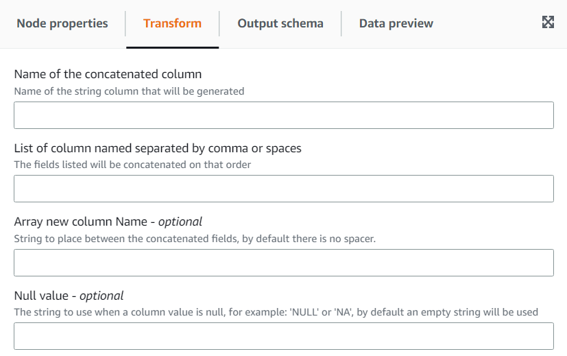

# Using the Concatenate Columns transform to append columns

The Concatenate transform allows you to build a new string column using the values of other columns with an optional spacer.
For example, if we define a concatenated column “date” as the concatenation of “year”, “month” and “day” (in that order) with “-” as the
spacer, we would get:

| day | month | year | date       |
| --- | ----- | ---- | ---------- | ------------------------------------------------------------------------------------------------------------------------------------------------------------------------------------------------------------------------------------------------------------------------------------------------------------------------------------------------------------------------------------------------------------------------------------------------------------------------------------------------------------------------------------------------------------------------------------------------------------------------------------------------------------------------------------------------------------------------------------------------------------------------------------------------------------------------------------------------------------------------------------------------------------------------------------------------------------------------------------------------------------------------------------------------------------------------------------------------------------------------ |
| 01  | 01    | 2020 | 2020-01-01 |
| 02  | 01    | 2020 | 2020-01-02 |
| 03  | 01    | 2020 | 2020-01-03 |
| 04  | 01    | 2020 | 2020-01-04 | ###### To add a Concatenate transform: 1. Open the Resource panel. Then choose **Concatenate Columns** to add a new transform to your job diagram. The node selected at the time of adding the node will be its parent. 2. (Optional) On the **Node properties** tab, you can enter a name for the node in the job diagram. If a node parent is not already selected, then choose a node from the Node parents list to use as the input source for the transform. 3. On the **Transform** tab, enter the name of the column that will hold the concatenated string as well as the columns to concatenate. The order in which you check the columns in the dropdown will be the order used.  4. **Spacer - optional** – Enter a string to place betwen the concatenated fields. By default, there is no spacer. 5. **Null value - optional** – Enter a string to use when a column value is null. By default, in the cases where columns have the value 'NULL' or 'NA', an empty string is used. |
