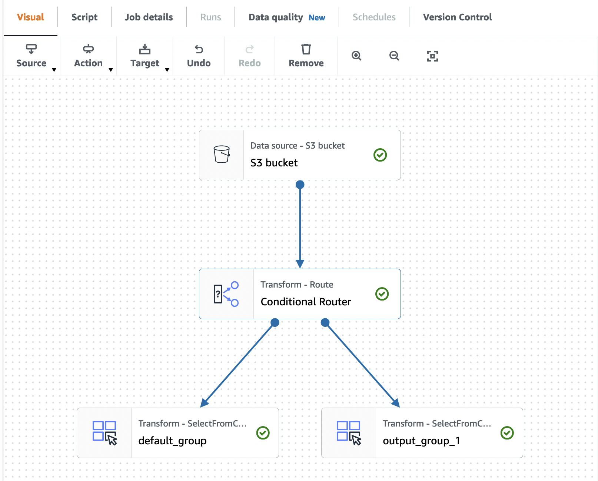
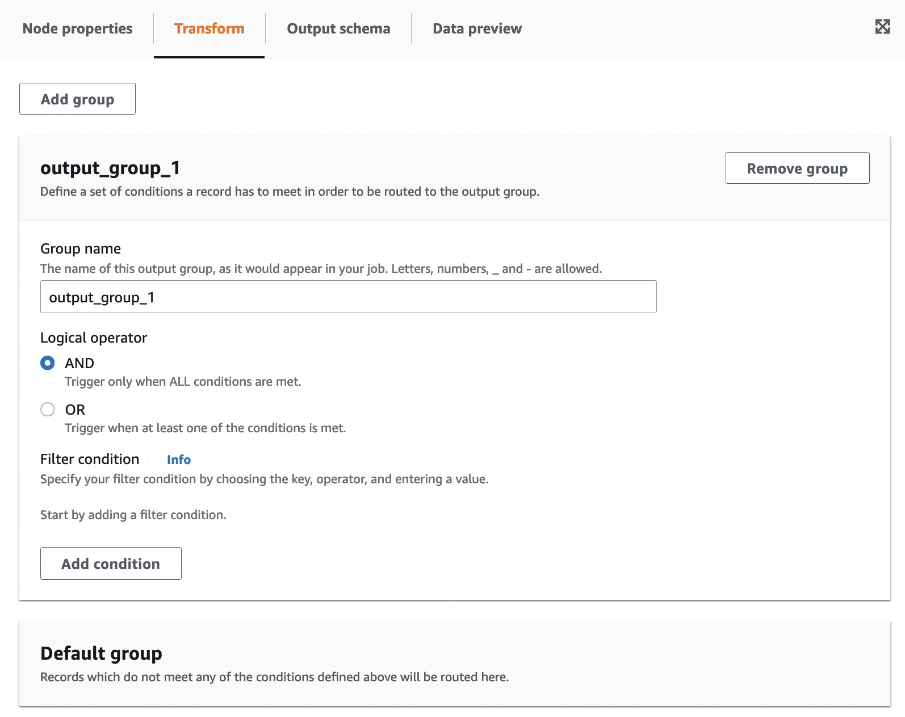
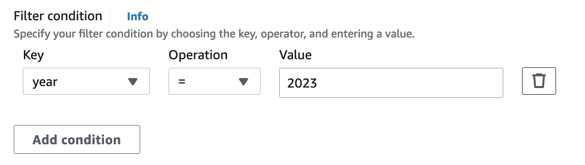

# Creating a Conditional Router transformation

The Conditional Router transform allows you to apply multiple conditions to incoming data. Each row of the incoming data is evaluated
by a group filter condition and processed into its corresponding group. If a row meets more than one group filter condition,
the transform passes the row to multiple groups. If a row does not meet any condition, it can either be dropped or routed
to a default output group.

This transform is similar to the filter transform, but useful for users who want to test the same input data on multiple conditions.

######

To add a Conditional Router transform:

1. Choose a node where you will perform the conditional router transformation. This can be a source node or another transform.
2. Choose **Action**, then use the search bar to find and choose 'Conditional Router'. A **Conditional Router** transform is added along with two output nodes. One output node, 'Default group',
   contains records which do not meet any of the conditions defined in the other output node(s). The default group cannot
   be edited.

You can add additional output groups by choosing **Add group**. For each output group, you can name the
group and add filter conditions and a logical operator.

 3. Rename the output group name by entering a new name for the group. AWS Glue Studio will automatically name your groups
for you (for example, 'output_group_1'). 4. Choose a logical operator (**AND**, **OR**) and add a **Filter condition** by specifying the
**Key**, **Operation**, and **Value**. Logical operators allow you to
implement more than one filter condition and perform the logical operator on each filter condition you specify.

When specifying the key, you can choose from available keys in your schema. You can then choose the available operation depending
on the type of key you selected. For example, if the key type is 'string', then the available operation to choose from is 'matches'.

 5. Enter the value in the **Value** field. To add additional filter conditions, choose **Add
condition**. To remove filter conditions, choose the trash can icon.
