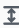
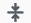
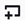

# Creating a custom transformation

If you need to perform more complicated transformations on your data, or want to add
data property keys to the dataset, you can add a **Custom code** transform
to your job diagram. The Custom code node allows you to enter a script that performs the
transformation.

When using custom code, you must use a schema editor to indicate the changes made to the
output through the custom code. When editing the schema, you can perform the following
actions:

- Add or remove data property keys
- Change the data type of data property keys
- Change the name of data property keys
- Restructure a nested property key
  You must use a _SelectFromCollection_ transform to choose a single
  `DynamicFrame` from the result of your Custom transform node before you can
  send the output to a target location.

Use the following tasks to add a custom transform node to your job diagram.

## Adding a custom code transform node to the job

diagram

###### To add a custom transform node to your job diagram

1. (Optional) Open the Resource panel and then choose **Custom transform** to add a
   custom transform to your job diagram.
2. On the **Node properties** tab, enter a name for the node in
   the job diagram. If a node parent is not already selected, or if you want multiple
   inputs for the custom transform, then choose a node from the **Node
   parents** list to use as the input source for the transform.

## Entering code for the custom transform

node

You can type or copy code into an input field. The job uses this code to perform the
data transformation. You can provide a code snippet in either Python or Scala. The code
should take one or more `DynamicFrames` as input and returns a collection of
`DynamicFrames`.

###### To enter the script for a custom transform node

1. With the custom transform node selected in the job diagram, choose the
   **Transform** tab.
2. In the text entry field under the heading **Code block**, paste
   or enter the code for the transformation. The code that you use must match the
   language specified for the job on the **Job details**
   tab.

When referring to the input nodes in your code, AWS Glue Studio names the
`DynamicFrames` returned by the job diagram nodes sequentially based on
the order of creation. Use one of the following naming methods in your code:

    * Classic code generation – Use functional names to refer to the nodes in
     your job diagram.


    	+ Data source nodes: `DataSource0`, `DataSource1`,
    	 `DataSource2`, and so on.
    	+ Transform nodes: `Transform0`, `Transform1`,
    	 `Transform2`, and so on.
    * New code generation – Use the name specified on the
     **Node properties** tab of a node, appended with
     '`_node1`', '`_node2`', and so on. For example,
     `S3bucket_node1`, `ApplyMapping_node2`,
     `S3bucket_node2`, `MyCustomNodeName_node1`.

For more information about the new code generator, see [Script code generation](job-editor-features.md#code-gen "job-editor-features.md#code-gen").

The following examples show the format of the code to enter in the code box:

Python
The following example takes the first `DynamicFrame` received,
converts it to a `DataFrame` to apply the native filter method (keeping
only records that have over 1000 votes), then converts it back to a
`DynamicFrame` before returning it.

```
def FilterHighVoteCounts (glueContext, dfc) -> DynamicFrameCollection:
    df = dfc.select(list(dfc.keys())[0]).toDF()
    df_filtered = df.filter(df["vote_count"] > 1000)
    dyf_filtered = DynamicFrame.fromDF(df_filtered, glueContext, "filter_votes")
    return(DynamicFrameCollection({"CustomTransform0": dyf_filtered}, glueContext))

```

Scala
The following example takes the first `DynamicFrame` received,
converts it to a `DataFrame` to apply the native filter method (keeping
only records that have over 1000 votes), then converts it back to a
`DynamicFrame` before returning it.

```
object FilterHighVoteCounts {
  def execute(glueContext : GlueContext, input : Seq[DynamicFrame]) : Seq[DynamicFrame] = {
    val frame = input(0).toDF()
    val filtered = DynamicFrame(frame.filter(frame("vote_count") > 1000), glueContext)
    Seq(filtered)
  }
}
```

## Editing the schema in a custom transform

node

When you use a custom transform node, AWS Glue Studio cannot automatically infer
the output schemas created by the transform. You use the schema editor to describe the
schema changes implemented by the custom transform code.

A custom code node can have any number of parent nodes, each providing a
`DynamicFrame` as input for your custom code. A custom code node returns a
collection of `DynamicFrames`. Each `DynamicFrame` that is used as
input has an associated schema. You must add a schema that describes each
`DynamicFrame` returned by the custom code node.

###### Note

When you set your own schema on a custom transform, AWS Glue Studio does not inherit schemas
from previous nodes.To update the schema, select the Custom transform node, then choose the Data preview tab.
Once the preview is generated, choose 'Use Preview Schema'.
The schema will then be replaced by the schema using the preview data.

###### To edit the output schemas for a custom transform node

1. With the custom transform node selected in the job diagram, in the node details
   panel, choose the **Output schema** tab.
2. Choose **Edit** to make changes to the schema.

If you have nested data property keys, such as an array or object, you can choose
the **Expand-Rows** icon (

) on the top right of each schema panel to expand the list of
child data property keys. After you choose this icon, it changes to the
**Collapse-Rows** icon (

), which you can choose to collapse the list of child property
keys. 3. Modify the schema using the following actions in the section on the right side of
the page:

    * To rename a property key, place the cursor in the **Key**
     text box for the property key, then enter the new name.
    * To change the data type for a property key, use the list to choose the new
     data type for the property key.
    * To add a new top-level property key to the schema, choose the
     **Overflow** (
    
    ) icon to the left of the **Cancel** button,
     and then choose **Add root key**.
    * To add a child property key to the schema, choose the
     **Add-Key** icon
    
    associated with the parent key. Enter a name for the child key
     and choose the data type.
    * To remove a property key from the schema, choose the
     **Remove** icon (
    
    ) to the far right of the key name.

4.  If your custom transform code uses multiple `DynamicFrames`, you can
    add additional output schemas.

        * To add a new, empty schema, choose the **Overflow** (
        
        ) icon, and then choose **Add output
         schema**.
        * To copy an existing schema to a new output schema, make sure the schema you
         want to copy is displayed in the schema selector. Choose the
         **Overflow** (
        
        ) icon, and then choose **Duplicate**.

    If you want to remove an output schema, make sure the schema you want to copy is
    displayed in the schema selector. Choose the **Overflow** (
    
    ) icon, and then choose **Delete**.

5.  Add new root keys to the new schema or edit the duplicated keys.
6.  When you are modifying the output schemas, choose the **Apply**
    button to save your changes and exit the schema editor.

If you do not want to save your changes, choose the **Cancel**
button.

## Configure the custom transform output

A custom code transform returns a collection of `DynamicFrames`, even if
there is only one `DynamicFrame` in the result set.

###### To process the output from a custom transform node

1. Add a _SelectFromCollection_ transform node, which has the
   custom transform node as its parent node. Update this transform to indicate which
   dataset you want to use. See [Using SelectFromCollection to
   choose which dataset to keep](transforms-configure-select-collection.md "transforms-configure-select-collection.md") for more information.
2. Add additional _SelectFromCollection_ transforms to the job
   diagram if you want to use additional `DynamicFrames` produced by the
   custom transform node.

Consider a scenario in which you add a custom transform node to split a flight
dataset into multiple datasets, but duplicate some of the identifying property keys in
each output schema, such as the flight date or flight number. You add a
_SelectFromCollection_ transform node for each output schema,
with the custom transform node as its parent. 3. (Optional) You can then use each _SelectFromCollection_
transform node as input for other nodes in the job, or as a parent for a data target
node.
