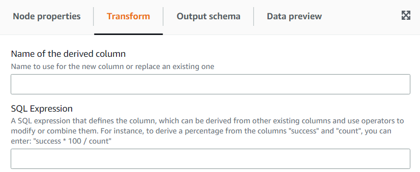

# Using the Derived Column transform to combine other columns

The **Derived Column** transform allows you to define a new column based on a math formula or SQL expression in which you
can use other columns in the data, as well as constants and literals. For instance, to derive a “percentage” column from the columns
"success" and "count", you can enter the SQL expression: "success \* 100 / count || '%'".

Example result:

| success | count | percentage |
| ------- | ----- | ---------- | ------------------------------------------------------------------------------------------------------------------------------------------------------------------------------------------------------------------------------------------------------------------------------------------------------------------------------------------------------------------------------------------------------------------------------------------------------------------------------------------------------------------------------------------------------------------------------------------------------------------------------------------------------------------------------------------------ |
| 14      | 100   | 14%        |
| 6       | 20    | 3%         |
| 3       | 40    | 7.5%       | ###### To add a Derived Column transform: 1. Open the Resource panel and then choose **Derived Column** to add a new transform to your job diagram. The node selected at the time of adding the node will be its parent. 2. (Optional) On the **Node properties** tab, you can enter a name for the node in the job diagram. If a node parent is not already selected, then choose a node from the Node parents list to use as the input source for the transform. 3. On the **Transform** tab, enter the name of the column and the expression for its content.  |
